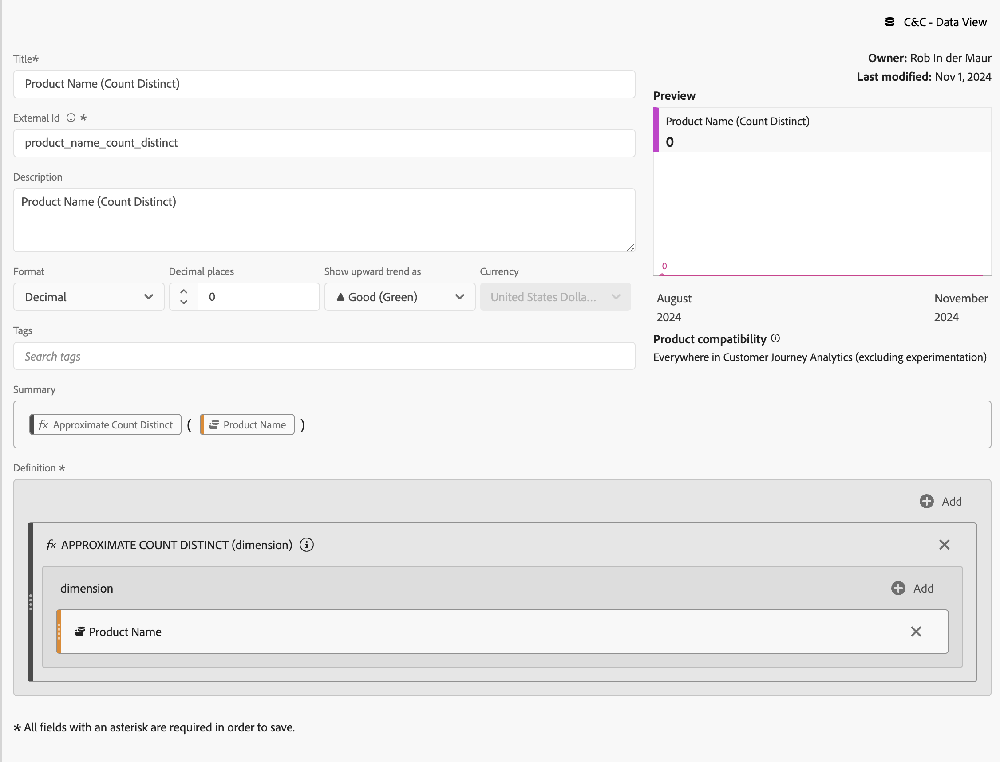

# Count distinct values dimensions


In this use case, you want to get the distinct number of product names that have been reported on during January 2023.

+++ Customer Journey Analytics

To report on a distinct count of product names, you set up a calculated metric in Customer Journey Analytics, with **[!UICONTROL Title]** `Product Name (Count Distinct)` and **[!UICONTROL External Id]** `product_name_count_distinct`.



You then can use that metric in an example **[!UICONTROL Count Distinct Dimension Values]** panel for the use case:


+++

+++ BI tools

>[!PREREQUISITES]
>
>Ensure you have validated [a successful connection, can list data views, and use a data view](connect-and-validate.md) for the BI tool for which you want to try out this use case. 
>

>[!BEGINTABS]

>[!TAB Power BI Desktop] 

1. To ensure the date range apply to all visualizations, drag and drop **[!UICONTROL daterangeday]** from the **[!UICONTROL Data]** pane on to **[!UICONTROL Filters]** on this page.
   1. Select the **[!UICONTROL daterangeday is (All)]** from **[!UICONTROL Filters on this page]**.
   1. Select **[!UICONTROL Advanced filtering]** as the **[!UICONTROL Filter type]**.
   1. Define the filter to **[!UICONTROL Show items when the value]** **[!UICONTROL is on or after]** `1/1/2023` **[!UICONTROL And]** **[!UICONTROL is before]** `2/1/2023`.
   1. Select **[!UICONTROL Apply filter]**.
   
1. In the **[!UICONTROL Data]** pane:
   1. Select **[!UICONTROL datarangeday]**.
   1. Select **[!UICONTROL sum cm_product_name_count_distinct]**, which is the calculated metric defined in Customer Journey Analytics.

1. To modify the vertical bar chart to a Table, ensure you have the chart selected and select **[!UICONTROL Table]** from the **[!UICONTROL Visualizations]** pane.
    
   Your Power BI Desktop should look like below.

   

1. Select the table visualization. From the context menu, select **[!UICONTROL Copy]** > **[!UICONTROL Copy visual]**.
1. Paste the visualization using **[!UICONTROL ctrl-v]**. The exact copy of the visualization overlaps the original one. Move it to the right in the report area.
1. To modify the copied visualization from a table to a card, select **[!UICONTROL Card]** from **[!UICONTROL Visualizations]**.

   Your Power BI Desktop should look like below.

   

Alternatively, you can use the count distinct functionality from Power BI. 

1. Select the **[!UICONTROL product_name]** dimension.
1. Apply the **[!UICONTROL Count (Distinct)]** function on the **[!UICONTROL product_name]** dimension in **[!UICONTROL Columns]**.

   


>[!TAB Tableau Desktop] 

1. Select the **[!UICONTROL Sheet 1]** tab at the bottom to switch from **[!UICONTROL Data source]**. In the **[!UICONTROL Sheet 1]** view:
   1. Drag the **[!UICONTROL Daterange]** entry from the **[!UICONTROL Tables]** list in the **[!UICONTROL Data]** pane and drop the entry onto the **[!UICONTROL Filters]** shelf.
   1. In the **[!UICONTROL Filter Field \[Daterange\]]** dialog, select **[!UICONTROL Range of Dates]** and select **[!UICONTROL Next >]**.
   1. In the **[!UICONTROL Filter \[Daterange\]]** dialog, select **[!UICONTROL Range of dates]**, and select `01/01/2023` - `31/1/2023`. Select **[!UICONTROL Apply]** and **[!UICONTROL OK]**.
   1. Drag **[!UICONTROL Cm Product Name Count Distinct]** to **[!UICONTROL Rows]**. The value changes to **[!UICONTROL SUM(Cm Product Name Count Distinct)]**. This field is the calculated metric that you have defined in Customer Journey Analytics.
   1. Drag **[!UICONTROL Daterangeday]** and drop next to **[!UICONTROL Columns]**. Select **[!UICONTROL Daterangeday]** and from the drop-down menu select **[!UICONTROL Day]**.
   1. To modify the lines visualization to a table, select **[!UICONTROL Text Table]** from **[!UICONTROL Show Me]**.
   1. Select **[!UICONTROL Swap Rows and Columns]** from the toolbar.
   1. Select **[!UICONTROL Fit Width]** from the **[!UICONTROL Fit]** drop-down menu.

      Your Tableau Desktop should look like below.

      

1. Select **[!UICONTROL Duplicate]** from the **[!UICONTROL Sheet 1]** tab context menu to create a second sheet.
1. Select **[!UICONTROL Rename]** from the **[!UICONTROL Sheet 1]** tab context menu to rename the sheet to `Data`.
1. Select **[!UICONTROL Rename]** from the **[!UICONTROL Sheet 1 (2)]** tab context menu to rename the sheet to `Card`.

1. Ensure you have selected the **[!UICONTROL Card]** view.
1. Select **[!UICONTROL DAY(Daterangeday)]** and from the drop-down menu select **[!UICONTROL Month]**. The value changes to **[!UICONTROL MONTH(Daterangeday)]**.
1. Select **[!UICONTROL SUM(Cm Product Name Count Distinct)]** in **[!UICONTROL Marks]** and from the drop-down menu select **[!UICONTROL Format]**.
1. To change the font size, in the **[!UICONTROL Format SUM(CM Product Name Count Distinct)]** pane, select **[!UICONTROL Font]** within **[!UICONTROL Default]** and select **[!UICONTROL 72]** for the font size.
1. To align the number, select **[!UICONTROL Automatic]** next to **[!UICONTROL Alignment]** and set **[!UICONTROL Horizontal]** to centered.
1. To use whole numbers, select **[!UICONTROL 123.456]** next to **[!UICONTROL Numbers]** and select **[!UICONTROL Number (Custom)]**. Set **[!UICONTROL Decimal places]** to `0`.

   Your Tableau Desktop should look like below.

   

1. Select **[!UICONTROL New Dashboard]** tab button (at the bottom) to create a new **[!UICONTROL Dashboard 1]** view. In the **[!UICONTROL Dashboard 1]** view:
   1. Drag and drop the **[!UICONTROL Card]** sheet from the **[!UICONTROL Sheets]** shelf onto the **[!UICONTROL Dashboard 1]** view that reads *Drop sheets here*.
   1. Drag and drop the **[!UICONTROL Data]** sheet from the **[!UICONTROL Sheets]** shelf underneath the **[!UICONTROL Card]** sheet on the **[!UICONTROL Dashboard 1]** view.

   Your **[!UICONTROL Dashboard 1]** view should look like below.

   


Alternatively, you can use the count distinct functionality from Tableau Desktop. 

1. Use  **[!UICONTROL Product Name]** instead of **[!UICONTROL Cm Product Name Count Distinct]**.
1. Apply **[!UICONTROL Measure]** > **[!UICONTROL Count (Distinct)]** on **[!UICONTROL Product Name]** in **[!UICONTROL Marks]**.

   


>[!TAB Looker]

1. In the **[!UICONTROL Explore]** interface of Looker, ensure you do have a clean setup. If not, select  **[!UICONTROL Remove fields and filters]**.
1. Select **[!UICONTROL + Filter]** underneath **[!UICONTROL Filters]**.
1. In the **[!UICONTROL Add Filter]** dialog:
   1. Select **[!UICONTROL ‣ Cc Data View]**
   1. From the list of fields, select **[!UICONTROL ‣ Daterange Date]** then **[!UICONTROL Daterange Date]**.
      
1. Specify the **[!UICONTROL Cc Data View Daterange Date]** filter as **[!UICONTROL is in range]** **[!UICONTROL 2023/01/01]** **[!UICONTROL until (before)]** **[!UICONTROL 2023/02/01]**.
1. From the **[!UICONTROL ‣ Cc Data View]** section in the left rail: 
   1. Select **[!UICONTROL Daterange Date]**, then **[!UICONTROL Date]**.
   1. Select **[!UICONTROL Aggregate ‣ Count Distinct]** from the **⋮ More** context menu on **[!UICONTROL Product Name]**.
      
1. Select **[!UICONTROL Run]**.
1. Select **[!UICONTROL ‣ Visualization]** and select 6︎⃣ from the toolbar to display a Single value visualization.

You should see a visualization and table similar as shown below.


>[!TAB Jupyter Notebook]

1. Enter the following statements in a new cell.

   ```
   data = %sql SELECT COUNT(DISTINCT(product_name)) AS `Product Name` \
      FROM cc_data_view \
      WHERE daterange BETWEEN '2023-01-01' AND '2023-02-01';
   display(data)
   ```

1. Execute the cell. You should see output similar to the screenshot below.

   


>[!TAB RStudio]

1. Enter the following statements between ` ```{r} ` and ` ``` ` in a new chunk.

   ```R
   ## Count Distinct
   df <- dv %>%
      filter(daterange >= "2023-01-01" & daterange < "2023-02-01") %>%
      summarise(product_name_count_distinct = n_distinct(product_name))
   print(df)
   ```

1. Run the chunk. You should see output similar to the screenshot below.

   


>[!ENDTABS]

+++

