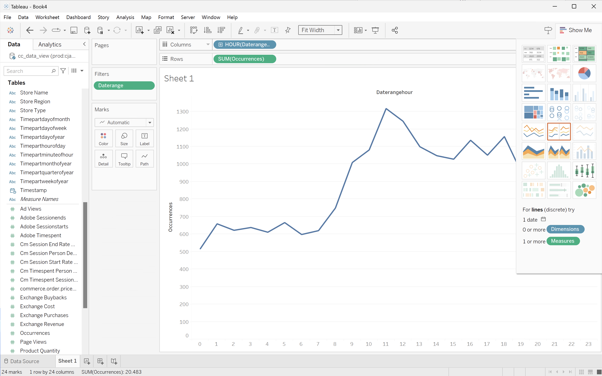
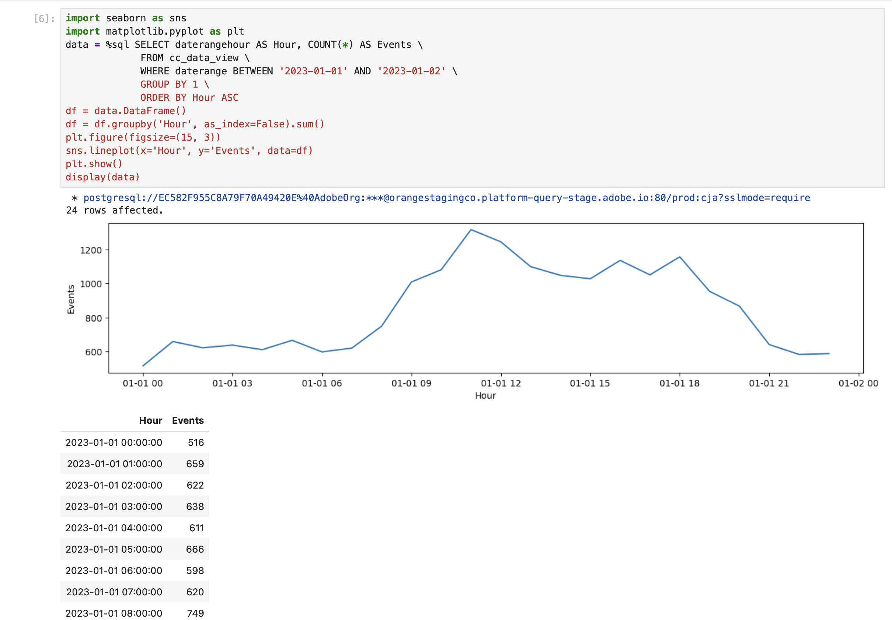

# Hourly trend


## Hourly trend

In this use case, you want to display a table and simple line visualization that shows an hourly trend of occurrences(events) for January 1, 2023.

+++ Customer Journey Analytics

An example **[!UICONTROL Hourly Trend]** panel for the use case:


+++

+++ BI tools

>[!PREREQUISITES]
>
>Ensure you have validated [a successful connection, can list data views, and use a data view](connect-and-validate.md) for the BI tool for which you want to try out this use case. 
>

>[!BEGINTABS]

>[!TAB Power BI Desktop] 

 Power BI does **not** understand how to handle date-time fields, so dimensions like **[!UICONTROL daterangehour]** and **[!UICONTROL daterangeminute]** are not supported.

>[!TAB Tableau Desktop] 

1. Select the **[!UICONTROL Sheet 1]** tab at the bottom to switch from **[!UICONTROL Data source]**. In the **[!UICONTROL Sheet 1]** view:
   1. Drag the **[!UICONTROL Daterange]** entry from the **[!UICONTROL Tables]** list in the **[!UICONTROL Data]** pane and drop the entry onto the **[!UICONTROL Filters]** shelf.
   1. In the **[!UICONTROL Filters Field \[Daterange\]]** dialog, select **[!UICONTROL Range of Dates]** and select **[!UICONTROL Next >]**.
   1. In the **[!UICONTROL Filter \[Daterange\]]** dialog, select **[!UICONTROL Range of dates]** and specify a period of `01/01/2023` - `02/01/2023`.

      

   1. Drag and drop **[!UICONTROL Daterangehour]** from the **[!UICONTROL Tables]** list in the **[!UICONTROL Data]** pane and drop the entry in the field next to **[!UICONTROL Columns]**.
      * Select **[!UICONTROL More]** > **[!UICONTROL Hours]** from the **[!UICONTROL Daterangeday]** drop-down menu, so that the value is updated to **[!UICONTROL HOUR(Daterangeday)]**.
   1. Drag and drop **[!UICONTROL Occurrences]** from the **[!UICONTROL Tables (*Measure Names*)]** list in the **[!UICONTROL Data]** pane and drop the entry in the field next to **[!UICONTROL Rows]**. The value is automatically converted to **[!UICONTROL SUM(Occurrences)]**.
   1. Modify **[!UICONTROL Standard]** to **[!UICONTROL Entire View]** from the **[!UICONTROL Fit]** drop-down menu in the toolbar.

      Your Tableau Desktop should look like below.

      

1. Select **[!UICONTROL Duplicate]** from the **[!UICONTROL Sheet 1]** tab context menu to create a second sheet.
1. Select **[!UICONTROL Rename]** from the **[!UICONTROL Sheet 1]** tab context menu to rename the sheet to `Graph`.
1. Select **[!UICONTROL Rename]** from the **[!UICONTROL Sheet 1 (2)]** tab context menu to rename the sheet to `Data`.
1. Ensure that the **[!UICONTROL Data]** sheet is selected. In the **[!UICONTROL Data]** view:
   1. Select **[!UICONTROL Show me]** at the top right and select **[!UICONTROL Text table]** (upper left top visualization) to modify the content of the Data view to a table.
   1. Drag **[!UICONTROL HOUR(Daterangeday)]** from **[!UICONTROL Columns]** to **[!UICONTROL Rows]**.
   1. Modify **[!UICONTROL Standard]** to **[!UICONTROL Entire View]** from the **[!UICONTROL Fit]** drop-down menu in the toolbar.

      Your Tableau Desktop should look like below.

      

1. Select **[!UICONTROL New Dashboard]** tab button (at the bottom) to create a new **[!UICONTROL Dashboard 1]** view. In the **[!UICONTROL Dashboard 1]** view:
   1. Drag and drop the **[!UICONTROL Graph]** sheet from the **[!UICONTROL Sheets]** shelf onto the **[!UICONTROL Dashboard 1]** view that reads *Drop sheets here*.
   1. Drag and drop the **[!UICONTROL Data]** sheet from the **[!UICONTROL Sheets]** shelf below the **[!UICONTROL Graph]** sheet onto the **[!UICONTROL Dashboard 1]** view.
   1. Select the **[!UICONTROL Data]** sheet in the view and modify **[!UICONTROL Entire View]** to **[!UICONTROL Fix Width]**.

      Your **[!UICONTROL Dashboard 1]** view should look like below.

      


>[!TAB Looker]


1. In the **[!UICONTROL Explore]** interface of Looker, ensure you do have a clean setup. If not, select  **[!UICONTROL Remove fields and filters]**.
1. Select **[!UICONTROL + Filter]** underneath **[!UICONTROL Filters]**.
1. In the **[!UICONTROL Add Filter]** dialog:
   1. Select **[!UICONTROL ‣ Cc Data View]**
   1. From the list of fields, select **[!UICONTROL ‣ Daterange Date]** then **[!UICONTROL Daterange Date]**.
      
1. Specify the **[!UICONTROL Cc Data View Daterange Date]** filter as **[!UICONTROL is in range]** **[!UICONTROL 2023/01/01]** **[!UICONTROL until (before)]** **[!UICONTROL 2023/01/02]**.
1. From the **[!UICONTROL Cc Data View]** section in the left rail, 
   1. Select **[!UICONTROL ‣ Daterangehour Date]**, then **[!UICONTROL Time]** from the list of **[!UICONTROL DIMENSIONS]**.
   1. Select **[!UICONTROL Count]** underneath **[!UICONTROL MEASURES]** in the left rail (at the bottom).
1. Select **[!UICONTROL Run]**.
1. Select **[!UICONTROL ‣ Visualization]** to display the line visualization.

You should see a visualization and table similar as shown below.


>[!TAB Jupyter Notebook]

1. Enter the following statements in a new cell.

   ```python
   import seaborn as sns
   import matplotlib.pyplot as plt
   data = %sql SELECT daterangehour AS Hour, COUNT(*) AS Events \
               FROM cc_data_view \
               WHERE daterange BETWEEN '2023-01-01' AND '2023-01-02' \
               GROUP BY 1 \
                ORDER BY Hour ASC
   df = data.DataFrame()
   df = df.groupby('Hour', as_index=False).sum()
   plt.figure(figsize=(15, 3))
   sns.lineplot(x='Hour', y='Events', data=df)
   plt.show()
   display(data)
   ```

1. Execute the cell. You should see output similar to the screenshot below.

   


>[!TAB RStudio]

1. Enter the following statements between ` ```{r} ` and ` ``` ` in a new chunk.

   ```R
   ## Hourly Events
   df <- dv %>%
      filter(daterange >= "2023-01-01" & daterange < "2023-01-02") %>%
      group_by(daterangehour) %>%
      count() %>%
      arrange(daterangehour, .by_group = FALSE)
   ggplot(df, aes(x = daterangehour, y = n)) +
      geom_line(color = "#69b3a2") +
      ylab("Events") +
      xlab("Hour")
   print(df)
   ```

1. Run the chunk. You should see output similar to the screenshot below.

   

>[!ENDTABS]

+++
