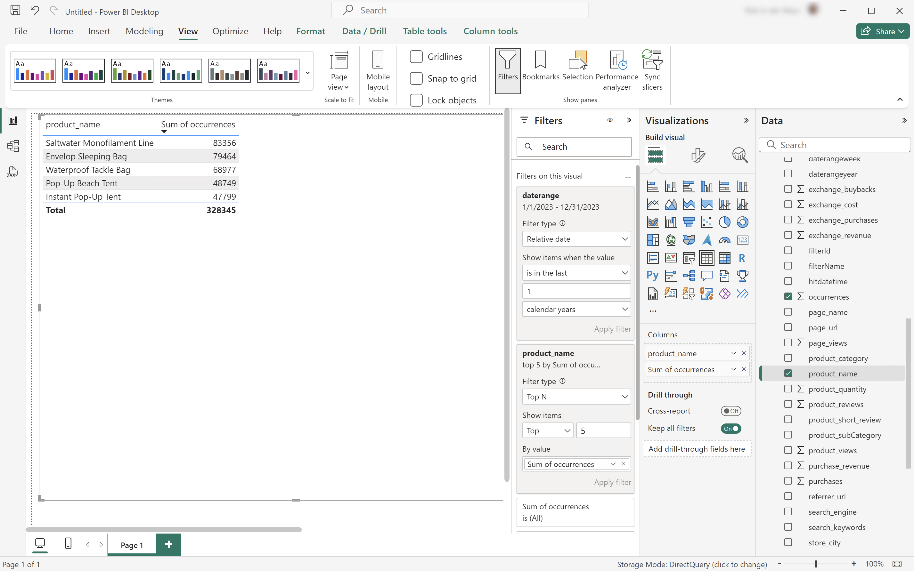

# Limits


In this use case, you want to report on the top 5 occurrences of product names during 2023.

+++ Customer Journey Analytics

An example **[!UICONTROL Limit]** panel for the use case:


+++

+++ BI tools

>[!PREREQUISITES]
>
>Ensure you have validated [a successful connection, can list data views, and use a data view](connect-and-validate.md) for the BI tool for which you want to try out this use case. 
>

>[!BEGINTABS]

>[!TAB Power BI Desktop] 

1. In the **[!UICONTROL Data]** pane:
   1. Select **[!UICONTROL daterange]**.
   1. Select **[!UICONTROL product_name]**.
   1. Select **[!UICONTROL sum occurrences]**.

1. In the **[!UICONTROL Filters]** pane:
   1. Select **[!UICONTROL daterange is (All)]** from **[!UICONTROL Filters on this visual]**.
   1. Select **[!UICONTROL Relative date]** as the **[!UICONTROL Filter type]**.
   1. Define the filter to **[!UICONTROL Show items when the value]** **[!UICONTROL is in the last]** `1` **[!UICONTROL calendar years]**.
   1. Select **[!UICONTROL Apply filter]**.
   1. Select **[!UICONTROL product_name is (All)]** from **[!UICONTROL Filters on this visual]**.
   1. Select **[!UICONTROL Top N]** as the **[!UICONTROL Filter type]**.
   1. Select **[!UICONTROL Show Items]** **[!UICONTROL Top]** `5` **[!UICONTROL By value]**.
   1. Drag and drop **[!UICONTROL sum occurrences]** from the **[!UICONTROL Data]** pane and drop it on **[!UICONTROL Add data fields here]**.
   1. Select **[!UICONTROL Apply filter]**.

1. In the Visualization pane:
   * Select  to remove daterange from Columns.

   Your Power BI Desktop should look like below.

   

The query executed by Power BI Desktop using the BI extension is including a `limit` statement but not the one expected. The limit to the top 5 occurrences is enforced by Power BI Desktop using explicit product name results.

```sql
select "_"."product_name",
    "_"."a0"
from 
(
    select "rows"."product_name" as "product_name",
        sum("rows"."occurrences") as "a0"
    from 
    (
        select "_"."daterangeName",
            "_"."daterange",
            "_"."filterId",
            "_"."filterName",
            "_"."timestamp",
            "_"."affiliate_name",
            "_"."affiliate_url",
            "_"."commerce.order.priceTotal",
            "_"."customer_city",
            "_"."customer_region",
            "_"."daterangeday",
            "_"."daterangefifteenminute",
            "_"."daterangefiveminute",
            "_"."daterangehour",
            "_"."daterangeminute",
            "_"."daterangemonth",
            "_"."daterangequarter",
            "_"."daterangesecond",
            "_"."daterangethirtyminute",
            "_"."daterangeweek",
            "_"."daterangeyear",
            "_"."hitdatetime",
            "_"."page_name",
            "_"."page_url",
            "_"."product_category",
            "_"."product_name",
            "_"."product_short_review",
            "_"."product_subCategory",
            "_"."referrer_url",
            "_"."search_engine",
            "_"."search_keywords",
            "_"."store_city",
            "_"."store_name",
            "_"."store_region",
            "_"."store_type",
            "_"."timepartdayofmonth",
            "_"."timepartdayofweek",
            "_"."timepartdayofyear",
            "_"."timeparthourofday",
            "_"."timepartminuteofhour",
            "_"."timepartmonthofyear",
            "_"."timepartquarterofyear",
            "_"."timepartweekofyear",
            "_"."cm_session_end_rate_defaultmetric",
            "_"."cm_session_person_defaultmetric",
            "_"."cm_session_start_rate_defaultmetric",
            "_"."cm_timespent_person_defaultmetric",
            "_"."cm_timespent_session_defaultmetric",
            "_"."cm_product_name_count_distinct",
            "_"."ad_views",
            "_"."adobe_sessionends",
            "_"."adobe_sessionstarts",
            "_"."adobe_timespent",
            "_"."exchange_buybacks",
            "_"."exchange_cost",
            "_"."exchange_purchases",
            "_"."exchange_revenue",
            "_"."occurrences",
            "_"."page_views",
            "_"."product_quantity",
            "_"."product_reviews",
            "_"."product_views",
            "_"."purchase_revenue",
            "_"."purchases",
            "_"."visitors",
            "_"."visits"
        from "public"."cc_data_view" "_"
        where (("_"."product_name" in ('Saltwater Monofilament Line', 'Pop-Up Beach Tent', 'Instant Pop-Up Tent', 'Envelop Sleeping Bag', 'Waterproof Tackle Bag')) and "_"."daterange" < date '2024-01-01') and "_"."daterange" >= date '2023-01-01'
    ) "rows"
    group by "product_name"
) "_"
where not "_"."a0" is null
limit 1000001
```

>[!TAB Tableau Desktop] 

1. Select the **[!UICONTROL Sheet 1]** tab at the bottom to switch from **[!UICONTROL Data source]**. In the **[!UICONTROL Sheet 1]** view:
   1. Drag **[!UICONTROL Daterange]** entry from the **[!UICONTROL Tables]** list in the **[!UICONTROL Filters]** shelf.
   1. In the **[!UICONTROL Filter Field \[Daterange\]]** dialog, select **[!UICONTROL Range of Dates]** and select **[!UICONTROL Next >]**.
   1. In the **[!UICONTROL Filter \[Daterange\]]** dialog, select **[!UICONTROL Relative dates]**, select **[!UICONTROL Years]**, and select **[!UICONTROL Previous years]**. Select **[!UICONTROL Apply]** and **[!UICONTROL OK]**.
   1. Drag **[!UICONTROL Product Name]** from the **[!UICONTROL Tables]** list to **[!UICONTROL Rows]**.
   1. Drag **[!UICONTROL Occurrences]** entry from the **[!UICONTROL Tables]** list and drop the entry in the field next to **[!UICONTROL Columns]**. The value changes to **[!UICONTROL SUM(Occurrences)]**.
   1. Select **[!UICONTROL Text Table]** from **[!UICONTROL Show Me]**.
   1. Select **[!UICONTROL Fit Width]** from the **[!UICONTROL Fit]** drop-down menu.
   1. Select **[!UICONTROL Product Name]** in **[!UICONTROL Rows]**. Select **[!UICONTROL Filter]** from the drop-down menu.
      1. In the **[!UICONTROL Filter \[Product Name\]]** dialog, select the **[!UICONTROL Top]** tab.
      1. Select **[!UICONTROL By field:]** **[!UICONTROL Top]** `5` **[!UICONTROL by Occurrences]** **[!UICONTROL Sum]**.
      1. Select **[!UICONTROL Apply]** and **[!UICONTROL OK]**.
      
          You notice that the table disappears. Selecting the top 5 product names by occurrences does **not** work properly using this filter.
      1. Select the **[!UICONTROL Product Name]** in the **[!UICONTROL Filter]** shelf and from the drop-down menu select **[!UICONTROL Remove]**. The table reappears.
   1. Select **[!UICONTROL SUM(Occurrences)]** in the **[!UICONTROL Marks]** shelf. Select **[!UICONTROL Filter]** from the drop-down menu.
      1. In the **[!UICONTROL Filter \[Occurrences\]]** dialog, select **[!UICONTROL At least]**.
      1. Enter `47.799` as the value. This value ensures that only the top 5 items are shown in the table. Select **[!UICONTROL Apply]** and **[!UICONTROL OK]**.

         Your Tableau Desktop should look like below.

            

As shown above, this query executed by Tableau Desktop, when defining a Top 5 occurrences filter on product names, fails.

```sql
SELECT CAST("cc_data_view"."product_name" AS TEXT) AS "product_name",
  SUM("cc_data_view"."occurrences") AS "sum:occurrences:ok"
FROM "public"."cc_data_view" "cc_data_view"
  INNER JOIN (
  SELECT CAST("cc_data_view"."product_name" AS TEXT) AS "product_name",
    SUM("cc_data_view"."occurrences") AS "$__alias__0"
  FROM "public"."cc_data_view" "cc_data_view"
  GROUP BY 1
  ORDER BY 2 DESC,
    1 ASC
  LIMIT 5
) "t0" ON (CAST("cc_data_view"."product_name" AS TEXT) = "t0"."product_name")
WHERE (("cc_data_view"."daterange" >= (TIMESTAMP '2023-01-01 00:00:00.000')) AND ("cc_data_view"."daterange" < (TIMESTAMP '2024-01-01 00:00:00.000')))
GROUP BY 1
```

The query executed by Tableau Desktop, when defining a Top 5 filter on occurrences, is shown below. The limit is not visible in the query and applied client side.

```sql
SELECT CAST("cc_data_view"."product_name" AS TEXT) AS "product_name",
  SUM("cc_data_view"."occurrences") AS "sum:occurrences:ok"
FROM "public"."cc_data_view" "cc_data_view"
WHERE (("cc_data_view"."daterange" >= (TIMESTAMP '2023-01-01 00:00:00.000')) AND ("cc_data_view"."daterange" < (TIMESTAMP '2024-01-01 00:00:00.000')))
GROUP BY 1
```

>[!TAB Looker]

1. In the **[!UICONTROL Explore]** interface of Looker, refresh your connection. Select  **[!UICONTROL Clear cache and refresh]**.
1. In the **[!UICONTROL Explore]** interface of Looker, ensure you do have a clean setup. If not, select  **[!UICONTROL Remove fields and filters]**.
1. Select **[!UICONTROL + Filter]** underneath **[!UICONTROL Filters]**.
1. In the **[!UICONTROL Add Filter]** dialog:
   1. Select **[!UICONTROL ‣ Cc Data View]**
   1. From the list of fields, select **[!UICONTROL ‣ Daterange Date]** then **[!UICONTROL Daterange Date]**.
      
1. Specify the **[!UICONTROL Cc Data View Daterange Date]** filter as **[!UICONTROL is in range]** **[!UICONTROL 2023/01/01]** **[!UICONTROL until (before)]** **[!UICONTROL 2024/01/01]**.
1. From the **[!UICONTROL ‣ Cc Data View]** section in the left rail: 
   1. Select **[!UICONTROL Product Name]**.
   1. Select **[!UICONTROL Count]** underneath **[!UICONTROL MEASURES]** in the left rail (at the bottom).
1. Ensure you select **[!UICONTROL ↓]** (**[!UICONTROL Descending, Sort Order: 1]**) on the **[!UICONTROL Purchase Revenue]** column.
1. Ensure you select **[!UICONTROL ↓]** (**[!UICONTROL Descending, Sort Order: 1]**) on the **[!UICONTROL Purchase Revenue]** column.
1. Select **[!UICONTROL Run]**.
1. Select **[!UICONTROL ‣ Visualization]**.

You should see a visualization and table similar as shown below.


The query generated by Looker using the BI extension is including `FETCH NEXT 5 ROWS ONLY`, which implies that the limit is executed through Looker and the BI extension.

```sql
-- Looker Query Context '{"user_id":6,"history_slug":"a8f3b1ebd5712413ca1ae695090f70db","instance_slug":"71d4667f0b76c0011463658f45c3f7a3"}' 
SELECT
    cc_data_view."product_name"  AS "cc_data_view.product_name",
    COUNT(*) AS "cc_data_view.count"
FROM
    "public"."cc_data_view" AS "cc_data_view"
WHERE ((( cc_data_view."daterange"  ) >= (DATE_TRUNC('day', DATE '2023-01-31')) AND ( cc_data_view."daterange"  ) < (DATE_TRUNC('day', DATE '2024-01-01'))))
GROUP BY
    1
ORDER BY
    2 DESC
FETCH NEXT 5 ROWS ONLY
```


>[!TAB Jupyter Notebook]

1. Enter the following statements in a new cell.

   ```python
   data = %sql SELECT product_name AS `Product Name`, COUNT(*) AS Events \
               FROM cc_data_view \
               WHERE daterange BETWEEN '2023-01-01' AND '2023-02-01' \
               GROUP BY 1 \
               ORDER BY `Events` DESC \
               LIMIT 5;
   display(data)
   ```

1. Execute the cell. You should see output similar to the screenshot below.

   

The query is excuted by the BI extension as defined in Jupyter Notebook.

>[!TAB RStudio]

1. Enter the following statements between ` ```{r} ` and ` ``` ` in a new chunk.

   ```R
   ## Dimension 1 Limited
   df <- dv %>%
      filter(daterange >= "2023-01-01" & daterange < "2024-01-01") %>%
      group_by(product_name) %>%
      count() %>%
      arrange(desc(n), .by_group = FALSE) %>%
      head(5)
   print(df)
   ```

1. Run the chunk. You should see output similar to the screenshot below.

   

The query generated by RStudio using the BI extension is including `LIMIT 5`, which implies that the limit is applied through RStudio and the BI extension.

```sql
SELECT "product_name", COUNT(*) AS "n"
FROM (
  SELECT "cc_data_view".*
  FROM "cc_data_view"
  WHERE ("daterange" >= '2023-01-01' AND "daterange" < '2024-01-01')
) AS "q01"
GROUP BY "product_name"
ORDER BY "n" DESC
LIMIT 5
```

>[!ENDTABS]

+++
