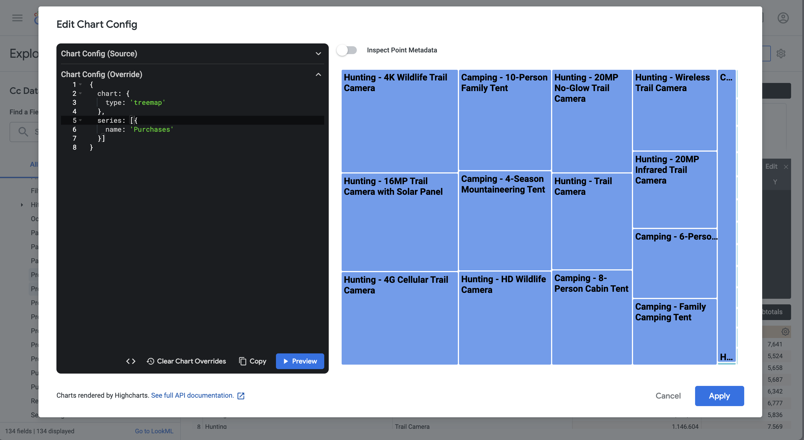

# Multiple dimension ranked


In this use case, you want to display a table that breaks down the purchase revenue and purchases for product names within product categories over 2023. On top of that you want to use some visualizations to illustrate both the product category distribution and product name contributions within each product category.

+++ Customer Journey Analytics

An example **[!UICONTROL Multiple Dimension Ranked]** panel for the use case:


+++

+++ BI tools

>[!PREREQUISITES]
>
>Ensure you have validated [a successful connection, can list data views, and use a data view](connect-and-validate.md) for the BI tool for which you want to try out this use case. 
>

>[!BEGINTABS]

>[!TAB Power BI Desktop] 

1. To ensure the date range apply to all visualizations, drag and drop **[!UICONTROL daterangeday]** from the **[!UICONTROL Data]** pane on to **[!UICONTROL Filters on this page]**.
   1. Select the **[!UICONTROL daterangeday is (All)]** from **[!UICONTROL Filters on this page]**.
   1. Select **[!UICONTROL Relative date]** as the **[!UICONTROL Filter type]**.
   1. Define the filter to **[!UICONTROL Show items when the value]** **[!UICONTROL is in the last]** `1` **[!UICONTROL calendar years]**.
   1. Select **[!UICONTROL Apply filter]**.
   
1. In the **[!UICONTROL Data]** pane:
   1. Select **[!UICONTROL datarangeday]**.
   1. Select **[!UICONTROL product_category]**.
   1. Select **[!UICONTROL product_name]**.
   1. Select **[!UICONTROL sum purchase_revenue]**
   1. Select **[!UICONTROL sum purchases]**

1. To modify the vertical bar chart to a Table, ensure you have the table selected and select **[!UICONTROL Matrix]** from the **[!UICONTROL Visualizations]** pane.
   * Drag **[!UICONTROL product_name]** from **[!UICONTROL Columns]** and drop the field underneath **[!UICONTROL product_categor]**y in **[!UICONTROL Rows]** in the **[!UICONTROL Visualization]** pane.
   
1. To limit the number of displayed products within the table, select **[!UICONTROL product_name is (All)]** in the **[!UICONTROL Filters]** pane.

   1. Select **[!UICONTROL Advanced filtering]**.
   1. Select **[!UICONTROL Filter type]** **[!UICONTROL Top N]** **[!UICONTROL Show items]** **[!UICONTROL Top]** `15` **[!UICONTROL By Value]**.
   1. Drag **[!UICONTROL purchases]** from the **[!UICONTROL Data]** pane onto the **[!UICONTROL Add data fields here]**.
   1. Select **[!UICONTROL Apply filter]**.

1. To improve readability, select **[!UICONTROL View]** from the top menu, and select **[!UICONTROL Page View]** > **[!UICONTROL Actual size]** and resize the table visualization.

1. To break down each category in the table, select **[!UICONTROL +]** at the product category level. Your Power BI Desktop should look like below.

   

1. Select **[!UICONTROL Home]** from the top menu, and select **[!UICONTROL New visual]**. A new visual is added to your report.

1. In the **[!UICONTROL Data]** pane:
   1. Select **[!UICONTROL product_category]**.
   1. Select **[!UICONTROL product_name]**.
   1. Select **[!UICONTROL purchase_revenue]**.

1. To modify the visual, select the bar chart and select **[!UICONTROL Treemap]** from the **[!UICONTROL Visualizations]** pane.
1. Ensure that **[!UICONTROL product_category]** is listed underneath **[!UICONTROL Category]**, and **[!UICONTROL product_name]** is listed underneath **[!UICONTROL Details]** in the **[!UICONTROL Visualizations]** pane.

   Your Power BI Desktop should look like below.

   

1. Select **[!UICONTROL Home]** from the top menu, and select **[!UICONTROL New visual]**. A new visual is added to your report.

1. In the **[!UICONTROL Data]** pane:
   1. Select **[!UICONTROL product_category]**.
   1. Select **[!UICONTROL purchase_revenue]**.
   1. Select **[!UICONTROL purchase]**.

1. In the **[!UICONTROL Visualizations]** pane:
   1. To modify the visualization, select **[!UICONTROL Line and stacked column chart]**. 
   1. Drag **[!UICONTROL sum_of_purchases]** from **[!UICONTROL Column y-axis]** to **[!UICONTROL Line y-axis]**.

1. In the report, reshuffle the individual visualizations. 

    Your Power BI Desktop should look like below.

    


>[!TAB Tableau Desktop] 

1. Select the **[!UICONTROL Sheet 1]** tab at the bottom to switch from **[!UICONTROL Data source]**. In the **[!UICONTROL Sheet 1]** view:
   1. Drag the **[!UICONTROL Daterange]** entry from the **[!UICONTROL Tables]** list in the **[!UICONTROL Data]** pane and drop the entry onto the **[!UICONTROL Filters]** shelf.
   1. In the **[!UICONTROL Filters Field \[Daterange\]]** dialog, select **[!UICONTROL Range of Dates]** and select **[!UICONTROL Next >]**.
   1. In the **[!UICONTROL Filter \[Daterange\]]** dialog, select **[!UICONTROL Relative dates]**, select **[!UICONTROL Years]**, and specify **[!UICONTROL Previous year]**. Select **[!UICONTROL Apply]** and **[!UICONTROL OK]**.

      Your Tableau Desktop should look like below.

      

   1. Drag **[!UICONTROL Product Category]** and drop next to **[!UICONTROL Columns]**.
   1. Drag **[!UICONTROL Purchase Revenue]** and drop next to **[!UICONTROL Rows]**. The value changes to **[!UICONTROL SUM(Purchase Revenue)]**.
   1. Drag Purchases and drop next to **[!UICONTROL Rows]**. The value changes to **[!UICONTROL SUM(Purchases)]**.
   1. Select **[!UICONTROL SUM(Purchases)]** and from the drop-down menu select **[!UICONTROL Dual Axis]**.
   1. Select **[!UICONTROL SUM(Purchases)]** in **[!UICONTROL Marks]** and select **[!UICONTROL Line]** from the drop-down menu.
   1. Select **[!UICONTROL SUM(Purchase Revenue)]** in **[!UICONTROL Marks]** and select **[!UICONTROL Bar]** from the drop-down menu.
   1. Select **[!UICONTROL Entire View]** from the **[!UICONTROL Fit]** menu.
   1. Select the **[!UICONTROL Purchase Revenue]** title in the chart and ensure that the purchase revenue is in ascending order.

      Your Tableau Desktop should look like below.

      

1. Rename the current **[!UICONTROL Sheet 1]** sheet to `Category`.
1. Select **[!UICONTROL New Worksheet]** to create a new sheet, and rename it to `Data`.

   1. Drag the **[!UICONTROL Daterange]** entry from the **[!UICONTROL Tables]** list in the **[!UICONTROL Data]** pane and drop the entry onto the **[!UICONTROL Filters]** shelf.
   1. In the **[!UICONTROL Filters Field \[Daterange\]]** dialog, select **[!UICONTROL Range of Dates]** and select **[!UICONTROL Next >]**.
   1. In the **[!UICONTROL Filter \[Daterange\]]** dialog, select **[!UICONTROL Relative dates]**, select **[!UICONTROL Years]**, and specify **[!UICONTROL Previous year]**. Select **[!UICONTROL Apply]** and **[!UICONTROL OK]**.
   1. Drag **[!UICONTROL Purchase Revenue]** from **[!UICONTROL Data]** pane to **[!UICONTROL Columns]**. The value changes to **[!UICONTROL SUM(Purchase Revenue)]**.
   1. Drag **[!UICONTROL Purchase]** from **[!UICONTROL Data]** pane to **[!UICONTROL Columns]**, next to **[!UICONTROL Purchase Revenue]**. The value changes to **[!UICONTROL SUM(Purchases)]**.
   1. Drag **[!UICONTROL Product Category]** from the **[!UICONTROL Data]** pane to **[!UICONTROL Rows]**.
   1. Drag **[!UICONTROL Product Name]** from the **[!UICONTROL Data]** pane to **[!UICONTROL Rows]**, next to **[!UICONTROL Product Category]**.
   1. To change the two horizontal bars to a table, select **[!UICONTROL Text Table]** from **[!UICONTROL Show Me]**.
   1. To limit the number of products, select **[!UICONTROL Purchases]** in **[!UICONTROL Measure Values]**. From the drop-down menu, select **[!UICONTROL Filter]**.
   1. In the **[!UICONTROL Filter \[Purchases\]]** dialog, select **[!UICONTROL At least]** and enter `7000`. Select **[!UICONTROL Apply]** and **[!UICONTROL OK]**.
   1. Select **[!UICONTROL Fit Width]** from **[!UICONTROL the]** Fit drop-down menu.

      Your Tableau Desktop should look like below.

      

1. Select **[!UICONTROL New worksheet]** to create a new sheet and rename it to **[!UICONTROL Treemap]**.
   1. Drag the **[!UICONTROL Daterange]** entry from the **[!UICONTROL Tables]** list in the **[!UICONTROL Data]** pane and drop the entry onto the **[!UICONTROL Filters]** shelf.
   1. In the **[!UICONTROL Filters Field \[Daterange\]]** dialog, select **[!UICONTROL Range of Dates]** and select **[!UICONTROL Next >]**.
   1. In the **[!UICONTROL Filter \[Daterange\]]** dialog, select **[!UICONTROL Relative dates]**, select **[!UICONTROL Years]**, and specify **[!UICONTROL Previous year]**. Select **[!UICONTROL Apply]** and **[!UICONTROL OK]**.
   1. Drag **[!UICONTROL Purchase Revenue]** from the **[!UICONTROL Data]** pane to **[!UICONTROL Rows]**. The values changes to **[!UICONTROL SUM(Purchase Revenue)]**.
   1. Drag **[!UICONTROL Purchase]** from the **[!UICONTROL Data]** pane to **[!UICONTROL Rows]**, next to **[!UICONTROL Purchase Revenue]**. The value changes to **[!UICONTROL SUM(Purchases)]**.
   1. Drag **[!UICONTROL Product Category]** from the **[!UICONTROL Data]** pane to **[!UICONTROL Columns]**.
   1. Drag **[!UICONTROL Product Name]** from the **[!UICONTROL Data]** pane to **[!UICONTROL Columns]**.
   1. To change the two vertical bar charts to a treemap, select **[!UICONTROL Treemap]** from **[!UICONTROL Show Me]**.
   1. To limit the number of products, select **[!UICONTROL Purchases]** in **[!UICONTROL Measure Values]**. From the drop-down menu, select **[!UICONTROL Filter]**.
   1. In the **[!UICONTROL Filter \[Purchases\]]** dialog, select **[!UICONTROL At least]** and enter `7000`. Select **[!UICONTROL Apply]** and **[!UICONTROL OK]**.
   1. Select **[!UICONTROL Fit Width]** from the **[!UICONTROL Fit]** drop-down menu.

      Your Tableau Desktop should look like below.

      

1. Select **[!UICONTROL New Dashboard]** tab button (at the bottom) to create a new **[!UICONTROL Dashboard 1]** view. In the **[!UICONTROL Dashboard 1]** view:
   1. Drag and drop the **[!UICONTROL Category]** sheet from the **[!UICONTROL Sheets]** shelf onto the **[!UICONTROL Dashboard 1]** view that reads *Drop sheets here*.
   1. Drag and drop the **[!UICONTROL Treemap]** sheet from the **[!UICONTROL Sheets]** shelf underneath the **[!UICONTROL Category]** sheet on the **[!UICONTROL Dashboard 1]** view.
   1. Drag and drop the **[!UICONTROL Data]** sheet from the **[!UICONTROL Sheets]** shelf underneath the **[!UICONTROL Treemap]** sheet on the **[!UICONTROL Dashboard 1]** view.
   1. Resize each of the sheets in the view.

   Your **[!UICONTROL Dashboard 1]** view should look like below.

   


>[!TAB Looker]

1. In the **[!UICONTROL Explore]** interface of Looker, ensure you do have a clean setup. If not, select  **[!UICONTROL Remove fields and filters]**.
1. Select **[!UICONTROL + Filter]** underneath **[!UICONTROL Filters]**.
1. In the **[!UICONTROL Add Filter]** dialog:
   1. Select **[!UICONTROL ‣ Cc Data View]**
   1. From the list of fields, select **[!UICONTROL ‣ Daterange Date]** then **[!UICONTROL Daterange Date]**.
      
1. Specify the **[!UICONTROL Cc Data View Daterange Date]** filter as **[!UICONTROL is in range]** **[!UICONTROL 2023/01/01]** **[!UICONTROL until (before)]** **[!UICONTROL 2024/01/01]**.
1. From the **[!UICONTROL ‣ Cc Data View]** section in the left rail: 
   1. Select **[!UICONTROL Product Category]**.
   1. Select **[!UICONTROL Product Name]**.
1. From the **[!UICONTROL ‣ Custom Fields]** section in the left rail:
   1. Select **[!UICONTROL Custom Measure]** from the **[!UICONTROL + Add]** drop-down menu. 
   1. In the **[!UICONTROL Create custom measure]** dialog:
      1. Select **[!UICONTROL Purchase Revenue]** from the **[!UICONTROL Field to measure]** drop-down menu.
      1. Select **[!UICONTROL Sum]** from the **[!UICONTROL Measure type]** drop-down menu.
      1. Enter a custom field name for **[!UICONTROL Name]**. For example: `Sum of Purchase Revenue`.
      1. Select the **[!UICONTROL Field details]** tab.
      1. Select **[!UICONTROL Decimals]** from the **[!UICONTROL Format]** drop-down menu and ensure `0` is entered in **[!UICONTROL Decimals]**.
         
      1. Select **[!UICONTROL Save]**.
   1. Select **[!UICONTROL Custom Measure]** once more from the **[!UICONTROL + Add]** drop-down menu. In the **[!UICONTROL Create custom]** measure dialog:
      1. Select **[!UICONTROL Purchases]** from the **[!UICONTROL Field to measure]** drop-down menu.
      1. Select **[!UICONTROL Sum]** from the **[!UICONTROL Measure type]** drop-down menu.
      1. Enter a custom field name for **[!UICONTROL Name]**. For example: `Sum of Purchases`.
      1. Select the **[!UICONTROL Field details]** tab.
      1. Select **[!UICONTROL Decimals]** from the **[!UICONTROL Format]** drop-down menu and ensure `0` is entered in **[!UICONTROL Decimals]**.
      1. Select **[!UICONTROL Save]**.
   1. Both fields are automatically added to the Data view.
1. In the **[!UICONTROL Filters]** section, select **[!UICONTROL + Filter]**. In the **[!UICONTROL Add Filter]** dialog. Select **[!UICONTROL ‣ Custom Fields]**, then **[!UICONTROL Purchase Revenue]**.
1. Select **[!UICONTROL is >]** and enter `800000` to limit the results.
1. Select **[!UICONTROL Run]**.
1. Select **[!UICONTROL ‣ Visualization]** to display the line visualization.
1. Select **[!UICONTROL Edit]** in **[!UICONTROL Visualization]** to update the visualization. In the popup dialog:
   1. Select the **[!UICONTROL Plot]** tab.
   1. Scroll down and select **[!UICONTROL Edit Chart Config]**.
   1. Modify the JSON in **[!UICONTROL Chart Config (Override)]** like in the screenshot below, and then select **[!UICONTROL Preview]**.
      
      

   1. Select **[!UICONTROL Apply]**.
   1. Select  next to **[!UICONTROL Edit]** to hide the popup dialog

You should see a visualization and table similar as shown below.


>[!TAB Jupyter Notebook]

1. Enter the following statements in a new cell.

   ```
   import seaborn as sns
   import matplotlib.pyplot as plt
   data = %sql SELECT product_category AS `Product Category`, product_name AS `Product Name`, SUM(purchase_revenue) AS `Purchase Revenue`, SUM(purchases) AS `Purchases` \
               FROM cc_data_view \
               WHERE daterange BETWEEN '2023-01-01' AND '2024-01-01' \
               GROUP BY 1, 2 \
               ORDER BY `Purchase Revenue` DESC \
               LIMIT 10;
   df = data.DataFrame()
   df = df.groupby(['Product Category', 'Product Name'], as_index=False).sum()
   plt.figure(figsize=(8, 8))
   sns.scatterplot(x='Product Category', y='Product Name', size='Purchase Revenue', sizes=(10, 200), hue='Purchases', palette='husl', data=df)
   plt.show()
   display(data)
   ```

1. Execute the cell. You should see output similar to the screenshot below.

   


>[!TAB RStudio]

1. Enter the following statements between ` ```{r} ` and ` ``` ` in a new chunk.

   ```R
   ## Multiple dimensions ranked
   df <- dv %>%
      filter(daterange >= "2023-01-01" & daterange < "2024-01-01") %>%
      group_by(product_category, product_name) %>%
      summarise(purchase_revenue = sum(purchase_revenue), purchases = sum(purchases), .groups = "keep") %>%
      arrange(desc(purchase_revenue), .by_group = FALSE)
   print(df)
   ```

1. Run the chunk. You should see output similar to the screenshot below.

   


>[!ENDTABS]

+++
