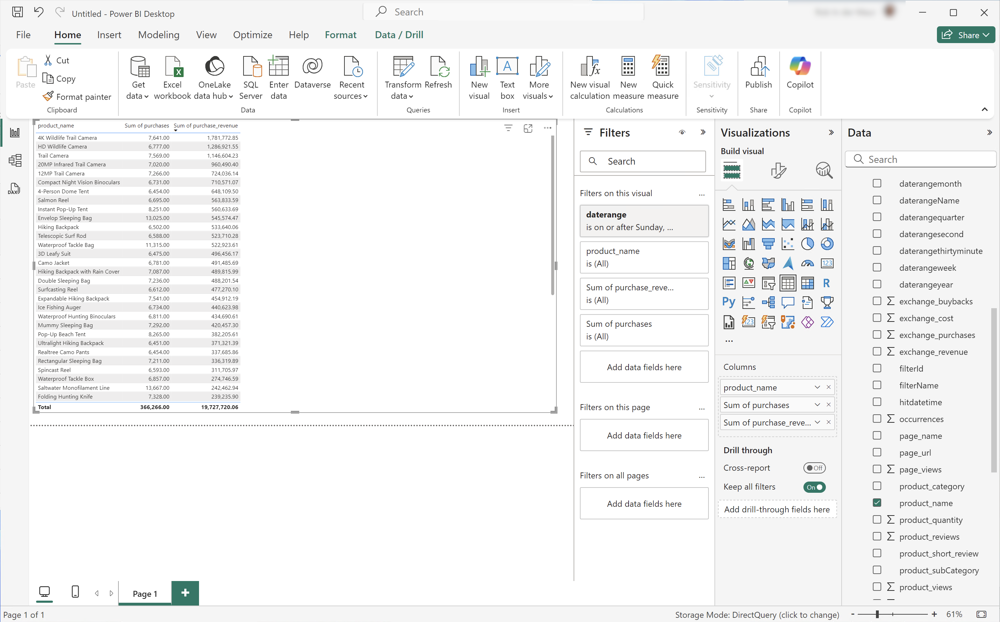
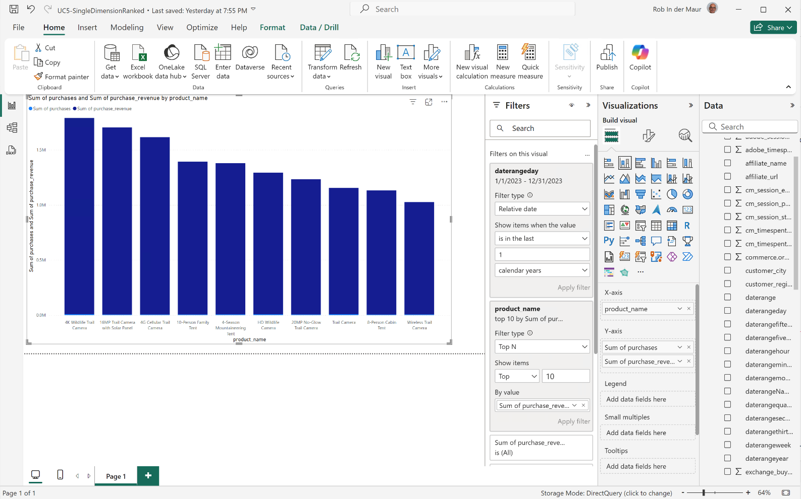
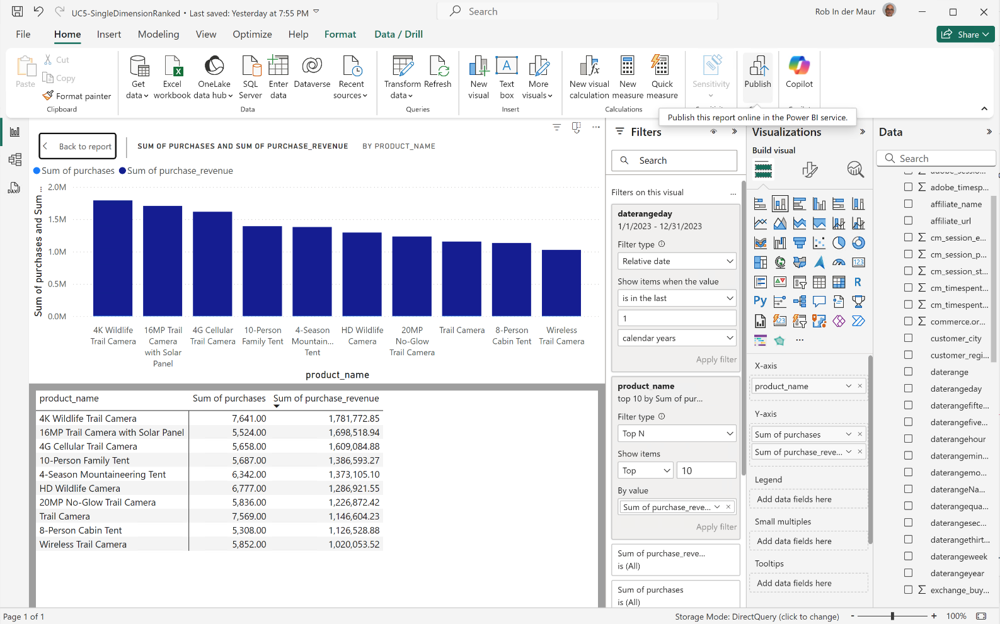
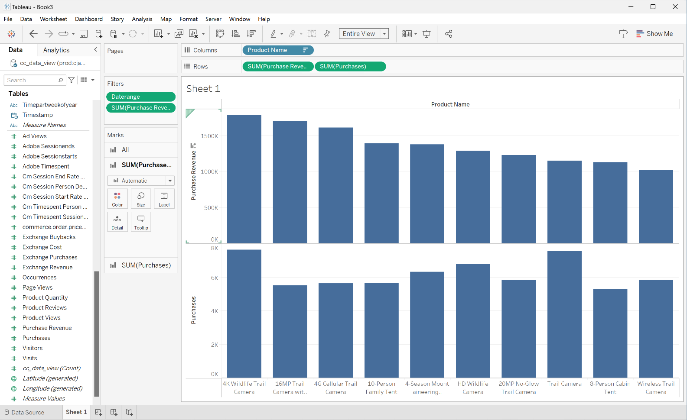
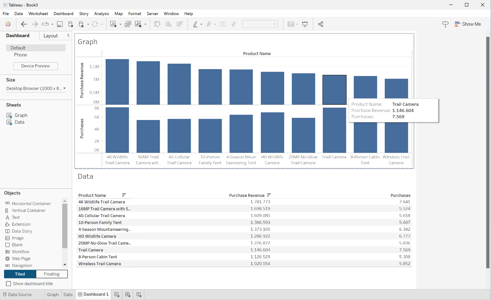
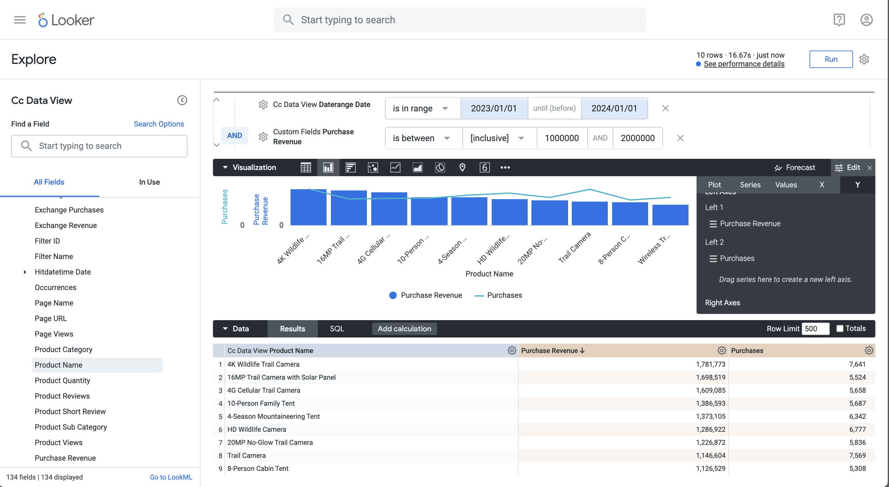

# Single dimension ranked


In this use case, you want to display a table and simple bar visualization that shows the purchases and purchases revenue for product names over 2023.

+++ Customer Journey Analytics

An example **[!UICONTROL Single Dimension Ranked]** panel for the use case:


+++

+++ BI tools

>[!PREREQUISITES]
>
>Ensure you have validated [a successful connection, can list data views, and use a data view](connect-and-validate.md) for the BI tool for which you want to try out this use case. 
>

>[!BEGINTABS]

>[!TAB Power BI Desktop] 

1. In the **[!UICONTROL Data]** pane:
   1. Select **[!UICONTROL daterange]**.
   1. Select **[!UICONTROL product_name]**.
   1. Select **[!UICONTROL sum purchase_revenue]**.
   1. Select **[!UICONTROL sum purchases]**.
   
   You see an empty table displaying only the column headers for the selected element. For better visibility, enlarge the visualization.

1. In the **[!UICONTROL Filters]** pane:

   1. Select the **[!UICONTROL daterange is (All)]** from **[!UICONTROL Filters on this visual]**.
   1. Select **[!UICONTROL Relative date]** as the **[!UICONTROL Filter type]**.
   1. Define the filter to **[!UICONTROL Show items when the value]** **[!UICONTROL is in the last]** `1` **[!UICONTROL calendar years]**.
   1. Select **[!UICONTROL Apply filter]**.
   
   You see the table updated with the applied **[!UICONTROL daterange]** filter.

1. In the **[!UICONTROL Visualization]** pane:

   1. Use  to remove **[!UICONTROL daterange]** from **[!UICONTROL Columns]**.
   1. Drag and drop **[!UICONTROL Sum of purchases_revenue]** underneath **[!UICONTROL Sum of purchases]** in **[!UICONTROL Columns]**.

1. On the Table visualization:
   
   1. Select **[!UICONTROL Sum of purchase_revenue]** to sort the product names in descending purchase revenue order. Your Power BI Desktop should look like below.
   
   

1. In the **[!UICONTROL Filters]** pane:

   1. Select **[!UICONTROL product_name is (All)]**.
   1. Set **[!UICONTROL Filter type]** to **[!UICONTROL Top N]**.
   1. Define the filter to **[!UICONTROL Show items]** **[!UICONTROL Top]** `10` **[!UICONTROL By value]**.
   1. Drag and drop **[!UICONTROL purchase_revenue]** into **[!UICONTROL By value]** **[!UICONTROL Add data fields here]**.
   1. Select **[!UICONTROL Apply filter]**.

   You see the table updated with values for purchase revenue in sync with the Freeform table visualization in Analysis Workspace.

1. In the **[!UICONTROL Visualizations]** pane:

   1. Select the **[!UICONTROL Line and stacked column chart]** visualization. 

   A line and stacked column chart visualization replaces the table while using the same data as the table.

1. Drag and drop **[!UICONTROL purchases]** onto **[!UICONTROL Line y-axis]** in the **[!UICONTROL Visualizations]** pane.

   The line and stacked column chart is updated. Your Power BI Desktop should look like below.

   

1. On the Line and stacked column chart visualization:

   1. Select .
   1. From the context menu, select **[!UICONTROL Show as a table]**.

   The main view is updated to show both a line visualization and a table.

   

>[!TAB Tableau Desktop]

1. Select the **[!UICONTROL Sheet 1]** tab at the bottom to switch from **[!UICONTROL Data source]**. In the **[!UICONTROL Sheet 1]** view:
   1. Drag the **[!UICONTROL Daterange]** entry from the **[!UICONTROL Tables]** list in the **[!UICONTROL Data]** pane and drop the entry onto the **[!UICONTROL Filters]** shelf.
   1. In the **[!UICONTROL Filters Field \[Daterange\]]** dialog, select **[!UICONTROL Range of Dates]** and select **[!UICONTROL Next >]**.
   1. In the **[!UICONTROL Filter \[Daterange\]]** dialog, select **[!UICONTROL Range of dates]** and specify a period of `01/01/2023` - `31/12/2023`. Select **[!UICONTROL Apply]** and **[!UICONTROL OK]**.

      

   1. Drag and drop **[!UICONTROL Product Name]** from the **[!UICONTROL Tables]** list in the **[!UICONTROL Data]** pane and drop the entry in the field next to **[!UICONTROL Rows]**.
   1. Drag and drop **[!UICONTROL Purchases]** from the **[!UICONTROL Tables (*Measure Names*)]** list in the **[!UICONTROL Data]** pane and drop the entry in the field next to **[!UICONTROL Rows]**. The value is automatically converted to **[!UICONTROL SUM(Purchases)]**.
   1. Drag and drop **[!UICONTROL Purchase Revenue]** from the **[!UICONTROL Tables (*Measure Names*)]** list in the **[!UICONTROL Data]** pane and drop the entry in the field next to **[!UICONTROL Columns]** and left from **[!UICONTROL SUM(Purchases)]**. The value is automatically converted to **[!UICONTROL SUM(Purchase Revenue)]**.
   1. To order both charts in descending purchase revenue order, hover over the **[!UICONTROL Purchase Revenue]** title and select the sort icon.
   1. To limit the number of entries in the charts, select **[!UICONTROL SUM(Purchase Revenue)]** in **[!UICONTROL Rows]** and from the drop-down menu select **[!UICONTROL Filter]**.
   1. In the **[!UICONTROL Filter \[Purchase Revenue\]]** dialog select **[!UICONTROL Range of values]** and enter appropriate values. For example: `1,000,000` - `2,000,000`. Select **[!UICONTROL Apply]** and **[!UICONTROL OK]**.
   1. To convert the two bar charts to a dual combination chart, select **[!UICONTROL SUM(Purchases)]** in **[!UICONTROL Rows]** and from the drop-down menu, select **[!UICONTROL Dual Axis]**. The bar charts transform into a scatter plot.
   1. To modify the scatter plot to a bar chart:
      1. Select **[!UICONTROL SUM(Purchases)]** in the **[!UICONTROL Marks]** area and select **[!UICONTROL Line]** from the drop-down menu.
      1. Select **[!UICONTROL SUM(Purchase Revenue)]** in the **[!UICONTROL Marks]** area and select **[!UICONTROL Bar]** from the drop-down menu.

   Your Tableau Desktop should look like below.

   

1. Select **[!UICONTROL Duplicate]** from the **[!UICONTROL Sheet 1]** tab context menu to create a second sheet.
1. Select **[!UICONTROL Rename]** from the **[!UICONTROL Sheet 1]** tab context menu to rename the sheet to `Data`.
1. Select **[!UICONTROL Rename]** from the **[!UICONTROL Sheet 1 (2)]** tab context menu to rename the sheet to `Graph`.
1. Ensure that the **[!UICONTROL Data]** sheet is selected.
   1. Select **[!UICONTROL Show me]** at the top right and select **[!UICONTROL Text table]** (upper left top visualization) to modify the content of the two charts to a table.
   1. To order purchase revenue in descending order, hover over **[!UICONTROL Purchase Revenue]** in the table and select .
   1. Select **[!UICONTROL Entire View]** from the **[!UICONTROL Fit]** drop-down menu.

   Your Tableau Desktop should look like below.

   

1. Select **[!UICONTROL New Dashboard]** tab button (at the bottom) to create a new **[!UICONTROL Dashboard 1]** view. In the **[!UICONTROL Dashboard 1]** view:
   1. Drag and drop the **[!UICONTROL Graph]** sheet from the **[!UICONTROL Sheets]** shelf onto the **[!UICONTROL Dashboard 1]** view that reads *Drop sheets here*.
   1. Drag and drop the **[!UICONTROL Data]** sheet from the **[!UICONTROL Sheets]** shelf below the **[!UICONTROL Graph]** sheet onto the **[!UICONTROL Dashboard 1]** view.
   1. Select the **[!UICONTROL Data]** sheet in the view and modify **[!UICONTROL Entire View]** to **[!UICONTROL Fix Width]**.

   Your **[!UICONTROL Dashboard 1]** view should look like below.

   


>[!TAB Looker]

1. In the **[!UICONTROL Explore]** interface of Looker, ensure you do have a clean setup. If not, select  **[!UICONTROL Remove fields and filters]**.
1. Select **[!UICONTROL + Filter]** underneath **[!UICONTROL Filters]**.
1. In the **[!UICONTROL Add Filter]** dialog:
   1. Select **[!UICONTROL ‣ Cc Data View]**
   1. From the list of fields, select **[!UICONTROL ‣ Daterange Date]** then **[!UICONTROL Daterange Date]**.
      
1. Specify the **[!UICONTROL Cc Data View Daterange Date]** filter as **[!UICONTROL is in range]** **[!UICONTROL 2023/01/01]** **[!UICONTROL until (before)]** **[!UICONTROL 2024/01/01]**.
1. From the **[!UICONTROL ‣ Cc Data View]** section in the left rail, select **[!UICONTROL Product Name]**.
1. From the **[!UICONTROL ‣ Custom Fields]** section in the left rail:
   1. Select **[!UICONTROL Custom Measure]** from the **[!UICONTROL + Add]** drop-down menu. 
   1. In the **[!UICONTROL Create custom measure]** dialog:
      1. Select **[!UICONTROL Purchase Revenue]** from the **[!UICONTROL Field to measure]** drop-down menu.
      1. Select **[!UICONTROL Sum]** from the **[!UICONTROL Measure type]** drop-down menu.
      1. Enter a custom field name for **[!UICONTROL Name]**. For example: `Purchase Revenue`.
      1. Select the **[!UICONTROL Field details]** tab.
      1. Select **[!UICONTROL Decimals]** from the **[!UICONTROL Format]** drop-down menu and ensure `0` is entered in **[!UICONTROL Decimals]**.
         
      1. Select **[!UICONTROL Save]**.
   1. Select **[!UICONTROL Custom Measure]** once more from the **[!UICONTROL + Add]** drop-down menu. In the **[!UICONTROL Create custom]** measure dialog:
      1. Select **[!UICONTROL Purchases]** from the **[!UICONTROL Field to measure]** drop-down menu.
      1. Select **[!UICONTROL Sum]** from the **[!UICONTROL Measure type]** drop-down menu.
      1. Enter a custom field name for **[!UICONTROL Name]**. For example: `Sum of Purchases`.
      1. Select the **[!UICONTROL Field details]** tab.
      1. Select **[!UICONTROL Decimals]** from the **[!UICONTROL Format]** drop-down menu and ensure `0` is entered in **[!UICONTROL Decimals]**.
      1. Select **[!UICONTROL Save]**.
   1. Both fields are automatically added to the Data view. 
1. Select **[!UICONTROL + Filter]** to add another **[!UICONTROL Filters]** and to limit the data.
1. In the **[!UICONTROL Add Filter]** dialog, select **[!UICONTROL ‣ Custom Fields]**, then **[!UICONTROL Purchase Revenue]**.
1. Make the appropriate selections and enter the proposed values, so the filter reads **[!UICONTROL is between inclusive]** `1000000` **[!UICONTROL AND]** `2000000`.
1. Select **[!UICONTROL Run]**.
1. Select **[!UICONTROL ‣ Visualization]** to display the line visualization.
1. Select **[!UICONTROL Edit]** in **[!UICONTROL Visualization]** to update the visualization. In the popup dialog:
   1. Select the **[!UICONTROL Series]** tab.
   1. Scroll down to see **[!UICONTROL Purchases]** and change the **[!UICONTROL Type]** to **[!UICONTROL Line]**.
   1. Select the **[!UICONTROL Y]** tab.
   1. Drag **[!UICONTROL Purchases]** from the **[!UICONTROL Left 1 ]** container to where it reads **[!UICONTROL *Drag series here to create a new left axis*]**. This action creates a **[!UICONTROL Left 2]** container.
      
   1. Select  next to **[!UICONTROL Edit]** to hide the popup dialog

You should see a visualization and table similar as shown below.


>[!TAB Jupyter Notebook]

1. Enter the following statements in a new cell.

   ```
   import seaborn as sns
   import matplotlib.pyplot as plt
   data = %sql SELECT product_name AS `Product Name`, SUM(purchase_revenue) AS `Purchase Revenue`, SUM(purchases) AS `Purchases` \
               FROM cc_data_view \
               WHERE daterange BETWEEN '2023-01-01' AND '2024-01-01' \
               GROUP BY 1 \
               LIMIT 10;
   df = data.DataFrame()
   df = df.groupby('Product Name', as_index=False).sum()
   plt.figure(figsize=(15, 3))
   sns.barplot(x='Purchase Revenue', y='Product Name', data=df)
   plt.show()
   display(data)
   ```

1. Execute the cell. You should see output similar to the screenshot below.

   


>[!TAB RStudio]

1. Enter the following statements between ` ```{r} ` and ` ``` ` in a new chunk.

   ```R
   library(tidyr)

   ## Single dimension ranked
   df <- dv %>%
      filter(daterange >= "2023-01-01" & daterange < "2024-01-01") %>%
      group_by(product_name) %>%
      summarise(purchase_revenue = sum(purchase_revenue), purchases = sum(purchases)) %>%
      arrange(product_name, .by_group = FALSE)
   dfV <- df %>%
      head(5)
   ggplot(dfV, aes(x = purchase_revenue, y = product_name)) +
      geom_col(position = "dodge") +
      geom_text(aes(label = purchase_revenue), vjust = -0.5)
   print(df)
   ```

1. Run the chunk. You should see output similar to the screenshot below.

   

>[!ENDTABS]

+++
