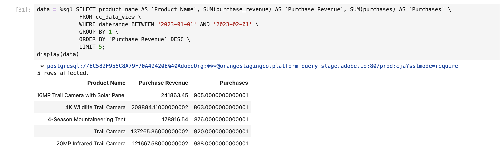

# Sort


In this use case, you want to report on purchase revenue and purchases for product names during January 2023, sorted in descending purchase revenue order.

+++ Customer Journey Analytics

An example **[!UICONTROL Sort]** panel for the use case:


+++

+++ BI tools

>[!PREREQUISITES]
>
>Ensure you have validated [a successful connection, can list data views, and use a data view](connect-and-validate) for the BI tool for which you want to try out this use case. 
>

>[!BEGINTABS]

>[!TAB Power BI Desktop] 

1. In the **[!UICONTROL Data]** pane:
   1. Select **[!UICONTROL daterange]**.
   1. Select **[!UICONTROL product_namr]**.
   1. Select **[!UICONTROL sum purchase_revenue]**.
   1. Select **[!UICONTROL sum purchases]**.

1. In the **[!UICONTROL Filters]** pane:
   1. Select **[!UICONTROL daterange is (All)]** from **[!UICONTROL Filters on this visual]**.
   1. Select **[!UICONTROL Advanced filtering]** as the **[!UICONTROL Filter type]**.
   1. Define the filter to **[!UICONTROL Show items when the value]** **[!UICONTROL is on or after]** `1/1/2023` **[!UICONTROL And]** **[!UICONTROL is before]** `2/1/2023`.

1. In the Visualizations pane:
   1. Select  to remove daterange from Columns.
   1. Drag **[!UICONTROL Sum of purchase_revenue]** to the bottom of **[!UICONTROL Column]** items.

1. In the report, select **[!UICONTROL Sum of purchase_revenue]** to sort the table in descending order of purchase revenue.

   Your Power BI Desktop should look like below.

   

The query executed by Power BI Desktop using the BI extension is not including a `sort` statement. The lack of a `sort` statement implies that the sort is executed client side.

```sql
select "_"."product_name",
    "_"."a0",
    "_"."a1"
from 
(
    select "rows"."product_name" as "product_name",
        sum("rows"."purchases") as "a0",
        sum("rows"."purchase_revenue") as "a1"
    from 
    (
        select "_"."daterangeName",
            "_"."daterange",
            "_"."filterId",
            "_"."filterName",
            "_"."timestamp",
            "_"."affiliate_name",
            "_"."affiliate_url",
            "_"."commerce.order.priceTotal",
            "_"."customer_city",
            "_"."customer_region",
            "_"."daterangeday",
            "_"."daterangefifteenminute",
            "_"."daterangefiveminute",
            "_"."daterangehour",
            "_"."daterangeminute",
            "_"."daterangemonth",
            "_"."daterangequarter",
            "_"."daterangesecond",
            "_"."daterangethirtyminute",
            "_"."daterangeweek",
            "_"."daterangeyear",
            "_"."hitdatetime",
            "_"."page_name",
            "_"."page_url",
            "_"."product_category",
            "_"."product_name",
            "_"."product_short_review",
            "_"."product_subCategory",
            "_"."referrer_url",
            "_"."search_engine",
            "_"."search_keywords",
            "_"."store_city",
            "_"."store_name",
            "_"."store_region",
            "_"."store_type",
            "_"."timepartdayofmonth",
            "_"."timepartdayofweek",
            "_"."timepartdayofyear",
            "_"."timeparthourofday",
            "_"."timepartminuteofhour",
            "_"."timepartmonthofyear",
            "_"."timepartquarterofyear",
            "_"."timepartweekofyear",
            "_"."cm_session_end_rate_defaultmetric",
            "_"."cm_session_person_defaultmetric",
            "_"."cm_session_start_rate_defaultmetric",
            "_"."cm_timespent_person_defaultmetric",
            "_"."cm_timespent_session_defaultmetric",
            "_"."cm_product_name_count_distinct",
            "_"."ad_views",
            "_"."adobe_sessionends",
            "_"."adobe_sessionstarts",
            "_"."adobe_timespent",
            "_"."exchange_buybacks",
            "_"."exchange_cost",
            "_"."exchange_purchases",
            "_"."exchange_revenue",
            "_"."occurrences",
            "_"."page_views",
            "_"."product_quantity",
            "_"."product_reviews",
            "_"."product_views",
            "_"."purchase_revenue",
            "_"."purchases",
            "_"."visitors",
            "_"."visits"
        from "public"."cc_data_view" "_"
        where "_"."daterange" < date '2023-02-01' and "_"."daterange" >= date '2023-01-01'
    ) "rows"
    group by "product_name"
) "_"
where not "_"."a0" is null or not "_"."a1" is null
limit 1000001
```


>[!TAB Tableau Desktop] 

1. Select the **[!UICONTROL Sheet 1]** tab at the bottom to switch from **[!UICONTROL Data source]**. In the **[!UICONTROL Sheet 1]** view:
   1. Drag **[!UICONTROL Daterange]** entry from the **[!UICONTROL Tables]** list in the **[!UICONTROL Filters]** shelf.
   1. In the **[!UICONTROL Filter Field \[Daterange\]]** dialog, select **[!UICONTROL Range of Dates]** and select **[!UICONTROL Next >]**.
   1. In the **[!UICONTROL Filter \[Daterange\]]** dialog, select **[!UICONTROL Range of dates]**, and select `01/01/2023` - `1/2/2023`. Select **[!UICONTROL Apply]** and **[!UICONTROL OK]**.
   1. Drag **[!UICONTROL Product Name]** from the **[!UICONTROL Tables]** list and drop the entry in the field next to **[!UICONTROL Rows]**.
   1. Drag **[!UICONTROL Purchases]** entry from the **[!UICONTROL Tables]** list and drop the entry in the field next to **[!UICONTROL Columns]**. The value changes to **[!UICONTROL SUM(Purchases)]**.
   1. Drag **[!UICONTROL Purchase Revenue]** entry from the **[!UICONTROL Tables]** list and drop the entry in the field next to **[!UICONTROL Columns]**, next to **[!UICONTROL SUM(Purchases)]**. The value changes to **[!UICONTROL SUM(Purchase Revenue)]**.
   1. Select **[!UICONTROL Text Table]** from **[!UICONTROL Show Me]**.
   1. Select **[!UICONTROL Fit Width]** from the **[!UICONTROL Fit]** drop-down menu.
   1. Select the **[!UICONTROL Purchase Revenue]** column header and sort the table on this column in descending order.

      Your Tableau Desktop should look like below.

         

The query executed by Tableau Desktop using the BI extension is not including a `sort` statement. The lack of this `sort` statement implies that the sort is executed client side.

```sql
SELECT CAST("cc_data_view"."product_name" AS TEXT) AS "product_name",
  SUM("cc_data_view"."occurrences") AS "sum:occurrences:ok",
  SUM("cc_data_view"."purchase_revenue") AS "sum:purchase_revenue:ok",
  SUM("cc_data_view"."purchases") AS "sum:purchases:ok"
FROM "public"."cc_data_view" "cc_data_view"
WHERE (("cc_data_view"."daterange" >= (DATE '2023-01-01')) AND ("cc_data_view"."daterange" <= (DATE '2023-02-01')))
GROUP BY 1
```

>[!TAB Looker]

1. In the **[!UICONTROL Explore]** interface of Looker, refresh your connection. Select  **[!UICONTROL Clear cache and refresh]**.
1. In the **[!UICONTROL Explore]** interface of Looker, ensure you do have a clean setup. If not, select  **[!UICONTROL Remove fields and filters]**.
1. Select **[!UICONTROL + Filter]** underneath **[!UICONTROL Filters]**.
1. In the **[!UICONTROL Add Filter]** dialog:
   1. Select **[!UICONTROL ‣ Cc Data View]**
   1. From the list of fields, select **[!UICONTROL ‣ Daterange Date]** then **[!UICONTROL Daterange Date]**.
      
1. Specify the **[!UICONTROL Cc Data View Daterange Date]** filter as **[!UICONTROL is in range]** **[!UICONTROL 2023/01/01]** **[!UICONTROL until (before)]** **[!UICONTROL 2023/02/01]**.
1. From the **[!UICONTROL ‣ Cc Data View]** section in the left rail, select **[!UICONTROL Product Name]**.
1. From the **[!UICONTROL ‣ Custom Fields]** section in the left rail:
   1. Select **[!UICONTROL Custom Measure]** from the **[!UICONTROL + Add]** drop-down menu. 
   1. In the **[!UICONTROL Create custom measure]** dialog:
      1. Select **[!UICONTROL Purchase Revenue]** from the **[!UICONTROL Field to measure]** drop-down menu.
      1. Select **[!UICONTROL Sum]** from the **[!UICONTROL Measure type]** drop-down menu.
      1. Enter a custom field name for **[!UICONTROL Name]**. For example: `Sum of Purchase Revenue`.
      1. Select the **[!UICONTROL Field details]** tab.
      1. Select **[!UICONTROL Decimals]** from the **[!UICONTROL Format]** drop-down menu and ensure `0` is entered in **[!UICONTROL Decimals]**.
         
      1. Select **[!UICONTROL Save]**.
1. Ensure you select **[!UICONTROL ↓]** (**[!UICONTROL Descending, Sort Order: 1]**) on the **[!UICONTROL Purchase Revenue]** column.
1. Select **[!UICONTROL Run]**.
1. Select **[!UICONTROL ‣ Visualization]**.

You should see a visualization and table similar as shown below.


The query generated by Looker using the BI extension is including `ORDER BY`, which implies that the sort is executed through Looker and the BI extension.

```sql
-- Looker Query Context '{"user_id":6,"history_slug":"fc83573987b999306eaf6e1a3f2cde70","instance_slug":"71d4667f0b76c0011463658f45c3f7a3"}' 
SELECT
    cc_data_view."product_name"  AS "cc_data_view.product_name",
    COALESCE(SUM(CAST(( cc_data_view."purchase_revenue"  ) AS DOUBLE PRECISION)), 0) AS "purchase_revenue"
FROM
    "public"."cc_data_view" AS "cc_data_view"
WHERE ((( cc_data_view."daterange"  ) >= (DATE_TRUNC('day', DATE '2024-01-31')) AND ( cc_data_view."daterange"  ) < (DATE_TRUNC('day', DATE '2023-02-01'))))
GROUP BY
    1
ORDER BY
    2 DESC
FETCH NEXT 500 ROWS ONLY

```


>[!TAB Jupyter Notebook]

1. Enter the following statements in a new cell.

   ```python
   data = %sql SELECT product_name AS `Product Name`, SUM(purchase_revenue) AS `Purchase Revenue`, SUM(purchases) AS `Purchases` \
               FROM cc_data_view \
               WHERE daterange BETWEEN '2023-01-01' AND '2023-02-01' \
               GROUP BY 1 \
               ORDER BY `Purchase Revenue` DESC \
               LIMIT 5;
   display(data)
   ```

1. Execute the cell. You should see output similar to the screenshot below.

   

The query is excuted by the BI extension as defined in Jupyter Notebook.


>[!TAB RStudio]

1. Enter the following statements between ` ```{r} ` and ` ``` ` in a new chunk.

   ```R
   ## Dimension 1 Sorted
   df <- dv %>%
      filter(daterange >= "2023-01-01" & daterange < "2023-02-01") %>%
      group_by(product_name) %>%
      summarise(purchase_revenue = sum(purchase_revenue), purchases = sum(purchases), .groups = "keep") %>%
      arrange(desc(purchase_revenue), .by_group = FALSE)
   print(df)
   ```

1. Run the chunk. You should see output similar to the screenshot below.

   

The query generated by RStudio using the BI extension is including `ORDER BY`, which implies that the order is applied through RStudio and the BI extension.

```sql
SELECT
  "product_name",
  SUM("purchase_revenue") AS "purchase_revenue",
  SUM("purchases") AS "purchases"
FROM (
  SELECT "cc_data_view".*
  FROM "cc_data_view"
  WHERE ("daterange" >= '2023-01-01' AND "daterange" < '2023-02-01')
) AS "q01"
GROUP BY "product_name"
ORDER BY "purchase_revenue" DESC
LIMIT 1000
```

>[!ENDTABS]

+++
