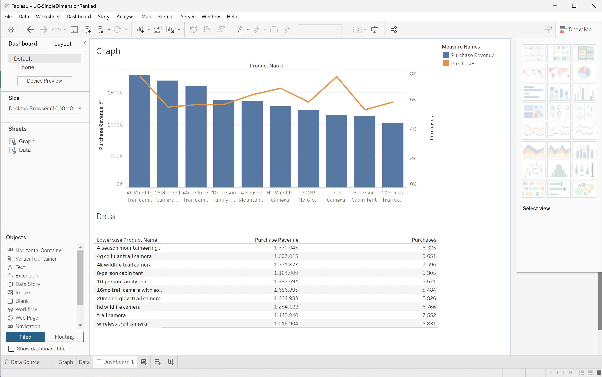
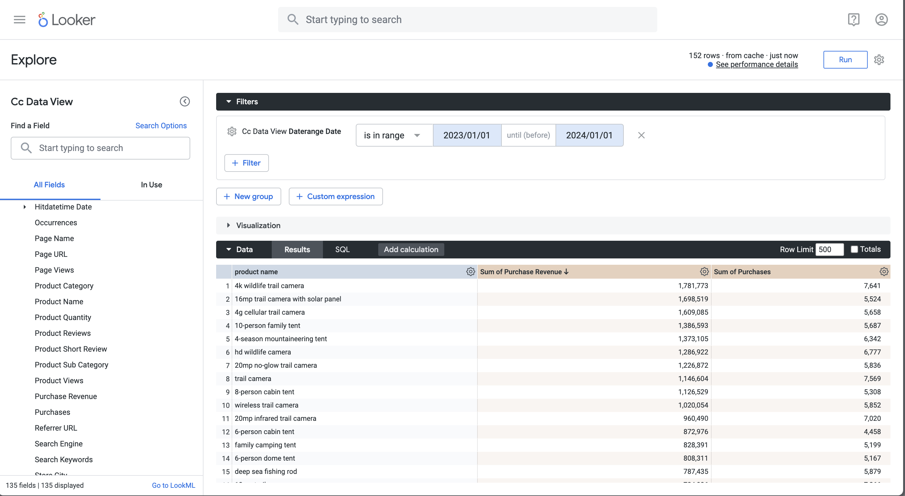

# Transformations


You want to understand the transformations of Customer Journey Analytics objects like dimensions, metrics, filters, calculated metrics, and date ranges by the various BI tools.

+++ Customer Journey Analytics

In Customer Journey Analytics, you define in a [data view](/help/data-views/data-views.md), which and how components of your datasets are exposed as [dimensions](/help/components/dimensions/overview.md) and [metrics](/help/components/apply-create-metrics.md). That definition of dimension and metrics is exposed to the BI tools using the BI extension. 
You use components like [Filters](/help/components/segments/seg-overview.md), [Calculated metrics](/help/components/calc-metrics/calc-metr-overview.md), and [Date ranges](/help/components/date-ranges/overview.md) as part of your Workspace projects. These components are also exposed to the BI tools using the BI extension.

+++

+++ BI tools

>[!PREREQUISITES]
>
>Ensure you have validated [a successful connection, can list data views, and use a data view](connect-and-validate.md) for the BI tool for which you want to try out this use case. 
>

>[!BEGINTABS]

>[!TAB Power BI Desktop] 

The Customer Journey Analytics objects are available in the **[!UICONTROL Data]** pane and are retrieved from the table you have selected in Power BI Desktop. For example, **[!UICONTROL public.cc_data_view]**. The name of the table is the same as the External ID that you have defined for your data view in Customer Journey Analytics. For example, data view with **[!UICONTROL Title]** `C&C - Data View` and **[!UICONTROL External ID]** `cc_data_view`.

**Dimensions**
Dimensions from Customer Journey Analytics are identified by the [!UICONTROL Component ID]. The [!UICONTROL Component ID] is defined in your Customer Journey Analytics data view. For example, dimension **[!UICONTROL Product Name]** in Customer Journey Analytics has a [!UICONTROL Component ID] **[!UICONTROL product_name]**, which is the name for the dimension in Power BI Desktop.
Date range dimensions from Customer Journey Analytics, like **[!UICONTROL Day]**, **[!UICONTROL Week]**, **[!UICONTROL Month]**, and more are available as **[!UICONTROL daterangeday]**, **[!UICONTROL daterangeweek]**, **[!UICONTROL daterangemonth]**, and more.

**Metrics**
Metrics from Customer Journey Analytics are identified by the [!UICONTROL Component ID]. The [!UICONTROL Component ID] is defined in your Customer Journey Analytics data view. For example, metric **[!UICONTROL Purchase Revenue]** in Customer Journey Analytics has a [!UICONTROL Component ID] **[!UICONTROL purchase_revenue]**, which is the name for the metric in Power BI Desktop. A **[!UICONTROL ∑]** indicates metrics. When you use a metric in any visualization, the metric is renamed to **[!UICONTROL Sum of *metric*]**.

**Filters**
Filters that you define in Customer Journey Analytics are available as part of the **[!UICONTROL filterName]** field. When you use a **[!UICONTROL filterName]** field in Power BI Desktop, you can specify which filter to use.

**Calculated metrics**
Calculated metrics that you define in Customer Journey Analytics are identified by the [!UICONTROL External ID] you have defined for the calculated metric. For example, calculated metric **[!UICONTROL Product Name (Count Distinct)]** has [!UICONTROL External ID] **[!UICONTROL product_name_count_distinct]** and is shown as **[!UICONTROL cm_product_name_count_distinc]**t in Power BI Desktop.

**Date ranges**
Date ranges that you define in Customer Journey Analytics are available as part of the **[!UICONTROL daterangeName]** field. When you use a **[!UICONTROL daterangeName]** field, you can specify which date range to use.

**Custom transformations**
Power BI Desktop provides custom transformation functionality using [Data Analysis Expressions (DAX)](https://learn.microsoft.com/en-us/dax/dax-overview). As an example, you want to execute the [Single dimension ranked](#single-dimension-ranked) use case with product names in lower case.

1. In the report view, select the bar visualization.
1. Select **[!UICONTROL product_name]** in the Data pane.
1. Select **[!UICONTROL New column]** in the toolbar.
1. In the formula editor, define a new column named `product_name_lower`, like `product_name_lower = LOWER('public.cc_data_view[product_name])`.
   
1. Ensure you select the new **[!UICONTROL product_name_lower]** column in the **[!UICONTROL Data]** pane instead of the **[!UICONTROL product_name]** column.
1. Select **[!UICONTROL Report as Table]** from  in the table visualization.

   Your Power BI Desktop should look like below. 
   

The custom transformation result in an update to SQL queries. See the use of the `lower` function in the SQL example below:

```sql
select "_"."product_name_lower",
    "_"."a0",
    "_"."a1"
from 
(
    select "rows"."product_name_lower" as "product_name_lower",
        sum("rows"."purchases") as "a0",
        sum("rows"."purchase_revenue") as "a1"
    from 
    (
        select "_"."daterange" as "daterange",
            "_"."product_name" as "product_name",
            "_"."purchase_revenue" as "purchase_revenue",
            "_"."purchases" as "purchases",
            lower("_"."product_name") as "product_name_lower"
        from 
        (
            select "_"."daterange",
                "_"."product_name",
                "_"."purchase_revenue",
                "_"."purchases"
            from 
            (
                select "daterange",
                    "product_name",
                    "purchase_revenue",
                    "purchases"
                from "public"."cc_data_view" "$Table"
            ) "_"
            where ("_"."daterange" < date '2024-01-01' and "_"."daterange" >= date '2023-01-01') and ("_"."product_name" in ('4G Cellular Trail Camera', '4K Wildlife Trail Camera', 'Wireless Trail Camera', '8-Person Cabin Tent', '20MP No-Glow Trail Camera', 'HD Wildlife Camera', '4-Season Mountaineering Tent', 'Trail Camera', '16MP Trail Camera with Solar Panel', '10-Person Family Tent'))
        ) "_"
    ) "rows"
    group by "product_name_lower"
) "_"
where not "_"."a0" is null or not "_"."a1" is null
limit 1000001

```

>[!TAB Tableau Desktop] 

The Customer Journey Analytics objects are available in the **[!UICONTROL Data]** side bar whenever you work in a sheet. And are retrieved from the table that you have selected as part of the **[!UICONTROL Data source]** page in Tableau. For example, **[!UICONTROL cc_data_view]**. The name of the table is the same as the External ID that you have defined for your data view in Customer Journey Analytics. For example, data view with **[!UICONTROL Title]** `C&C - Data View` and **[!UICONTROL External ID]** `cc_data_view`.

**Dimensions**
Dimensions from Customer Journey Analytics are identified by the [!UICONTROL Component name]. The [!UICONTROL Component name] is defined in your Customer Journey Analytics data view. For example, dimension **[!UICONTROL Product Name]** in Customer Journey Analytics has a [!UICONTROL Component name] **[!UICONTROL Product Name]**, which is the name for the dimension in Tableau. All dimensions are identified by **[!UICONTROL Abc]**.
Date range dimensions from Customer Journey Analytics, like **[!UICONTROL Day]**, **[!UICONTROL Week]**, **[!UICONTROL Month]**, and more are available as **[!UICONTROL Daterangeday]**, **[!UICONTROL Daterangeweek]**, **[!UICONTROL Daterangemonth]**, and more. When you use a date range dimension, you have to select an appropriate definition of date or time to apply to that date range dimension from the drop-down menu. For example, **[!UICONTROL Year]**, **[!UICONTROL Quarter]**, **[!UICONTROL Month]**, **[!UICONTROL Day]**.

**Metrics**
Metrics from Customer Journey Analytics are identified by the [!UICONTROL Component Name]. The [!UICONTROL Component Name] is defined in your Customer Journey Analytics data view. For example, metric **[!UICONTROL Purchase Revenue]** in Customer Journey Analytics has a [!UICONTROL Component Name] **[!UICONTROL Purchase Revenue]**, which is the name for the metric in Tableau. All metrics are identified by **[!UICONTROL #]**. When you use a metric in any visualization, the metric is renamed to **[!UICONTROL Sum(*metric*)]**.

**Filters**
Filters that you define in Customer Journey Analytics are available as part of the **[!UICONTROL Filter Name]** field. When you use a **[!UICONTROL Filter Name]** field in Tableau, you can specify which filter to use.

**Calculated metrics**
Calculated metrics that you define in Customer Journey Analytics are identified by the [!UICONTROL Title] you have defined for the calculated metric. For example, calculated metric **[!UICONTROL Product Name (Count Distinct)]** has [!UICONTROL Title] **[!UICONTROL Product Name (Count Distinct)]** and is shown as **[!UICONTROL Cm Product Name Count Distinct]** in Tableau.

**Date ranges**
Date ranges that you define in Customer Journey Analytics are available as part of the **[!UICONTROL Daterange Name]** field. When you use a **[!UICONTROL Daterange Name]** field, you can specify which date range to use.

**Custom transformations**
Tableau Desktop provides custom transformation functionality using [Calculated Fields](https://help.tableau.com/current/pro/desktop/en-us/calculations_calculatedfields_create.htm). As an example, you want to execute the [Single dimension ranked](#single-dimension-ranked) use case with product names in lower case.

1. Select **[!UICONTROL Analysis]** > **[!UICONTROL Create Calculated Field]** from the main menu.
   1. Define **[!UICONTROL Lowercase Product Name]** using the function `LOWER([Product Name])`.
      
   1. Select **[!UICONTROL OK]**.
1. Select the **[!UICONTROL Data]** sheet.
   1. Drag **[!UICONTROL Lowercase Product Name]** from **[!UICONTROL Tables]** and drop the entry in the field next to **[!UICONTROL Rows]**.
   1. Remove **[!UICONTROL Product Name]** from **[!UICONTROL Rows]**.
1. Select **[!UICONTROL Dashboard 1]** view.

Your Tableau Desktop should look like below.



The custom transformation result in an updates to SQL queries. See the use of the `LOWER` function in the SQL example below:

```sql
SELECT LOWER(CAST(CAST("cc_data_view"."product_name" AS TEXT) AS TEXT)) AS "Calculation_1562467608097775616",
  SUM("cc_data_view"."purchase_revenue") AS "sum:purchase_revenue:ok",
  SUM("cc_data_view"."purchases") AS "sum:purchases:ok"
FROM "public"."cc_data_view" "cc_data_view"
WHERE (("cc_data_view"."daterange" >= (DATE '2023-01-01')) AND ("cc_data_view"."daterange" <= (DATE '2023-12-31')))
GROUP BY 1
HAVING ((SUM("cc_data_view"."purchase_revenue") >= 999999.99999998999) AND (SUM("cc_data_view"."purchase_revenue") <= 2000000.00000002))
```

>[!TAB Looker]

The Customer Journey Analytics objects are available in the **[!UICONTROL Explore]** interface. And are retrieved as part of setting up your connection, project, and model in Looker. For example, **[!UICONTROL cc_data_view]**. The name of the view is the same as the External ID that you have defined for your data view in Customer Journey Analytics. For example, data view with **[!UICONTROL Title]** `C&C - Data View` and **[!UICONTROL External ID]** `cc_data_view`.

**Dimensions**
Dimensions from Customer Journey Analytics are listed as **[!UICONTROL DIMENSION]** in the **[!UICONTROL Cc Data View]** left rail. The dimension is defined in your Customer Journey Analytics data view. For example, dimension **[!UICONTROL Product Name]** in Customer Journey Analytics has a **[!UICONTROL DIMENSION]** **[!UICONTROL Product Name]**, which is the name for the dimension in Looker. 
Date range dimensions from Customer Journey Analytics, like **[!UICONTROL Day]**, **[!UICONTROL Week]**, **[!UICONTROL Month]**, and more are available as **[!UICONTROL Daterangeday Date]**, **[!UICONTROL Daterangeweek Date]**, **[!UICONTROL Daterangemonth Date]**, and more.  When you use a date range dimension, you have to select an appropriate definition of date or time. For example, **[!UICONTROL Year]**, **[!UICONTROL Quarter]**, **[!UICONTROL Month]**, **[!UICONTROL Date]**.

**Metrics**
Metrics from Customer Journey Analytics are listed as **[!UICONTROL DIMENSION]** in in the **[!UICONTROL Cc Data View]** left rail. For example, metric **[!UICONTROL Purchase Revenue]** in Customer Journey Analytics has a **[!UICONTROL DIMENSION]** **[!UICONTROL Purchase Revenue]**. To actually use as a metric, create a custom measure field as shown in the examples above, or use the shortcut on a dimension. For example, **[!UICONTROL ⋮]**, select **[!UICONTROL Aggregate]**, and then select **[!UICONTROL Sum]**..

**Filters**
Filters that you define in Customer Journey Analytics are available as part of the **[!UICONTROL Filter Name]** field. When you use a **[!UICONTROL Filter Name]** field in Looker, you can specify which filter to use.

**Calculated metrics**
Calculated metrics that you define in Customer Journey Analytics are identified by the [!UICONTROL Title] you have defined for the calculated metric. For example, calculated metric **[!UICONTROL Product Name (Count Distinct)]** has [!UICONTROL Title] **[!UICONTROL Product Name (Count Distinct)]** and is shown as **[!UICONTROL Cm Product Name Count Distinct]** in Looker.

**Date ranges**
Date ranges that you define in Customer Journey Analytics are available as part of the **[!UICONTROL Daterange Name]** field. When you use a **[!UICONTROL Daterange Name]** field, you can specify which date range to use.

**Custom transformations**
Looker provides custom transformation functionality using custom field builders, as shown above. As an example, you want to execute the [Single dimension ranked](#single-dimension-ranked) use case with product names in lower case.

1. From the **[!UICONTROL ‣ Custom Fields]** section in the left rail:
   1. Select **[!UICONTROL Custom Dimension]** from the **[!UICONTROL + Add]** drop-down menu. 
   1. Enter `lower(${cc_data_view.product_name})` in the **[!UICONTROL Expression]** text area. You are assisted with the correct syntax when you start to type `Product Name`.
      
   1. Enter `product name` as the **[!UICONTROL Name]**.
   1. Select **[!UICONTROL Save]**.

You should see a similar table as shown below.




The custom transformation result in an updates to SQL queries. See the use of the `LOWER` function in the SQL example below:

```sql
SELECT
    LOWER((cc_data_view."product_name")) AS "product_name",
    COALESCE(SUM(CAST(( cc_data_view."purchase_revenue"  ) AS DOUBLE PRECISION)), 0) AS "sum_of_purchase_revenue",
    COALESCE(SUM(CAST(( cc_data_view."purchases"  ) AS DOUBLE PRECISION)), 0) AS "sum_of_purchases"
FROM public.cc_data_view  AS cc_data_view
WHERE ((( cc_data_view."daterange"  ) >= (DATE_TRUNC('day', DATE '2023-01-01')) AND ( cc_data_view."daterange"  ) < (DATE_TRUNC('day', DATE '2024-01-01'))))
GROUP BY
    1
ORDER BY
    2 DESC
FETCH NEXT 500 ROWS ONLY
```

>[!TAB Jupyter Notebook]

The Customer Journey Analytics objects (dimensions, metrics, filters, calculated metrics, and date ranges) are available as part of the embedded SQL queries you construct. See earlier examples.

**Custom transformations**

1. Enter the following statements in a new cell.

   ```python
   data = %sql SELECT LOWER(product_category) AS `Product Category`, COUNT(*) AS EVENTS \
               FROM cc_data_view \
               WHERE daterange BETWEEN '2023-01-01' AND '2024-01-01' \
               GROUP BY 1 \
               ORDER BY `Events` DESC \
               LIMIT 5;
   display(data)
   ```

1. Execute the cell. You should see output similar to the screenshot below.

   

The query is excuted by the BI extension as defined in Jupyter Notebook.

>[!TAB RStudio]

The Customer Journey Analytics components (dimensions, metrics, filters, calculated metrics, and date ranges) are available as similar named objects in the R language. Refer to the components using the component  See earlier examples.

**Custom transformations**

1. Enter the following statements between ` ```{r} ` and ` ``` ` in a new chunk.

   ```R
   df <- dv %>%
      filter(daterange >= "2023-01-01" & daterange <= "2024-01-01") %>%
      mutate(d2=lower(product_category)) %>%
      group_by(d2) %>%
      count() %>%
      arrange(d2, .by_group = FALSE)
   print(df)
   ```

1. Run the chunk. You should see output similar to the screenshot below.

   

The query generated by RStudio using the BI extension is including `lower`, which implies that the custom transformation is executed by RStudio and the BI extension.

```sql
SELECT "d2", COUNT(*) AS "n"
FROM (
  SELECT "cc_data_view".*, lower("product_category") AS "d2"
  FROM "cc_data_view"
  WHERE ("daterange" >= '2023-01-01' AND "daterange" <= '2024-01-01')
) AS "q01"
GROUP BY "d2"
ORDER BY "d2"
LIMIT 1000
```

>[!ENDTABS]

+++
