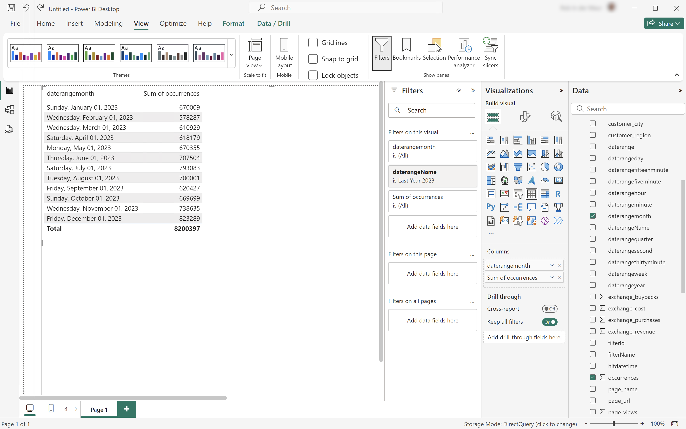
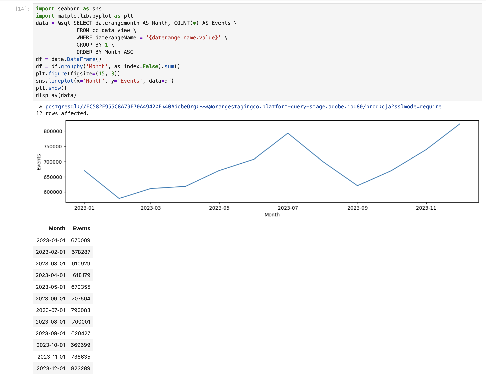
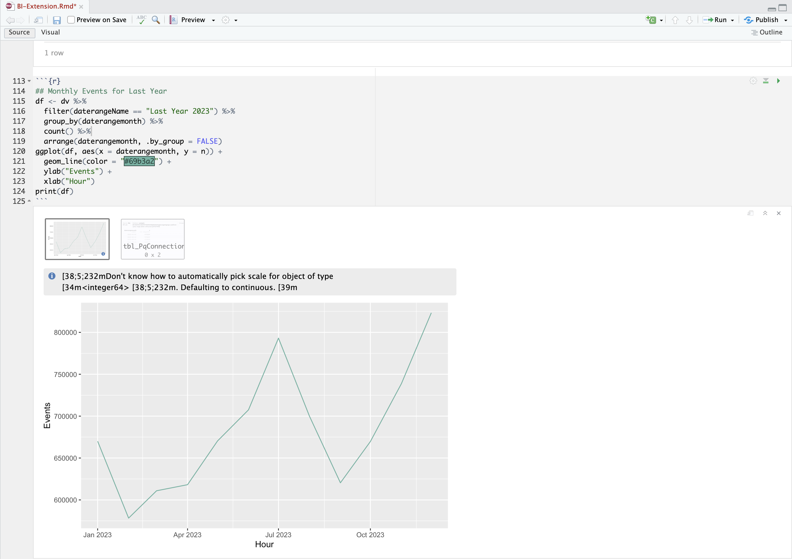

# Use date range names to filter

In this use case you want to use a date range that you have defined in Customer Journey Analytics to filter and report on occurrences (events) during the last year.

+++ Customer Journey Analytics

To report using a date range, you set up a date range in Customer Journey Analytics, with **[!UICONTROL Title]** `Last Year 2023`.


You then can use that date range in an example **[!UICONTROL Using Date Range Names To Filter]** panel for the use case:


Note how the date range defined in the Freeform table visualization overrules the date range applied to the panel.

+++

+++ BI tools

>[!PREREQUISITES]
>
>Ensure you have validated [a successful connection, can list data views, and use a data view](connect-and-validate.md) for the BI tool for which you want to try out this use case. 
>

>[!BEGINTABS]

>[!TAB Power BI Desktop] 

1. In the **[!UICONTROL Data]** pane:
   1. Select **[!UICONTROL daterangemonth]**.
   1. Select **[!UICONTROL daterangeName]**.
   1. Select **[!UICONTROL sum occurrences]**.
   
   You see a visualization displaying **[!UICONTROL Error fetching data for this visual]**.

1. In the **[!UICONTROL Filters]** pane:

   1. Select the **[!UICONTROL daterangeName is (All)]** from **[!UICONTROL Filters on this visual]**.
   1. Select **[!UICONTROL Basic filtering]** as the **[!UICONTROL Filter type]**.
   1. Underneath the **[!UICONTROL Search]** field, select **[!UICONTROL Last Year 2023]**, which is the name of your date range defined in Customer Journey Analytics.
   1. Select  to remove **[!UICONTROL daterangeName]** from **[!UICONTROL Columns]**.
   
   You see the table updated with the applied **[!UICONTROL daterangeName]** filter. Your Power BI Desktop should look like below.

   

>[!TAB Tableau Desktop] 

1. Select the **[!UICONTROL Sheet 1]** tab at the bottom to switch from **[!UICONTROL Data source]**. In the **[!UICONTROL Sheet 1]** view:
   1. Drag the **[!UICONTROL Daterange Name]** entry from the **[!UICONTROL Tables]** list in the **[!UICONTROL Filters]** shelf.
   1. In the **[!UICONTROL Filter \[Daterange Name\]]** dialog ensure **[!UICONTROL Select from list]** is selected, and select **[!UICONTROL Last Year 2023]** from the list. Select **[!UICONTROL Apply]** and **[!UICONTROL OK]**.
   1. Drag **[!UICONTROL Daterangemonth]** entry from the **[!UICONTROL Tables]** list and drop the entry in the field next to **[!UICONTROL Rows]**. Select **[!UICONTROL Daterangemonth]** and select **[!UICONTROL Month]**. The value changes to **[!UICONTROL MONTH(Daterangemonth)]**.
   1. Drag **[!UICONTROL Occurrences]** entry from the **[!UICONTROL Tables]** list and drop the entry in the field next to **[!UICONTROL Columns]**. The value changes to **[!UICONTROL SUM(Occurrences)]**.
   1. Select **[!UICONTROL Text Table]** from **[!UICONTROL Show Me]**.
   1. Select **[!UICONTROL Swap Rows and Columns]** from the toolbar.
   1. Select **[!UICONTROL Fit Width]** from the **[!UICONTROL Fit]** drop-down menu.

      Your Tableau Desktop should look like below.

      

>[!TAB Looker]

1. In the **[!UICONTROL Explore]** interface of Looker, ensure you do have a clean setup. If not, select  **[!UICONTROL Remove fields and filters]**.
1. Select **[!UICONTROL + Filter]** underneath **[!UICONTROL Filters]**.
1. In the **[!UICONTROL Add Filter]** dialog:
   1. Select **[!UICONTROL ‣ Cc Data View]**
   1. From the list of fields, select **[!UICONTROL ‣ Daterange Name]**.
1. Specify the **[!UICONTROL Cc Data View Daterange Name]** filter as **[!UICONTROL is]** and select **[!UICONTROL Last Year 2023]** from the list of values.
1. From the **[!UICONTROL ‣ Cc Data View]** section in the left rail: 
   1. Select **[!UICONTROL Daterange Month]**, then **[!UICONTROL Month]**.
   1. Select **[!UICONTROL Count]** underneath **[!UICONTROL MEASURES]** in the left rail (at the bottom).
1. Select **[!UICONTROL Run]**.
1. Select **[!UICONTROL ‣ Visualization]**.

You should see a visualization and table similar as shown below.


>[!TAB Jupyter Notebook]

1. Enter the following statements in a new cell.

   ```python
   data = %sql SELECT daterangeName FROM cc_data_view;
   style = {'description_width': 'initial'}
   daterange_name = widgets.Dropdown(
      options=[d for d, in data],
      description='Date Range Name:',
      style=style
   )
   display(daterange_name)
   ```

1. Execute the cell. You should see output similar to the screenshot below.

   

1. Select **[!UICONTROL Fishing Products]** from the drop-down menu.

1. Enter the following statements in a new cell.

   ```python
   import seaborn as sns
   import matplotlib.pyplot as plt
   data = %sql SELECT daterangemonth AS Month, COUNT(*) AS Events \
               FROM cc_data_view \
               WHERE daterangeName = '{daterange_name.value}' \
               GROUP BY 1 \
               ORDER BY Month ASC
   df = data.DataFrame()
   df = df.groupby('Month', as_index=False).sum()
   plt.figure(figsize=(15, 3))
   sns.lineplot(x='Month', y='Events', data=df)
   plt.show()
   display(data)
   ```

1. Execute the cell. You should see output similar to the screenshot below.

   


>[!TAB RStudio]

1. Enter the following statements between ` ```{r} ` and ` ``` ` in a new chunk. Ensure you use the appropriate date range name. For example, `Last Year 2023`.

   ```R
   ## Monthly Events for Last Year
   df <- dv %>%
      filter(daterangeName == "Last Year 2023") %>%
      group_by(daterangemonth) %>%
      count() %>%
      arrange(daterangemonth, .by_group = FALSE)
   ggplot(df, aes(x = daterangemonth, y = n)) +
      geom_line(color = "#69b3a2") +
      ylab("Events") +
      xlab("Hour")
   print(df)
   ```

1. Run the chunk. You should see output similar to the screenshot below.

   

>[!ENDTABS]

+++

