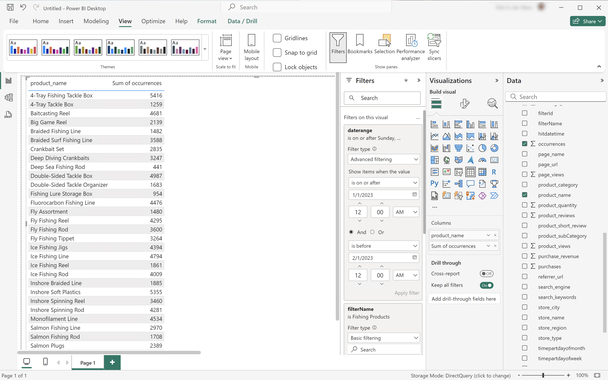
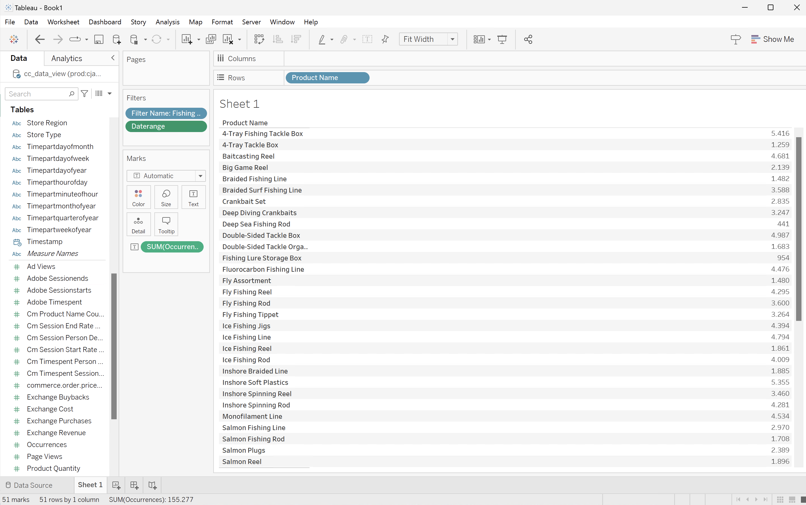

# Use segment names to segment

In this use case, you want to use an existing segment for the Fishing product category, that you have defined in Customer Journey Analytics. To segment and report on product names and occurrences (events) during January 2023.

+++ Customer Journey Analytics

Inspect the segment that you want to use in Customer Journey Analytics.


You then can use that segment in an example **[!UICONTROL Using Segment Names To Segment]** panel for the use case:


+++

+++ BI tools

>[!PREREQUISITES]
>
>Ensure you have validated [a successful connection, can list data views, and use a data view](connect-and-validate.md) for the BI tool for which you want to try out this use case. 
>

>[!BEGINTABS]

>[!TAB Power BI Desktop] 

1. In the **[!UICONTROL Data]** pane:
   1. Select **[!UICONTROL daterange]**.
   1. Select **[!UICONTROL filterName]**.
   1. Select **[!UICONTROL product_name]**.
   1. Select **[!UICONTROL sum occurrences]**.

  You see a visualization displaying **[!UICONTROL Error fetching data for this visual]**.

1. In the **[!UICONTROL Filters]** pane:

   1. Select **[!UICONTROL filterName is (All)]** from **[!UICONTROL Filters on this visual]**.
   1. Select **[!UICONTROL Basic filtering]** as the **[!UICONTROL Filter type]**.
   1. Underneath the **[!UICONTROL Search]** field, select **[!UICONTROL Fishing Products]**, which is the name of the existing filter defined in Customer Journey Analytics.
   1. Select **[!UICONTROL daterange is (All)]** from **[!UICONTROL Filters on this visual]**.
   1. Select **[!UICONTROL Advanced filtering]** as the **[!UICONTROL Filter type]**.
   1. Define the filter to **[!UICONTROL Show items when the value]** **[!UICONTROL is on or after]** `1/1/2023` **[!UICONTROL And]** **[!UICONTROL is before]** `2/1/2023`.
   1. Select  to remove **[!UICONTROL filterName]** from **[!UICONTROL Columns]**.
   1. Select  to remove **[!UICONTROL daterange]** from **[!UICONTROL Columns]**.
   
   You see the table updated with the applied **[!UICONTROL filterName]** filter. Your Power BI Desktop should look like below.

   


>[!TAB Tableau Desktop] 

1. Select the **[!UICONTROL Sheet 1]** tab at the bottom to switch from **[!UICONTROL Data source]**. In the **[!UICONTROL Sheet 1]** view:
   1. Drag the **[!UICONTROL Filter Name]** entry from the **[!UICONTROL Tables]** list in the **[!UICONTROL Filters]** shelf.
   1. In the **[!UICONTROL Filter \[Filter Name\]]** dialog ensure **[!UICONTROL Select from list]** is selected, and select **[!UICONTROL Fishing Products]** from the list. Select **[!UICONTROL Apply]** and **[!UICONTROL OK]**.
   1. Drag **[!UICONTROL Daterange]** entry from the **[!UICONTROL Tables]** list in the **[!UICONTROL Filters]** shelf.
   1. In the **[!UICONTROL Filter Field \[Daterange\]]** dialog, select **[!UICONTROL Range of Dates]** and select **[!UICONTROL Next >]**.
   1. In the **[!UICONTROL Filter \[Daterang\]]** dialog, select **[!UICONTROL Range of dates]**, and select `01/01/2023` - `01/02/2023`. Select **[!UICONTROL Apply]** and **[!UICONTROL OK]**.
   1. Drag **[!UICONTROL Product Name]** from the **[!UICONTROL Tables]** list to **[!UICONTROL Rows]**.
   1. Drag **[!UICONTROL Occurrences]** entry from the **[!UICONTROL Tables]** list and drop the entry in the field next to **[!UICONTROL Columns]**. The value changes to **[!UICONTROL SUM(Occurrences)]**.
   1. Select **[!UICONTROL Text Table]** from **[!UICONTROL Show Me]**.
   1. Select **[!UICONTROL Fit Width]** from the **[!UICONTROL Fit]** drop-down menu.

      Your Tableau Desktop should look like below.

         

>[!TAB Looker]

1. In the **[!UICONTROL Explore]** interface of Looker, ensure you do have a clean setup. If not, select  **[!UICONTROL Remove fields and filters]**.
1. Select **[!UICONTROL + Filter]** underneath **[!UICONTROL Filters]**.
1. In the **[!UICONTROL Add Filter]** dialog:
   1. Select **[!UICONTROL ‣ Cc Data View]**
   1. From the list of fields, select **[!UICONTROL ‣ Daterange Date]** then **[!UICONTROL Daterange Date]**.
      
1. Specify the **[!UICONTROL Cc Data View Daterange Date]** filter as **[!UICONTROL is in range]** **[!UICONTROL 2023/01/01]** **[!UICONTROL until (before)]** **[!UICONTROL 2023/02/01]**.
1. Select **[!UICONTROL + Filter]** underneath **[!UICONTROL Filters]** to add another filter.
1. In the **[!UICONTROL Add Filter]** dialog:
   1. Select **[!UICONTROL ‣ Cc Data View]**
   1. From the list of fields, select **[!UICONTROL ‣ Filter name]**.
1. Ensure **[!UICONTROL is]** the selection for the filter.
1. Select **[!UICONTROL Fishing Products]** from the list of possible values.
1. From the **[!UICONTROL ‣ Cc Data View]** section in the left rail: 
   1. Select **[!UICONTROL Product Name]**.
   1. Select **[!UICONTROL Count]** underneath **[!UICONTROL MEASURES]** in the left rail (at the bottom).
1. Select **[!UICONTROL Run]**.
1. Select **[!UICONTROL ‣ Visualization]**.

You should see a visualization and table similar as shown below.


>[!TAB Jupyter Notebook]

1. Enter the following statements in a new cell.

   ```python
   data = %sql SELECT filterName FROM cc_data_view;
   style = {'description_width': 'initial'}
   filter_name = widgets.Dropdown(
      options=[d for d, in data],
      description='Filter Name:',
      style=style
   )
   display(filter_name)
   ```

1. Execute the cell. You should see output similar to the screenshot below.

   

1. Select **[!UICONTROL Fishing Products]** from the drop-down menu.

1. Enter the following statements in a new cell.

   ```python
   import seaborn as sns
   import matplotlib.pyplot as plt
   data = %sql SELECT product_name AS `Product Name`, COUNT(*) AS Events \
               FROM cc_data_view \
               WHERE daterange BETWEEN '2023-01-01' AND '2023-02-01' \
                  AND filterName = '{filter_name.value}' \
               GROUP BY 1 \
               LIMIT 10;
   df = data.DataFrame()
   df = df.groupby('Product Name', as_index=False).sum()
   plt.figure(figsize=(15, 3))
   sns.barplot(x='Events', y='Product Name', data=df)
   plt.show()
   display(data)
   ```

1. Execute the cell. You should see output similar to the screenshot below.

   


>[!TAB RStudio]

1. Enter the following statements between ` ```{r} ` and ` ``` ` in a new chunk. Ensure you use the appropriate filter name. For example, `Fishing Products`.

   ```R
   ## Dimension filtered by name
   df <- dv %>%
      filter(daterange >= "2023-01-01" & daterange < "2023-02-01" & filterName == "Fishing Products") %>%
      group_by(product_name) %>%
      count() %>%
      arrange(desc(n), .by_group = FALSE)
   print(df)
   ```

1. Run the chunk. You should see output similar to the screenshot below.

   


>[!ENDTABS]

+++
