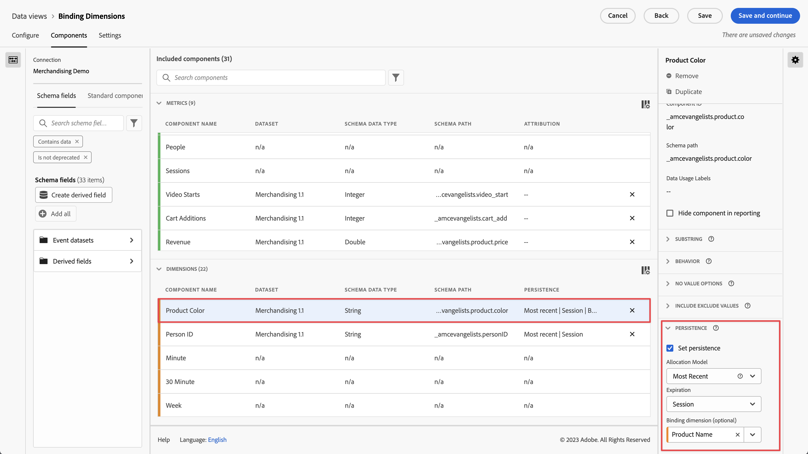
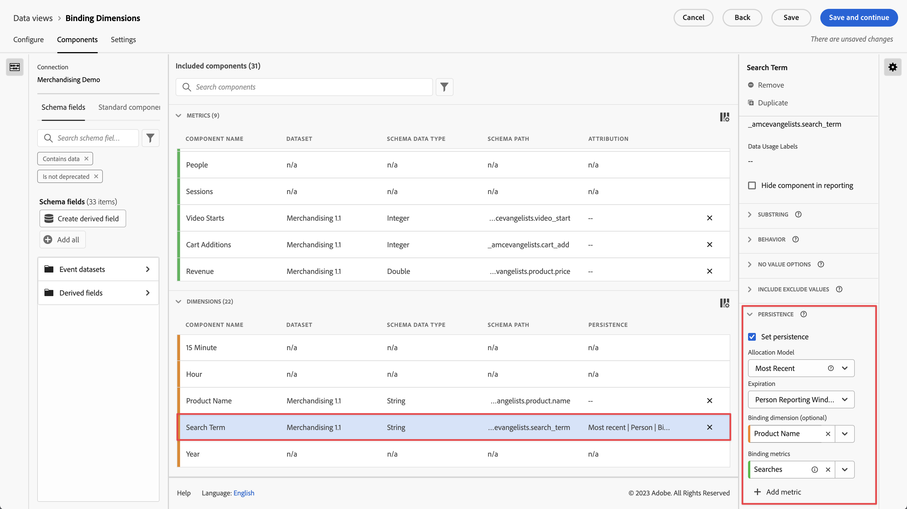

# Use binding dimensions and metrics in CJA

Customer Journey Analytics offers several ways to persist dimension values beyond the hit that they are set on. One of the persistence methods that Adobe offers is known as Binding. In previous versions of Adobe Analytics, this concept was known as merchandising.

While you can use binding dimensions with top-level event data, this concept is best used when working with [Arrays of objects](/help/use-cases/object-arrays.md). You can attribute a dimension to one part of an object array without applying it to all of the attributes in a given event. For example, you can attribute a search term to one product in your shopping cart object array without binding that search term to the entire event.

## Example 1: Use binding dimensions to attribute additional product attributes to a purchase

You can bind dimension items within an object array to another dimension. When the bound dimension item appears, CJA recalls the bound dimension and includes it in the event for you. Consider the following customer journey:

1. A person views a product page on a washing machine.

    ```json
    {
        "PersonID": "1",
        "product": [
            {
                "name": "Washing Machine 2000",
                "color": "white",
                "type": "front loader",
            },
        ],
        "timestamp": 1534219229
    }
    ```

1. The person then views a product page on a dryer.

    ```json
    {
        "PersonID": "1",
        "product": [
            {
                "name": "Dryer 2000",
                "color": "neon orange",
            },
        ],
        "timestamp": 1534219502
    }
    ```

1. Ultimately they make a purchase. The color of each product wasn't included in the purchase event.

    ```json
    {
        "PersonID": "1",
        "orders": 1,
        "product": [
            {
                "name": "Washing Machine 2000",
                "price": 1600,
            },
            {
                "name": "Dryer 2000",
                "price": 499
            }
        ],
        "timestamp": 1534219768
    }
    ```

If you wanted to look at revenue by color without a binding dimension, the dimension `product.color` persists and incorrectly attributes credit to the dryer's color:

| product.color | revenue |
| --- | --- |
| neon orange | 2099 |

You can go into the Data View Manager and bind product color to product name:



When you set this persistence model, CJA takes note of the product name whenever product color is set. When it recognizes the same product name in a subsequent event for this person, the product color is brought over as well. The same data when you bind product color to product name would look similar to the following:

| product.color | revenue |
| --- | --- |
| white | 1600 |
| neon orange | 499 |

## Example 2: Use binding metrics to tie search term to a product purchase

One of the most common merchandising methods in Adobe Analytics has been to bind a search term to a product so each search term gets credit for it's appropriate product. Consider the following customer journey:

1. A person arrives to your site and searches for "boxing gloves". The searches metric increments by one, and the top three search results are displayed.

    ```json
    {
        "PersonID": "1",
        "page_name": "Search results",
        "search": "1",
        "search_term": "boxing gloves",
        "product": [
            {
                "name": "Beginner gloves",
            },
            {
                "name": "Tier 3 gloves",
            },
            {
                "name": "Professional gloves",
            }
        ]
    }
    ```

2. They find a pair of gloves that they like, and add it to their cart.

    ```json
    {
        "PersonID": "1",
        "page_name": "Shopping cart",
        "cart_add": "1",
        "product": [
            {
                "name": "Tier 3 gloves",
            }
        ]
    }
    ```

3. The person then searches for "tennis racket". The searches metric increments by one, and the top three search results are displayed.

    ```json
    {
        "PersonID": "1",
        "page_name": "Search results",
        "search": "1",
        "search_term": "tennis racket",
        "product": [
            {
                "name": "Shock absorb racket",
            },
            {
                "name": "Women's open racket",
            },
            {
                "name": "Extreme racket",
            }
        ]
    }
    ```

4. They find a racket that they like, and add it to their cart.

    ```json
    {
        "PersonID": "1",
        "page_name": "Shopping cart",
        "cart_add": "1",
        "product": [
            {
                "name": "Tier 3 gloves",
            },
            {
                "name": "Shock absorb racket",
            }
        ]
    }
    ```

5. The person searches a third time for "shoes". The searches metric increments by one, and the top three search results are displayed.

    ```json
    {
        "PersonID": "1",
        "page_name": "Search results",
        "search": "1",
        "search_term": "shoes",
        "product": [
            {
                "name": "Men's walking shoes",
            },
            {
                "name": "Tennis shoes",
            },
            {
                "name": "Skate shoes",
            }
        ]
    }
    ```

6. They find a pair of shoes that they like, and add it to their cart.

    ```json
    {
        "PersonID": "1",
        "page_name": "Shopping cart",
        "cart_add": "1",
        "product": [
            {
                "name": "Tier 3 gloves",
            },
            {
                "name": "Shock absorb racket",
            },
            {
                "name": "Skate shoes",
            }
        ]
    }
    ```

7. The person goes through the checkout process and purchases these three items.

    ```json
    {
        "PersonID": "1",
        "page_name": "Thank you for your purchase",
        "purchase": "1",
        "product": [
            {
                "name": "Tier 3 gloves",
                "price": "89.99"
            },
            {
                "name": "Shock absorb racket",
                "price": "34.99"
            },
            {
                "name": "Skate shoes",
                "price": "79.99"
            }
        ]
    }
    ```

If you use an allocation model that does not include a binding dimension with search term, all three products attribute revenue to only a single search term. For example, if you used Original allocation with the search term dimension:

| search_term | revenue |
| --- | --- |
| boxing gloves | $204.97 |

If you used Most Recent allocation with the search term dimension, all three products still attribute revenue to a single search term:

| search_term | revenue |
| --- | --- |
| shoes | $204.97 |

While this example includes only one person, many persons who search for different things can misattribute search terms to different products, making it difficult to determine what the best search results actually are.

You can bind search terms to product name whenever the Searches metric is present to correctly attribute search term to revenue.



In Analysis Workspace, the resulting report would look similar to the following:

| search_term | revenue |
| --- | --- |
| boxing gloves | $89.99 |
| tennis racket | $34.99 |
| shoes | $79.99 |

CJA automatically detects the relationship between the selected dimension and the binding dimension. If the binding dimension is in an object array while the selected dimension is at a higher level, a binding metric is required. A binding metric acts as a trigger for a binding dimension, so it only binds itself on events where the binding metric is present. In the above example, the search results page always includes a search term dimension and a searches metric.

Setting the search term dimension to this persistence model executes the following logic:

* When the search term dimension is set, check for the presence of product name.
* If product name is not there, do nothing.
* If product name is there, check for the presence of the Searches metric.
* If the Searches metric is not there, do nothing.
* If the Searches metric is there, bind the search term to all product names in that event. It copies itself down to the same level as product name for that event. In this example, it is treated as product.search_term.
* If the same product name is seen in a subsequent event, the bound search term is carried forward to that event as well.

## Example 3: Bind video search term to user profile

You can bind a search term to a user profile so persistence between profiles remains completely separated. For example, your organization runs a streaming service where an overarching account can have multiple profiles. The person has a child profile and an adult profile.

1. The account logs in under the child profile and searches for a kid's TV show. Note that the `"ProfileID"` is `2` to represent the child profile.

    ```json
    {
        "PersonID": "7078",
        "ProfileID": "2",
        "Searches": "1",
        "search_term": "kids show"
    }
    ```

1. They find the show "Orangey" and play it so their child can watch it.

    ```json
    {
        "PersonID": "7078",
        "ProfileID": "2",
        "ShowName": "Orangey",
        "VideoStarts": "1"
    }
    ```

1. Later that evening, the parent switches to their profile and searches for adult content to watch. Note that the `"ProfileID"` is `1` to represent the adult profile. Both profiles belong to the same account, represented by the same `"PersonID"`.

    ```json
    {
        "PersonID": "7078",
        "ProfileID": "1",
        "Searches": "1",
        "search_term": "grownup movie"
    }
    ```

1. The find the show "Analytics After Hours" and enjoy their evening watching it.

    ```json
    {
        "PersonID": "7078",
        "ProfileID": "1",
        "ShowName": "Analytics After Hours",
        "VideoStarts": "1"
    }
    ```

1. The next day, they continue the show "Orangey" for their child. They do not need to search since they are now already aware of the show.

    ```json
    {
        "PersonID": "7078",
        "ProfileID": "2",
        "ShowName": "Orangey",
        "VideoStarts": "1"
    }
    ```

If you use Most Recent allocation with Person expiration, the `"grownup movie"` search term is attributed to the last view of the kid's show.

| Search term | Video starts |
| --- | --- |
| grownup movie | 2 |
| kids show | 1 |

However, if you bound `search_term` to `ProfileID`, each profile's searches would be isolated to their own profile, attributed to the correct shows that they search for.


Analysis Workspace would correctly attribute the second episode of Orangey to the search term `"kids show"` without taking searches from other profiles into account.

| Search term | Video starts |
| --- | --- |
| kids show | 2 |
| grownup movie | 1 |

## Example 4: Evaluate browse vs. search behavior in a retail setting

You can bind values to dimensions set on previous events. When you set a variable with a binding dimension, CJA takes into account the persisted value. If this behavior is undesired, you can adjust the binding dimension's persistence settings. Consider the following example where `product_finding_method` is set on an event, then bound to the Cart Adds metric on the following event.

1. A person performs a search for `"camera"`. Note that no products are set on this page.

    ```json
    {
        "search_term": "camera",
        "product_finding_method": "search"
    }
    ```

1. They click on a camera that they like and add it to their cart.

    ```json
    {
        "Product": [
            {
                "name": "DSLR Camera"
            }
        ],
        "CartAdd": "1"
    }
    ```

1. The person then browses into the men's belts category without performing a search. Note that no products are set on this page.

    ```json
    {
        "category": "Men's belts",
        "product_finding_method": "browse"
    }
    ```

1. They click on a belt that they like and add it to their cart.

    ```json
    {
        "Product": [
            {
                "name": "Ratchet belt"
            }
        ],
        "CartAdd": "1"
    }
    ```

1. They go through the checkout process and purchase these two items.

    ```json
    {
        "Product": [
            {
                "name": "DSLR Camera",
                "price": "399.99"
            },
            {
                "name": "Ratchet belt",
                "price": "19.99"
            }
        ],
        "Purchase": "1"
    }
    ```

If persistence is set to most recent allocation without a binding dimension, all $419.98 of revenue is attributed to the `browse` finding method.

| Product finding method | Revenue |
| --- | --- |
| browse | 419.98 |

If persistence is set using original allocation without a binding dimension, all $419.98 of revenue is attributed to the `search` finding method.

| Product finding method | Revenue |
| --- | --- |
| search | 419.98 |

However, if you bind `product_finding_method` to the Cart Adds metric, the resulting report attributes each product to the correct finding method.

| Product finding method | Revenue |
| --- | --- |
| search | 399.99 |
| browse | 19.99 |
