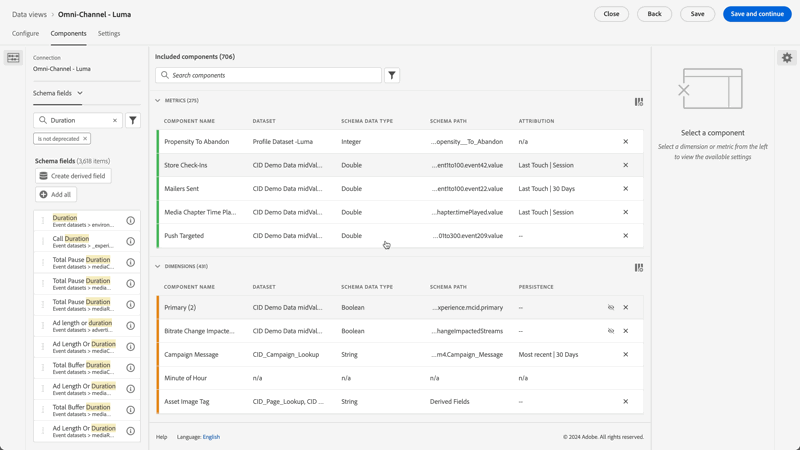
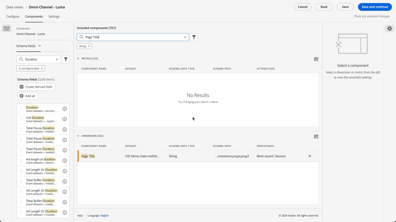

# Data views use cases

These use cases illustrate the flexibility and power of data views in Customer Journey Analytics.

## Use binding dimensions metrics

See the [Use binding dimensions metrics](binding-dimensions-metrics.md) use case for more details.

## Use summary data

See the [Use summary data](summary-data.md) use case for more details.

## BI extension use cases

See the [BI extension use cases](bi-extension-usecases.md) on how to accomplish a number of use cases using the Customer Journey Analytics BI extension.

## Create a metric from a string schema field {#string}

For example, when creating a data view, you could create an [!UICONTROL Orders] metric from a [!UICONTROL Page Title] schema field that is a string.

1. On the **[!UICONTROL Components]** tab, drag the **[!UICONTROL Page Title]** into the **[!UICONTROL Metrics]** section under [!UICONTROL Included components].
1. Highlight the metric you just dragged in and rename it to `Orders` in the **[!UICONTROL Component Settings]** on
1. Open the **[!UICONTROL Include/Exclude Values]** section and specify the following:
   1. Enable **[!UICONTROL Set include exclude values]**.
   1. Select **[!UICONTROL If all criteria are met]** from **[!UICONTROL Match]**.
   1. Specify `confirmation`. This text for the page_title indicates that this page is related to placing an order. After reviewing all the page titles where those criteria are met, a `1` will be counted for each instance. The result is a new metric (not a calculated metric.) A metric that has included/excluded values can be used everywhere any other metric can be used. It works with Attribution IQ, segments, and everywhere else you can use standard metrics.

   {width=100%}
1. You can further specify an attribution model for this metric, such as [!UICONTROL Last Touch], with a [!UICONTROL Lookback window] of [!UICONTROL Session].
   You can also create another [!UICONTROL Orders] metric from the same field and specify a different attribution model. Such as [!UICONTROL First Touch], and a different [!UICONTROL Lookback window], such as [!UICONTROL 30 days].

Another example would be to use the Person ID, a dimension, as a metric to determine how many Person IDs your company has.

## Use integers as dimensions {#integers}

Previously, integers would automatically be treated as metrics in Customer Journey Analytics. Now, numerics (including custom events from Adobe Analytics) can be treated as dimensions. Here is an example:

1. Drag the **[!UICONTROL Duration]** integer into the **[!UICONTROL Dimensions]** section under [!UICONTROL Included Components]:
1. You can now add **[!UICONTROL Value Bucketing]** to present this dimension in a bucketed fashion in reporting. Without bucketing, each instance of this dimension would appear as a line item in Workspace reporting.
   {width=100%}

## Use numeric dimensions as metrics in flow diagrams {#numeric}

You can use a numeric dimension to get metrics into your [!UICONTROL  Flow] visualization. 

1. On the Data Views [Components](https://experienceleague.adobe.com/en/docs/analytics-platform/using/cja-dataviews/create-dataview) tab, drag the [!UICONTROL Marketing Channels] schema field into the [!UICONTROL Metrics] area under [!UICONTROL Included components]. 
2. In Workspace reporting, this flow shows [!UICONTROL Marketing Channels] flowing into [!UICONTROL Orders]:

## Do sub-event filtering {#sub-event}

This capability is specifically applicable to array-based fields. The include/exclude functionality lets you filter at the sub-event level, whereas filters (segments) built in the filter builder only give you filtering at the event level. So, you can do sub-event filtering by using include/exclude in Data views, and then reference that new metric/dimension in a filter at the event level.

For example, use the include/exclude functionality in Data views to focus only on products that generated sales of more than $50. So, if you have an order that includes a $50 product purchase and a $25 product purchase, the include/exclude functionality removes the $25 product purchase, not the entire order.

1. On the Data Views [Components](https://experienceleague.adobe.com/en/docs/analytics-platform/using/cja-dataviews/create-dataview) tab, drag the **[!UICONTROL Revenue]** schema field into the **[!UICONTROL Metrics]** area under [!UICONTROL Included components].
1. Select the metric and configure the following on the right side:
   a. Under **[!UICONTROL Format]**, select **[!UICONTROL Currency]**.
   b. Under **[!UICONTROL Currency]**, select **[!UICONTROL USD]**.
   c. Under **[!UICONTROL Include/Exclude Values]**, select the checkbox next to **[!UICONTROL Set include/exclude values]**.
   d. Under **[!UICONTROL Match]**, select **[!UICONTROL If all criteria are met]**.
   e. Under **[!UICONTROL Criteria]**, select **[!UICONTROL is greater than or equal]**.
   f. Specify `50` as the value.

These new settings allow you to view only high-value revenue and filter out anything below $50.

## Use the [!UICONTROL No value options] setting {#no-value}

Your company may have spent time training your users to expect "Unspecified" for dimensions in reports. The default for dimensions in Data views is "No value". However, you can specify per dimension how No value should be reported. See the No value options for a dimension component.

{width=100%}

## Create multiple metrics with different attribution settings {#attribution}

Using the **[!UICONTROL Duplicate]** feature at the top right, to create a number of Total Revenue metrics with different attribution settings like **[!UICONTROL First Touch]**, **[!UICONTROL Last Touch]**, and **[!UICONTROL Algorithmic]**.

Don't forget to rename each metric to reflect the differences, such as `Total Revenue (Algorithmic)`

{width=100%}

For more information on other data views settings, see [Create data views](/help/data-views/create-dataview.md).
For a conceptual overview of data views, see [Data views overview](/help/data-views/data-views.md).

## New session and return session reporting {#new-repeat}

You can determine whether a session is indeed the first-ever session for a user or a return session. Based on the reporting window that you defined for this data view and a 13-month lookback window. This reporting lets you determine, for example:

* What percentage of your orders are coming from new or return sessions?

* For a given marketing channel, or a specific campaign, are you targeting first-time users or return users? How does this choice influence conversion rates?

One dimension and two metrics facilitates this reporting: 

* [Session type](https://experienceleague.adobe.com/en/docs/analytics-platform/using/cja-dataviews/component-reference) - This dimension has two values: [!UICONTROL New] and [!UICONTROL Returning]. The [!UICONTROL New] line item includes all the behavior (that is, metrics against this dimension) from a session that has been determined to be a person's defined first session. Everything else is included in the [!UICONTROL Returning] line item (assuming everything belongs to a session). Where metrics are not part of any session, they fall into the 'Not applicable' bucket for this dimension.

* [First-time Sessions](https://experienceleague.adobe.com/en/docs/analytics-platform/using/cja-dataviews/component-reference). The First-time Sessions metric is defined as a person's defined first session within the reporting window. 

* [Return Sessions](https://experienceleague.adobe.com/en/docs/analytics-platform/using/cja-dataviews/component-reference) The Return Sessions metric is the number of sessions that were not a person's first-time session.-->

To access the components:

1. Go into the data view editor.
1. Select the **[!UICONTROL Components]** tab and then select **[!UICONTROL Standard components]** from the left rail.
1. Drag the **[!UICONTROL Session type]**, **[!UICONTROL First-time Sessions]**, and **[!UICONTROL Return Sessions]** components into your data view.

New sessions are reported accurately almost always. The only exceptions are:

* When a first session occurred before the 13-month lookback window.  This session is ignored.

* When a session spans both the lookback window and the reporting window.  For example, you run a report from June 1 to June 15, 2022. The lookback window would span from May 1, 2021 to May 31, 2022. If a session starts on May 30, 2022 and ends on June 1, 2022, the session is included in the lookback window. And all sessions in the reporting window are counted as return sessions. 

## Use the Date and Date-Time functionality {#date}

Schemas in Adobe Experience Platform contain [!UICONTROL Date] and [!UICONTROL Date-Time] fields. Customer Journey Analytics data views now support these fields. When you drag these fields into a data view as a dimension, you can specify their [format](/help/data-views/component-settings/format.md). This format setting determines how the fields are displayed in reporting. For example:

* For the Date format, if you select **[!UICONTROL Day]** with the format **[!UICONTROL Month, Day, Year]**, an example output in reporting might look like: August 23, 2022.

* For the Date-Time format, if you select **[!UICONTROL Minute of Day]** with the format **[!UICONTROL Hour:Minute]**, your output might look like: 20:20.

Dates after Jan 1, 1900 (with the single exception of Jan 1, 1970) and date-time values after Jan 1, 2000 00:00:00 are supported.

### Date and Date-Time use cases

* Date: A travel company collects the departure date for trips as a field in their data. The company would like to have a report, which compares the [!UICONTROL Day of Week] for all departure dates collected to understand which is most popular. And the company would like to do the same for the [!UICONTROL Month of Year].

* Date-Time: A retail company collects the time for each of their in-store point-of-sale (POS) purchases. Over a given month, the company would like to understand the busiest shopping periods by [!UICONTROL Hour of Day].

>[!MORELIKETHIS]
>
>[Date and Date-Time in the Format component setting](/help/data-views/component-settings/format.md)
>

