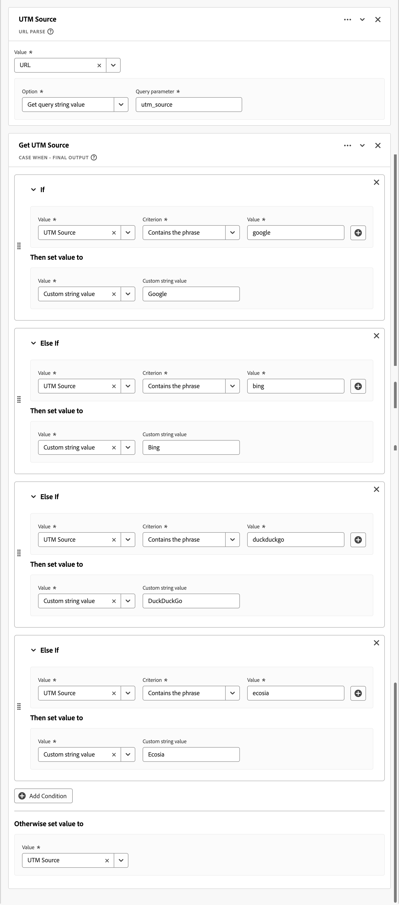
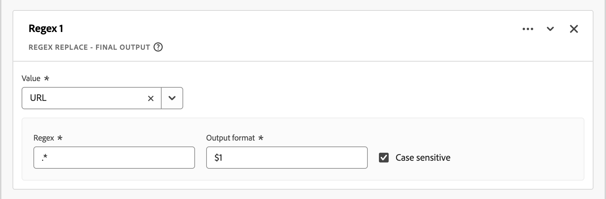
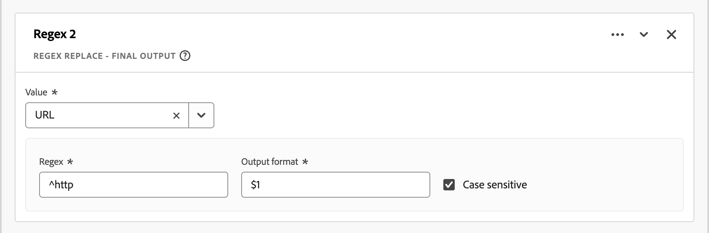

# Derived fields guidelines

Customer Journey Analytics [derived fields](/help/data-views/derived-fields/derived-fields.md) let you transform, classify, and enrich data at query time without modifying source datasets. That flexibility can introduce complexity, performance problems, and maintenance overhead if applied without discipline.

This article provides guidelines (best practices, guardrails, and common pitfalls) for working with derived fields. The intended audience is data architects, product administrators, and analysts who need to:

* **Optimize performance**: Identify patterns that slow down the execution of queries or hit system limits, to select the right tool for the job: 

  * [Derived fields](/help/data-views/derived-fields/derived-fields.md)
  * [Data view settings](/help/data-views/component-settings/overview.md)
  * [Data Prep](https://experienceleague.adobe.com/en/docs/experience-platform/data-prep/home)
  * [Calculated metrics](/help/components/calc-metrics/calc-metr-overview.md)
  * [Lookup datasets](/help/getting-started/cja-upgrade/cja-upgrade-dataset-lookup.md)
  
* **Improve maintainability**: Build derived field logic that is clear, modular, and easy to update.
* **Ensure correctness**: Avoid common logical errors in classification, attribution, and data transformation.

This article organizes the sections around the following themes:

* [High-cardinality derived fields](#high-cardinality-derived-fields)
* [Over-complex Case When rule chains](#over-complex-case-when-rule-chains)
* [Wrong usage](#wrong-usage)
* [Misclassifications of metrics and dimensions](#misclassifications-of-metrics-and-dimensions)
* [Marketing channel and campaign logic pitfalls](#marketing-channel-and-campaign-logic-pitfalls)
* [Non-normalized string keys used in lookups](#non-normalized-string-keys-used-in-lookups)
* [Regex misuse or overreach](#regex-misuse-or-overreach)
* [Calculated metric style logic in derived fields](#calculated-metric-style-logic-in-derived-fields)
* [Over-usage of Next or Previous or sequential functions](#over-usage-of-next-or-previous-or-sequential-functions)
* [Ignoring session and person-level context](#ignoring-session-and-person-level-context)
* [Hitting or nearing documented function limits](#hitting-or-nearing-documented-function-limits)
* [Data view-specific optimization rules](#data-view-specific-optimization-rules)

Each section includes:

* **Patterns** to detect: Observable signals in your derived field definitions.
* **Risk diagnosis**: Why the pattern is problematic. Possible reasons are negative effects on **performance**, **data quality**, or **maintenance**.
* **Recommendations**: Concrete steps to refactor or improve the implementation.

These guidelines help you to create efficient, scalable, and semantically correct implementations in Customer Journey Analytics. Apply these guidelines when you audit existing data views, design new derived fields, or build governance tools.

## High-cardinality derived fields

This section discusses data view default segments that reference high-cardinality derived fields.

**Patterns**

* Data view default segments that reference a derived field that is built on a high-cardinality dimension (approximately one million or more distinct values). For example: full page URL.
* Simple operations like [Lowercase](/help/data-views/derived-fields/derived-fields.md#lowercase), [Trim](/help/data-views/derived-fields/derived-fields.md#trim), or [Case When](/help/data-views/derived-fields/derived-fields.md#case-when) checks on page URL are often more expensive than the same logic on low-cardinality fields.

**Risk diagnosis: performance**

* Default segments that filter on derived fields touching page URL or other high-cardinality dimensions add latency to every query against the data view.

**Recommendations**

* Avoid referencing full page URLs or similarly high-cardinality components directly in data view default segments. Push heavy URL logic (complex [Case When](/help/data-views/derived-fields/derived-fields.md#case-when), [Regex Replace](/help/data-views/derived-fields/derived-fields.md#regex-replace), multiple string functions) upstream to [Data Prep](https://experienceleague.adobe.com/en/docs/experience-platform/data-prep/home) or [lookup datasets](/help/getting-started/cja-upgrade/cja-upgrade-dataset-lookup.md) so the resulting classifications land on simpler, lower-cardinality dimensions.
* Prefer lower-cardinality keys such as normalized page name, site section, or pre-classified URL groups.
* Periodically audit existing data view default segments and derived fields for references to high-cardinality dimensions (page URL, campaign IDs, raw query strings) and refactor to normalized or grouped keys.

## Over-complex Case When rule chains

This section discusses over-complex chains of [Case When](/help/data-views/derived-fields/derived-fields.md#case-when) rules. 

Customer Journey Analytics enforces explicit [function and operator limits](/help/data-views/derived-fields/derived-fields.md#limitations) per derived field (for example,  maximum number of operators, maximum number of function per type). Over-complex functions and chains within functions are harder to maintain and more error-prone.

**Patterns**

* Very large [Case When](/help/data-views/derived-fields/derived-fields.md#case-when) functions with complex **[!UICONTROL If]** and **[!UICONTROL Else If]** chains:
  * Many conditions (for example: more than 20 operators) or deep nesting (more than 3 or 4 levels of nested [Case When](/help/data-views/derived-fields/derived-fields.md#case-when) **[!UICONTROL If]** and **[!UICONTROL Else If]** logic).
  * Repeated conditions on the same field with different values.
* Repeated constant string matching.

  +++ Example

  

  +++

  
**Risk diagnosis: performance, data quality, high maintenance**

* Maintainability and error risk: logic encoded as a monolithic rule block is hard to debug and update.
* Potential performance and limit risk: you may hit or approach [operator or function limits](/help/data-views/derived-fields/derived-fields.md#limitations), especially with classify-like patterns.

**Recommendations**

* Split into multiple derived fields. For example, separate *campaign normalization* (mapping inconsistent campaign identifiers to a canonical value) from channel bucketing instead of combining everything in one giant rule.
* Use lookup datasets. Many **[!UICONTROL If Value _value_ Criterion _criterion_ Then set _value_ to value]** conditions are better implemented as a [lookup dataset](/help/getting-started/cja-upgrade/cja-upgrade-dataset-lookup.md) combined with the [Lookup](/help/data-views/derived-fields/derived-fields.md#lookup) function instead of using long [Case When](/help/data-views/derived-fields/derived-fields.md#case-when) chains.
* Use data view component filters. If part of the logic simply filters out bad values, use [include exclude](/help/data-views/component-settings/include-exclude-values.md) at the data view component level instead of embedding that logic in a derived field.

## Wrong usage

This section discusses the wrong use of derived fields. Especially, where alternatives are a better solution.

>[!NOTE]
>
>Moving logic from a derived field into a data view component setting does not by itself improve query performance. Both approaches compile to the same underlying derived logic. The recommendations in this section are about clarity, governance, and reuse rather than speed.

**Patterns**

* A derived field replicates behavior already available in component settings:
  * Case normalization, trimming, or simple filtering (for example: excluding `unknown`, `undefined`, or `null`) with no additional complexity.
  * Basic bucketing on number ranges. 
    
    +++ Example

    

    +++

    Instead, use [value bucketing](/help/data-views/component-settings/value-bucketing.md) on a dimension in your Data view.
  * Persistence or attribution logic coded with [Next or Previous](/help/data-views/derived-fields/derived-fields.md#next-or-previous) or manual sequence logic where Data view [attribution](/help/data-views/component-settings/attribution.md) and [expiration](/help/data-views/component-settings/persistence.md) settings would suffice.
  * A derived metric that simply counts an existing metric under a condition.
  
    +++ Example

    

    +++

    This approach replicates what a filtered metric or [Include exclude values](/help/data-views/component-settings/include-exclude-values.md) could achieve.

**Risk diagnosis: data quality, high maintenance**

* Redundant complexity: derived fields are used where simpler built-in data view features exist.
* Governance risk: other users may not understand why a derived field exists instead of a native setting. The pattern increases clutter in derived fields administration.
* Reduced reusability: encoding conditional flags as derived fields makes it harder to reuse base metrics with different filters across projects.

**Recommendations**

* Trim / Lowercase: use the [Substring](/help/data-views/component-settings/substring.md) and [Behavior](/help/data-views/component-settings/behavior.md) component settings unless you need combined multi-step transformations.
* Value exclusion: use [Include exclude values](/help/data-views/component-settings/include-exclude-values.md) for metrics or dimension values at the data view component level, not in a derived field.
* Attribution and persistence: Use the data view [Persistence](/help/data-views/component-settings/persistence.md) settings (**[!UICONTROL Allocation model]** and **[!UICONTROL Expiration]**) for dimensions instead of simulating them in a derived field with [Next or Previous](/help/data-views/derived-fields/derived-fields.md#next-or-previous) or other sequential logic. 
* Numeric bucketing: keep the derived field numeric and let the data view create a bucketed dimension on top, rather than hard-coding range labels in a [Case When](/help/data-views/derived-fields/derived-fields.md#case-when) chain.
* Conditional logic: convert simple 0 or 1 flag logic to either:
  * the original metric with include or exclude values filter logic as applied in Analysis Workspace. 
  * a filtered metric using data view component settings configuration.

## Misclassifications of metrics and dimensions

This section discusses the misclassification of metrics and dimensions.

**Patterns**

* A derived field clearly produces:
  * Numeric outputs (count, ratio, or arithmetic) but the component is configured as a dimension.
  * Categorical outputs (labels or strings) but the component is configured as a metric.
* A derived field encodes 0/1 flags as strings.

Customer Journey Analytics allows coercing numeric fields to dimensions and string fields to metrics at the data view level, but misalignment can create confusing reporting.

**Risk diagnosis: data quality**

* Semantic mismatch: the component type does not match the nature of the derived result, making the component type harder to analyze or aggregate correctly.

**Recommendations**

* If the output is numeric:
  * Set the component type to **[!UICONTROL Metric]** in the data view.
  * If the component represents a subset metric (for example, **[!UICONTROL Checkout Page Views]**), use a filtered metric within the data view rather than a derived string plus a calculated metric on top.
* If the output is a label:
  * Set the component type to **[!UICONTROL Dimension]** and configure the [Persistence](/help/data-views/component-settings/persistence.md) settings (**[!UICONTROL Allocation model]** and **[!UICONTROL Expiration]**) accordingly.

## Marketing channel and campaign logic pitfalls

This section discusses marketing channel and campaign logic pitfalls.

>[!NOTE]
>
>Consider upstream simplification: use [Data Prep](https://experienceleague.adobe.com/en/docs/experience-platform/data-prep/home), [lookup datasets](/help/getting-started/cja-upgrade/cja-upgrade-dataset-lookup.md), or derived field functions like [Classify](/help/data-views/derived-fields/derived-fields.md#classify) to consolidate similar marketing channel rules and reduce the number of operators in your [Case When](/help/data-views/derived-fields/derived-fields.md#case-when) logic. Also, limit the number of high-cardinality fields referenced in channel classification logic (for example: many distinct query parameter keys), as these fields increase both cardinality and query cost.

**Patterns**

* Customer Journey Analytics marketing channels are often implemented using derived fields.

  * Derived fields implementing marketing channel or campaign bucketing based on URL parameters, referrer, landing page, and more.
  * Suspicious ordering: a generic catch-all rule appears before more specific rules are applied.
  * Incomplete handling of all possible options: no explicit branch for **[!UICONTROL Referring Domain is not set]** or **[!UICONTROL Query Parameter is not set]**.

**Risk diagnosis: data quality**

* Logic ordering error: later rules in the chain that potentially override specific channels and lead to misclassified traffic.
* Direct traffic mislabeling: unmatched traffic falls into an unintended channel or is labeled as `Other`.

**Recommendations**

* Enforce top-down priority ordering. Place the strongest signals first (for example: internal domains to exclude paid campaign parameters).
* Include a final explicit **[!UICONTROL Otherwise set value to]** case. Set the fallback to **[!UICONTROL No value]** to avoid overwriting prior channels. Do not set the value to **[!UICONTROL Custom string value]** and then the **[!UICONTROL Custom string value]** to  `Direct`, `None` or `Unclassified` in this catch-all step.
* Use templates. Leverage the marketing-channel derived-field templates where possible. Or at least align the logic with Adobe's recommended marketing-channel best practices.

## Non-normalized string keys used in lookups

This section discusses the use of non-normalized string keys in lookups.

**Patterns**

* A [Lookup](/help/data-views/derived-fields/derived-fields.md#lookup) function over an event or profile field that feeds a lookup dataset.
* No preceding [Lowercase](/help/data-views/derived-fields/derived-fields.md#lowercase), [Trim](/help/data-views/derived-fields/derived-fields.md#trim), or [Regex Replace](/help/data-views/derived-fields/derived-fields.md#regex-replace) standardizes the key.
* Common candidates: URL, campaign ID, email, account ID.

**Risk diagnosis: Data Quality, High Maintenance**

* Data quality risk: lookups fail when key casing or whitespace differs from the lookup table, leading to *no match* values and gaps in reporting.

**Recommendations**

* Add the [Lowercase](/help/data-views/derived-fields/derived-fields.md#lowercase) and [Trim](/help/data-views/derived-fields/derived-fields.md#trim) functions before the [Lookup](/help/data-views/derived-fields/derived-fields.md#lookup) function unless there is a documented reason to preserve upper- or lowercase.
* If multiple transformations are already chained, verify their order: normalize first, then look up.

## Regex misuse or overreach

This section discusses the misuse or overreach of the regex functionality for derived fields.

**Patterns**

* [Regex Replace](/help/data-views/derived-fields/derived-fields.md#regex-replace) or regex-based conditions use broad patterns; simpler [Case When](/help/data-views/derived-fields/derived-fields.md#case-when) functions with **[!UICONTROL Contains]** or **[!UICONTROL Starts with]** are better alternatives.

  +++ Example

  

  

  +++

* Multiple regex conditions overlap or conflict.
* Heavy regex usage to parse URLs instead of using the [URL Parse](/help/data-views/derived-fields/derived-fields.md#url-parse) function.

**Risk diagnosis: Performance, Data Quality, High Maintenance**

* Performance and maintainability risk: complex regex patterns are harder to debug and may be slower.
* Correctness risk: overly broad regex may capture unintended values.

**Recommendations**

* Prefer [URL Parse](/help/data-views/derived-fields/derived-fields.md#url-parse) for standard URL elements (domain, path, query parameters) rather than [Regex Replace](/help/data-views/derived-fields/derived-fields.md#regex-replace).
* For simple pattern checks, use [Case When](/help/data-views/derived-fields/derived-fields.md#case-when) with **[!UICONTROL Contains]**, **[!UICONTROL Starts with]**, or **[!UICONTROL Ends with]** logic instead of regular expressions with [Regex Replace](/help/data-views/derived-fields/derived-fields.md#regex-replace).
* Flag regular expressions that use multiple nested groups or alternations for simple patterns. Or regular expressions that you can replace using derived field string functions.

## Calculated metric style logic in derived fields

This section discusses the use of calculated style logic in a derived field.

>[!NOTE]
>
>Derived fields evaluate at the event (row) level before aggregation, whereas Analysis Workspace calculated metrics operate on already-aggregated values. Ratios, averages, and distinct-style calculations can therefore yield different results depending on whether these calculations are implemented as a derived field or as a calculated metric. Be deliberate about where the arithmetic lives, because the grain of evaluation changes the answer.

**Patterns**

* Pure arithmetic on numeric fields inside a derived field (sum, subtraction, division) that looks like a calculated metric.

  +++ Examples
  
  
  
  .

  +++

* No use of string manipulation or classification; the logic is purely numeric.

**Risk diagnosis: data quality**

* Governance and design question: the arithmetic may be better placed as:
  * A derived field metric (if you want the derived field as a governed standard metric for all users).
  * A calculated metric in Analysis Workspace (if the calculated metric is analysis specific).

**Recommendations**

* If the arithmetic result is generally useful across users and projects, keep the result as a derived field metric. Ensure that the component type is metric and the formatting (currency, percentage) is configured at the data view level.
* If the result is niche or analyst-specific, move the result to a calculated metric and simplify the data view.

## Over-usage of Next or Previous or sequential functions

This section discusses the over-usage of [Next or Previous](/help/data-views/derived-fields/derived-fields.md#next-or-previous) or sequential functions.

**Patterns**

* A derived field uses [Next or Previous](/help/data-views/derived-fields/derived-fields.md#next-or-previous) functions multiple times (close to the documented per-field limit).
* [Next or Previous](/help/data-views/derived-fields/derived-fields.md#next-or-previous) is used to implement persistence-like logic (for example: carrying a campaign forward) instead of using data view persistence.
 
**Risk diagnosis: data quality, high maintenance**

* Complexity and fragility: heavy sequential logic is harder to reason about and may break if sessionization rules or ordering change.
* Redundancy with dimension persistence: the data view [Persistence](/help/data-views/component-settings/persistence.md) settings (Allocation model) on the dimension better cover some use cases (for example, Last touch channel on a session).

**Recommendations**

* For patterns that resemble standard persistence (for example, carrying a value forward across a session or person), use the dimension's [Persistence](/help/data-views/component-settings/persistence.md) settings (**[!UICONTROL Allocation model]** and **[!UICONTROL Expiration]**) in the data view instead of simulating these patterns with [Next or Previous](/help/data-views/derived-fields/derived-fields.md#next-or-previous).
* Reserve [Next or Previous](/help/data-views/derived-fields/derived-fields.md#next-or-previous) for advanced multi-step path or funnel labeling that dimension persistence alone cannot achieve (for example: channel sequence concatenation).

## Ignoring session and person-level context

This section discusses ignoring session and person-level context when defining a derived field.

>[!NOTE]
>
>In some cases, a segment scoped at the session or person level in Analysis Workspace can model the behavior more simply than a derived field. Consider using segments instead of complex cross-scope derived fields when appropriate.

**Patterns**

* A derived field implicitly assumes a particular [container level](/help/getting-started/cja-b2b-concepts-features.md#containers) (event, session, or person) but:

  * The derived field makes no reference to session or person-level attributes.
  * Data view session settings conflict with the intended logic.

**Risk diagnosis: Data Quality**

* Conceptual mismatch: derived field semantics may not match the aggregation level that analysts expect (for example: a persona based field that can change with every event).

**Recommendations**

* If the logic is intended to be session-level: verify that [session settings](/help/data-views/session-settings.md) are configured appropriately, and consider using session-scoped components or summarization in Analysis Workspace or in an [integrated BI tool](/help/data-views/bi-extension.md).
* If the logic is intended to be person-level: use profile datasets or lookup datasets and reference these datasets within derived fields.
* Evaluate whether a session-scoped or person-scoped segment in Analysis Workspace would achieve the same outcome more simply than a derived field.

## Hitting or nearing documented function limits

This section discusses the implications of hitting or nearing the documented derived field function limits.

>[!NOTE]
>
>Reduce reliance on high-cardinality fields within complex derived fields where possible (for example: use normalized keys or grouped classifications) to limit query cost and the likelihood of hitting [operator or function limits](/help/data-views/derived-fields/derived-fields.md#limitations).

CustoCustomer Journey Analytics [documents](/help/data-views/derived-fields/derived-fields.md#limitations) maximum functions and operators per derived field, including limits per function type.atterns**

* A derived field uses many [Lookup](/help/data-views/derived-fields/derived-fields.md#lookup), [Math](/help/data-views/derived-fields/derived-fields.md#math) operations, [Split](/help/data-views/derived-fields/derived-fields.md#split) or other functions.
* The number of operators is near the [documented limits](/help/data-views/derived-fields/derived-fields.md#limitations) (for example: more than 70% - 80% of allowed counts).

**Risk diagnosis: performance, high maintenance**

* Scalability risk: future additions may fail or behave unexpectedly if the field hits its function limit.

**Recommendations**

* Proactively flag when usage exceeds a threshold (for example: > 70% of any function or operator limit).
* Split the logic into multiple derived fields that are chained together (for example: a derived field A that normalizes a lookup key, and a derived field B that uses the normalized lookup key to lookup a label).
* Use external Data Prep or a lookup dataset where especially large classifications are needed.

## Data view-specific optimization rules

This section discusses data view specific optimization rules for derived fields.

Also check the data view configuration for each derived component.

**Patterns**

* A derived dimension has default attribution (for example: Last touch with session expiration) but the derived field name implies a different semantic (for example: `First Campaign of Visit`, `Original Source`).
* A derived dimension has default [Persistence](/help/data-views/component-settings/persistence.md) settings (for example: **[!UICONTROL Most Recent]** allocation with **[!UICONTROL Session]** expiration) but the name of the derived dimension implies a different semantic (e.g., `First Campaign of Visit` or `Original Source`).

**Risk diagnosis: data quality**

* Semantic mismatch: the dimension's label suggests a different allocation or expiration behavior (for example, Original allocation or Person-level expiration) than what is actually configured.
* This mismatch increases the risk that analysts misinterpret reports or compare components that appear similar by name but use different allocation models.

**Recommendations**

* Adjust the [allocation model and expiration](/help/data-views/component-settings/persistence.md) on that dimension to align name and behavior. For example, a derived field dimension named `Original Source` should use First touch attribution with expiration set to Person.
* Adjust the **[!UICONTROL Allocation model]** and **[!UICONTROL Expiration]** in the dimension's [Persistence](/help/data-views/component-settings/persistence.md) settings to align name and behavior. For example, `Original Source` should set the **[!UICONTROL Allocation model]** to  **[!UICONTROL Original]**  with **[!UICONTROL Expiration]** set to **[!UICONTROL Person]**.
