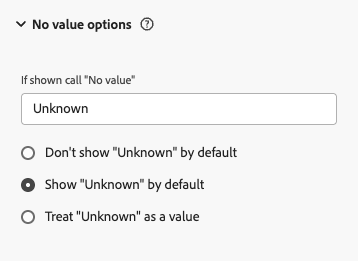

# How to handle No value

When working with Customer Journey Analytics, encountering **[!UICONTROL No value]** entries in reports and dashboards raises important questions about data quality, collection methods, and reporting accuracy. These instances need careful monitoring, as they reveal hidden gaps in data collection. The challenge lies in distinguishing between two scenarios: when **[!UICONTROL No value]** entries need investigation by data source providers, and when **[!UICONTROL No value]** entries reflect the natural flow of data into Customer Journey Analytics. Understanding this distinction is crucial for maintaining efficient analytics operations. This guide helps you make informed decisions about **[!UICONTROL No value]** appearances in your Customer Journey Analytics implementation.

## Understand No value

**[!UICONTROL No value]** appears when a dimension does not have a corresponding value for an event that otherwise contains a metric. Seeing **[!UICONTROL No value]** in a report isn't always a problem. In many cases, it reflects the expected structure of your dataset.

Dimension items fall into one of three categories:

* **Expected [!UICONTROL No value]**: A natural result of how users move through your data, such as visitors who haven't signed in yet, or dimensions that don't apply to every event
* **Problematic [!UICONTROL No value]**: The result of a failed data collection or an implementation error, where a value exists but is missing
* **Valid value**: The dimension successfully captured a value

The following diagram shows how Customer Journey Analytics arrives at each of these categories as data moves from your source through Adobe Experience Platform.

The flowchart illustrates how Customer Journey Analytics evaluations focus on incoming data by first checking for value presence, then determining whether missing values are expected or problematic. This clear assessment helps administrators and analysts differentiate between **[!UICONTROL No value]** cases requiring source investigation and those representing normal operations.

## When No value is expected

The following are common, expected reasons for **[!UICONTROL No value]** to appear in a report:

* A dimension only applies to specific scenarios, such as traffic source or device type
* A first-time visitor hasn't been assigned an identifier yet
* A visitor is in a pre-login state and hasn't provided user information
* A feature or product interaction doesn't apply to a particular user journey
* A cross-device scenario doesn't carry dimension values across devices

In these cases, **[!UICONTROL No value]** indicates where a user is in their authentication journey, during the transition from an unidentified to an identified state, as illustrated below.

## When No value needs attention

Investigate **[!UICONTROL No value]** entries when they result from any of the following:

**Implementation issues at the data source:**

* Missing data elements or null values
* Incorrect variable mapping
* An improperly configured data layer
* Failed data collection
* A mismatch between incoming data and the defined schema

**Data quality issues:**

* Broken tracking code
* Incomplete data collection
* Integration failures
* Errors introduced during data transformation
* Disruptions in the data pipeline

## Manage No value in data view settings

Data view settings give you control over how **[!UICONTROL No value]** items display in reports, including renaming the label, showing or hiding the items by default, and treating **[!UICONTROL No value]** as a legitimate string value. See [No value options component settings](/help/data-views/component-settings/no-value-options.md) for the full list of settings and how they affect percentage distributions, filtering, and segmentation.

When configuring these settings, evaluate your reporting requirements and assess how the presence of **[!UICONTROL No value]** affects your analysis. Consider both immediate effects on data visibility and long-term impacts on trend analysis and reporting consistency. Well-chosen configurations enhance data clarity while keeping business insights accessible and actionable, regardless of how **[!UICONTROL No value]** entries appear in your reports. The ideal configuration balances data representation with practical analytical needs, creating a reporting environment that delivers accurate and meaningful insights even when **[!UICONTROL No value]** data is present. 

The following table summarizes the various configurations available.

<table>
<thead>
<tr>
<th>Category</th>
<th>Setting</th>
<th>What it does</th>
<th>Impact</th>
</tr>
</thead>
<tbody>
<tr>
<td rowspan="2">Show options</td>
<td></td>
<td rowspan="2">Can be included or excluded via checkbox selection within freeform table search filter.</td>
<td rowspan="2">Visibility</td>
</tr>
<tr>
<td></td>
</tr>
<tr>
<td rowspan="2">Custom naming</td>
<td></td>
<td rowspan="2">Affects reporting dimension value display and potentially value consolidation and metric aggregation.</td>
<td rowspan="2">Naming</td>
</tr>
<tr>
<td></td>
</tr>
<tr>
<td rowspan="3">Treatment options</td>
<td></td>
<td>Applies only to non-numeric dimensions.
Affects both attribution and the include **[!UICONTROL No value]** option in freeform table search filter.</td>
<td>Value handling and visibility</td>
</tr>
<tr>
<td rowspan="2">Numeric dimension support:  </td>
<td rowspan="2">Can be included or excluded via checkbox selection within freeform table search filter</td>
<td rowspan="2">Visibility</td>
</tr>
<tr>
</tr>
</tbody>
</table>

### If shown, call "No value"

This setting lets you customize how **[!UICONTROL No value]** rows display in reports. You can enter a custom name for the **[!UICONTROL No value]** dimension item in the text field, providing more meaningful context through **[!UICONTROL If shown, call "No value"]**. Using clear, business-friendly terms instead of `No value` helps your organization better understand report values. While you cannot use **[!UICONTROL No value]** directly as a string in segments, you can achieve the same effect using the **[!UICONTROL does not exist]** operator.

You can replace `No value` with descriptive terms like `Pre-login User` for authentication status, `No Customer Tier` for customers without tiers, or `No Tracked Marketing Channel` for unidentified marketing sources. This creates more intuitive reports. `Pre-login User` clearly shows where a customer is in their journey, while `No Customer Tier` provides specific context. Remember that your chosen description applies to all **[!UICONTROL No value]** instances for that dimension, so select terms that accurately reflect all scenarios where dimension values are absent.

### Don't show No value by default

This setting determines whether to hide **[!UICONTROL No value]** rows by default in reporting. When enabled, these rows are filtered out initially but can still be shown within a freeform table if needed by check box selection within the freeform table search filter. Note that hiding **[!UICONTROL No value]** rows affects the percentage distribution of the remaining values, as percentages are recalculated based on the visible items only.

### Show No value by default

This setting controls whether **[!UICONTROL No value]** appears by default in reports. When enabled, **[!UICONTROL No value]** entries are visible, though users can exclude them using the checkbox in the freeform table search filter. Including or excluding **[!UICONTROL No value]** rows affects percentage distributions, as percentages are calculated based only on visible items.

### Treat No value as a value

This setting treats **[!UICONTROL No value]** as a string value (except for numeric dimensions), allowing you to customize its representation as a dimension value. This customization affects both attribution and the **[!UICONTROL Include No value]** option in the Freeform table search filter. Keep in mind that when you assign a custom string value, all matching values in your dataset are consolidated under that same dimension string value.

The **[!UICONTROL Treat "No value" as a value]** setting serves a different purpose than showing **[!UICONTROL No value]** by default. While showing by default only controls visibility, treating as a value changes how Customer Journey Analytics logically handles these entries. Here's why this distinction matters:

* It enables more granular control in filtering and segmentation, making **[!UICONTROL No value]** a distinct, actionable dimension value.
* It maintains consistent attribution and representation throughout your analytics by treating **[!UICONTROL No value]** as a legitimate dimension value in both attribution models and visualizations.

You treat **[!UICONTROL No value]** as a value when:

* The absence of data itself is meaningful to your analysis (such as pre-login states or unattributed traffic).
* You need to create segments or calculated metrics that specifically target or exclude these cases.

In contrast, showing **[!UICONTROL No value]** by default is better suited when you need basic visibility of missing data without the complexity of additional logic and attribution that comes with treating it as a value.

### No value support for numeric dimensions

For numeric dimensions, several configuration options are available. In the Data view dimensions settings, you can configure all **[!UICONTROL No value]** options except **[!UICONTROL Treat "No value" as a value]**. You can also manage **[!UICONTROL Include "No value"]** for numeric dimensions by check box selection within the freeform table search filter. When creating segments, you can use the **[!UICONTROL exists]** or **[!UICONTROL does not exist]** operators with numeric dimensions.

## Best practices

Once you've identified problematic **[!UICONTROL No value ]** instances, you'll need to develop and implement a remediation strategy. This remediation can be done in two ways: 

* Adjust Data View component **[!UICONTROL No Value]** option settings, or 
* Fix issues at the data collection source. 
 
Choose your approach carefully, as each path has different implications for both quick fixes and long-term data quality. Your implementation follows a methodical process that fixes current issues while preventing future ones. Success depends on planning, systematic execution, and ongoing monitoring. 

Here are key strategic considerations for your remediation plan:

### Prevent No value issues

* Validate data before it's processed
* Set default dimension values where appropriate (never for a person ID)
* Document the scenarios where **[!UICONTROL No value]** is expected
* Add quality checks at the point of data collection
* Monitor compliance with your data model
* Log errors during data collection
* Add automated tests for your implementation
* Require schema fields where a value always exists

### Validate No value in your reports

* Create segments that isolate **[!UICONTROL No value]** patterns
* Build a QA dashboard that monitors **[!UICONTROL No value]** trends over time
* Set up alerts that track changes in **[!UICONTROL No value]** volume
* Generate automated reports that highlight significant pattern changes
* Cross-reference **[!UICONTROL No value]** patterns across related dimensions
* Conduct regular audits of your data view configuration
* Maintain a changelog of changes to your **[!UICONTROL No value]** strategy
* Create standard operating procedures and documentation templates for stakeholders

## Conclusion

Not every **[!UICONTROL No value]** entry signals a problem. Interpreting **[!UICONTROL No value]** correctly requires understanding your Adobe Experience Platform and Customer Journey Analytics data architecture, as well as how users move through your product or site. Rather than trying to eliminate every instance of **[!UICONTROL No value]**, establish documented, organization-wide rules that distinguish expected **[!UICONTROL No value]** from problematic **[!UICONTROL No value]**, grounded in your own user journeys and business cases.

>[!MORELIKETHIS]
>
>[The complete playbook for handling **[!UICONTROL No value]** in Adobe Customer Journey Analytics](https://experienceleaguecommunities.adobe.com/adobe-analytics-3/the-complete-playbook-for-handling-no-value-in-adobe-cja-12769)
