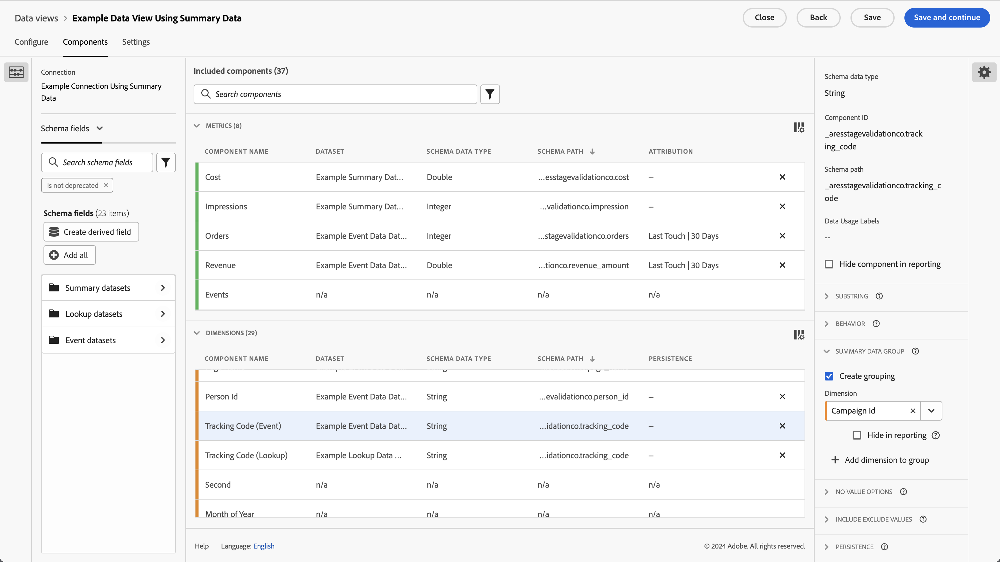
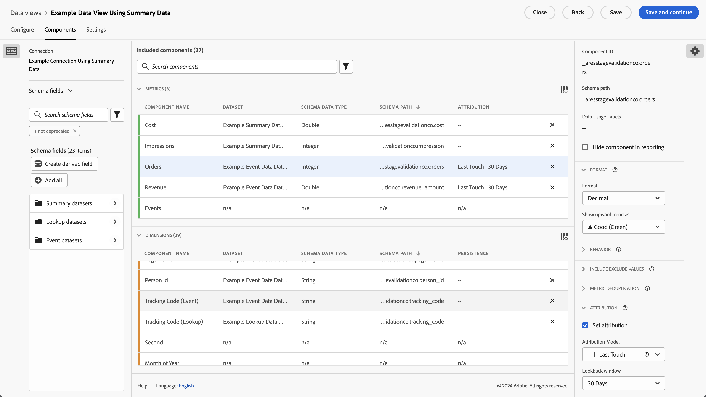

# Use summary data

This use case is to help you understand how to use summary data in your reporting and analysis. The use case details all the steps that are required to use summary data in Customer Journey Analytics:

- [Ingest](#ingest) summary data and other data sources in Experience Platform. 
- Set up your [Connection](#connection) for the summary data and other data sources.
- Configure your [Data view](#data-view) to combine your data sources.
- Report and analyze in [Workspace](#workspace) on your combined data.

The use case provides sample data for summary data, event data and lookup data. All data contains random values.

## Ingest 

You use the following sample summary data for this use case, showing summary data for running campaigns on Facebook.

+++Summary data

| _id | campaign_name | cost | impression | campaign_id | network | ad_group | timestamp |
|---|---|---:|---:|---|---|---|---|
| 1 | 123 Campaign | 100 | 5000 | abc123 | facebook | abc-adgroup | 2024-07-18T18:20:39.000Z |
| 2 | 123 Campaign | 50 | 4000 | def123 | facebook | def-adgroup | 2024-07-18T18:20:39.000Z |
| 3 | 123 Campaign | 125 | 6000 | ghi123 | facebook | ghi-adgroup | 2024-07-18T18:20:39.000Z |
| 4 | 456 Campaign | 25 | 2500 | abc456 | facebook | abc-adgroup | 2024-07-18T18:20:39.000Z |
| 5 | 456 Campaign | 10 | 1000 | def456 | facebook | def-adgroup | 2024-07-18T18:20:39.000Z |
| 6 | 456 Campaign | 115 | 5500 | ghi456 | facebook | ghi-adgroup | 2024-07-18T18:20:39.000Z |
| 7 | 789 Campaign | 200 | 9000 | abc789 | facebook | abc-adgroup | 2024-07-18T18:20:39.000Z |
| 8 | 789 Campaign | 20 | 2000 | def789 | facebook | def-adgroup | 2024-07-18T18:20:39.000Z |
| 9 | 789 Campaign | 225 | 12000 | ghi789 | facebook | ghi-adgroup | 2024-07-18T18:20:39.000Z |
| 10 | 987 Campaign | 125 | 10000 | abc987 | facebook | abc-adgroup | 2024-07-18T18:20:39.000Z |
| 11 | 987 Campaign | 120 | 15000 | def987 | facebook | def-adgroup | 2024-07-18T18:20:39.000Z |
| 12 | 987 Campaign | 315 | 22500 | ghi987 | facebook | ghi-adgroup | 2024-07-18T18:20:39.000Z |
| 13 | 654 Campaign | 325 | 20000 | abc654 | facebook | abc-adgroup | 2024-07-18T18:20:39.000Z |
| 14 | 654 Campaign | 320 | 25000 | def654 | facebook | def-adgroup | 2024-07-18T18:20:39.000Z |
| 15 | 654 Campaign | 315 | 22500 | ghi654 | facebook | ghi-adgroup | 2024-07-18T18:20:39.000Z |
| 16 | 321 Campaign | 25 | 2000 | abc321 | facebook | abc-adgroup | 2024-07-18T18:20:39.000Z |
| 17 | 321 Campaign | 20 | 2500 | def321 | facebook | def-adgroup | 2024-07-18T18:20:39.000Z |
| 18 | 321 Campaign | 15 | 2250 | ghi321 | facebook | ghi-adgroup | 2024-07-18T18:20:39.000Z |

[ Download sample summary data](./assets/summary-data.csv)

+++

To use the summary data in Customer Journey Analytics, in a report or as part of analyzing data in Workspace, you need

- a summary schema in Experience Platform,
- a summary dataset in Experience Platform,
- a connection in Customer Journey Analytics configured to use the summary dataset,
- a data view in Customer Journey Analytics, correctly configured with metrics and dimensions for the summary data.

You use this summary data alongside a dataset for event data and a dataset for lookup data.

+++Event data

Event data is available in the Example Event Data Dataset. The sample data looks like:
    
| timestamp | _id | page_name | person_id | tracking_code | orders | revenue_amount |
|---|---:|---|---|---|---:|---:|
| 2024-07-18T19:15:39+00:00 | 1 | home page | person-1abc123 | abc123 |  |  |
| 2024-07-18T19:15:39+00:00 | 2 | confirmation page | person-1abc123 |  | 1 | 174.25 |
| 2024-07-18T19:15:39+00:00 | 3 | home page | person-2def123 | def123 |  |  |
| 2024-07-18T19:15:39+00:00 | 4 | home page | person-3ghi123 | ghi123 |  |  |
| 2024-07-18T19:15:39+00:00 | 5 | confirmation page | person-3ghi123 |  | 1 | 149.25 |
| 2024-07-18T19:15:39+00:00 | 6 | home page | person-4abc456 | abc456 |  |  |
| 2024-07-18T19:15:39+00:00 | 7 | home page | person-5def456 | def456 |  |  |
| 2024-07-18T19:15:39+00:00 | 8 | home page | person-6ghi456 | ghi456 |  |  |
| 2024-07-18T19:15:39+00:00 | 9 | confirmation page | person-6ghi456 |  | 1 | 159.25 |
| 2024-07-18T19:15:39+00:00 | 10 | home page | person-7abc789 | abc789 |  |  |
| 2024-07-18T19:15:39+00:00 | 11 | home page | person-8def789 | def789 |  |  |
| 2024-07-18T19:15:39+00:00 | 12 | home page | person-9ghi789 | ghi789 |  |  |
| 2024-07-18T19:15:39+00:00 | 13 | confirmation page | person-9ghi789 |  | 1 | 124.25 |
| 2024-07-18T19:15:39+00:00 | 14 | home page | person-10abc987 | abc987 |  |  |
| 2024-07-18T19:15:39+00:00 | 15 | home page | person-11def987 | def987 |  |  |
| 2024-07-18T19:15:39+00:00 | 16 | home page | person-12ghi987 | ghi987 |  |  |
| 2024-07-18T19:15:39+00:00 | 17 | home page | person-13abc654 | abc654 |  |  |
| 2024-07-18T19:15:39+00:00 | 18 | home page | person-14def654 | def654 |  |  |
| 2024-07-18T19:15:39+00:00 | 19 | home page | person-15ghi654 | ghi654 |  |  |
| 2024-07-18T19:15:39+00:00 | 20 | confirmation page | person-15ghi654 |  | 1 | 174.25 |
| 2024-07-18T19:15:39+00:00 | 21 | home page | person-16abc321 | abc321 |  |  |
| 2024-07-18T19:15:39+00:00 | 22 | home page | person-17def321 | def321 |  |  |
| 2024-07-18T19:15:39+00:00 | 23 | home page | person-18ghi321 | ghi321 |  |  |
| 2024-07-18T19:15:39+00:00 | 24 | home page | person-19abc123 | abc123 |  |  |
| 2024-07-18T19:15:39+00:00 | 25 | home page | person-20def123 | def123 |  |  |
| 2024-07-18T19:15:39+00:00 | 26 | home page | person-21ghi123 | ghi123 |  |  |
| 2024-07-18T19:15:39+00:00 | 27 | confirmation page | person-21ghi123 |  | 1 | 149.25 |
| 2024-07-18T19:15:39+00:00 | 28 | home page | person-22abc456 | abc456 |  |  |
| 2024-07-18T19:15:39+00:00 | 29 | home page | person-23def456 | def456 |  |  |
| 2024-07-18T19:15:39+00:00 | 30 | home page | person-24ghi456 | ghi456 |  |  |
| 2024-07-18T19:15:39+00:00 | 31 | home page | person-25abc789 | abc789 |  |  |
| 2024-07-18T19:15:39+00:00 | 32 | confirmation page | person-25abc789 |  | 1 | 139.25 |
| 2024-07-18T19:15:39+00:00 | 33 | home page | person-26abc987 | abc987 |  |  |
| 2024-07-18T19:15:39+00:00 | 34 | home page | person-27def987 | def987 |  |  |
| 2024-07-18T19:15:39+00:00 | 35 | home page | person-28ghi987 | ghi987 |  |  |
| 2024-07-18T19:15:39+00:00 | 36 | home page | person-29abc654 | abc654 |  |  |
| 2024-07-18T19:15:39+00:00 | 37 | confirmation page | person-29abc654 |  | 1 | 124.25 |
| 2024-07-18T19:15:39+00:00 | 38 | home page | person-30def654 | def654 |  |  |
| 2024-07-18T19:15:39+00:00 | 39 | home page | person-31ghi654 | ghi654 |  |  |
| 2024-07-18T19:15:39+00:00 | 40 | home page | person-32abc321 | abc321 |  |  |
| 2024-07-18T19:15:39+00:00 | 41 | home page | person-33ghi456 | ghi456 |  |  |
| 2024-07-18T19:15:39+00:00 | 42 | confirmation page | person-33ghi456 |  | 1 | 174.25 |
| 2024-07-18T19:15:39+00:00 | 43 | home page | person-34abc789 | abc789 |  |  |
| 2024-07-18T19:15:39+00:00 | 44 | home page | person-35def789 | def789 |  |  |
| 2024-07-18T19:15:39+00:00 | 45 | home page | person-36ghi789 | ghi789 |  |  |
| 2024-07-18T19:15:39+00:00 | 46 | confirmation page | person-36ghi789 |  | 1 | 149.25 |
| 2024-07-18T19:15:39+00:00 | 47 | home page | person-37abc987 | abc987 |  |  |
| 2024-07-18T19:15:39+00:00 | 48 | home page | person-38def987 | def987 |  |  |
| 2024-07-18T19:15:39+00:00 | 49 | home page | person-39ghi987 | ghi987 |  |  |
| 2024-07-18T19:15:39+00:00 | 50 | home page | person-40abc654 | abc654 |  |  |
| 2024-07-18T19:15:39+00:00 | 51 | confirmation page | person-40abc654 |  | 1 | 124.25 |
| 2024-07-18T19:15:39+00:00 | 52 | home page | person-41def654 | def654 |  |  |
| 2024-07-18T19:15:39+00:00 | 53 | home page | person-42ghi654 | ghi654 |  |  |
| 2024-07-18T19:15:39+00:00 | 54 | home page | person-43abc321 | abc321 |  |  |
| 2024-07-18T19:15:39+00:00 | 55 | home page | person-44def321 | def321 |  |  |
| 2024-07-18T19:15:39+00:00 | 56 | home page | person-45ghi321 | ghi321 |  |  |
| 2024-07-18T19:15:39+00:00 | 57 | home page | person-46abc123 | abc123 |  |  |
| 2024-07-18T19:15:39+00:00 | 58 | confirmation page | person-46abc123 |  | 1 | 174.25 |
| 2024-07-18T19:15:39+00:00 | 59 | home page | person-47def123 | def123 |  |  |
| 2024-07-18T19:15:39+00:00 | 60 | home page | person-48ghi123 | ghi123 |  |  |
| 2024-07-18T19:15:39+00:00 | 61 | home page | person-49abc456 | abc456 |  |  |
| 2024-07-18T19:15:39+00:00 | 62 | home page | person-50def456 | def456 |  |  |
| 2024-07-18T19:15:39+00:00 | 63 | home page | person-51ghi456 | ghi456 |  |  |
| 2024-07-18T19:15:39+00:00 | 64 | home page | person-52abc789 | abc789 |  |  |
| 2024-07-18T19:15:39+00:00 | 65 | confirmation page | person-52abc789 |  | 1 | 149.25 |
| 2024-07-18T19:15:39+00:00 | 66 | home page | person-53abc987 | abc987 |  |  |
| 2024-07-18T19:15:39+00:00 | 67 | home page | person-54def987 | def987 |  |  |
| 2024-07-18T19:15:39+00:00 | 68 | home page | person-55ghi987 | ghi987 |  |  |
| 2024-07-18T19:15:39+00:00 | 69 | confirmation page | person-55ghi987 |  | 1 | 124.25 |
| 2024-07-18T19:15:39+00:00 | 70 | home page | person-56abc123 | abc123 |  |  |
| 2024-07-18T19:15:39+00:00 | 71 | home page | person-57def123 | def123 |  |  |
| 2024-07-18T19:15:39+00:00 | 72 | confirmation page | person-57def123 |  | 1 | 174.25 |
| 2024-07-18T19:15:39+00:00 | 73 | home page | person-58ghi123 | ghi123 |  |  |
| 2024-07-18T19:15:39+00:00 | 74 | home page | person-59abc456 | abc456 |  |  |
| 2024-07-18T19:15:39+00:00 | 75 | confirmation page | person-59abc456 |  | 1 | 149.25 |
| 2024-07-18T19:15:39+00:00 | 76 | home page | person-60def456 | def456 |  |  |
| 2024-07-18T19:15:39+00:00 | 77 | home page | person-61ghi456 | ghi456 |  |  |
| 2024-07-18T19:15:39+00:00 | 78 | home page | person-62abc789 | abc789 |  |  |
| 2024-07-18T19:15:39+00:00 | 79 | confirmation page | person-62abc789 |  | 1 | 159.25 |
| 2024-07-18T19:15:39+00:00 | 80 | home page | person-63def789 | def789 |  |  |
| 2024-07-18T19:15:39+00:00 | 81 | home page | person-64ghi789 | ghi789 |  |  |
| 2024-07-18T19:15:39+00:00 | 82 | home page | person-65abc987 | abc987 |  |  |
| 2024-07-18T19:15:39+00:00 | 83 | confirmation page | person-65abc987 |  | 1 | 124.25 |
| 2024-07-18T19:15:39+00:00 | 84 | home page | person-66def987 | def987 |  |  |
| 2024-07-18T19:15:39+00:00 | 85 | home page | person-67ghi987 | ghi987 |  |  |
| 2024-07-18T19:15:39+00:00 | 86 | home page | person-68abc654 | abc654 |  |  |
| 2024-07-18T19:15:39+00:00 | 87 | home page | person-69def654 | def654 |  |  |
| 2024-07-18T19:15:39+00:00 | 88 | home page | person-70ghi654 | ghi654 |  |  |
| 2024-07-18T19:15:39+00:00 | 89 | home page | person-71abc321 | abc321 |  |  |
| 2024-07-18T19:15:39+00:00 | 90 | confirmation page | person-71abc321 |  | 1 | 174.25 |
| 2024-07-18T19:15:39+00:00 | 91 | home page | person-72def321 | def321 |  |  |
| 2024-07-18T19:15:39+00:00 | 92 | home page | person-73ghi321 | ghi321 |  |  |
| 2024-07-18T19:15:39+00:00 | 93 | home page | person-74abc123 | abc123 |  |  |
| 2024-07-18T19:15:39+00:00 | 94 | home page | person-75def123 | def123 |  |  |
| 2024-07-18T19:15:39+00:00 | 95 | home page | person-76ghi123 | ghi123 |  |  |
| 2024-07-18T19:15:39+00:00 | 96 | home page | person-77abc456 | abc456 |  |  |
| 2024-07-18T19:15:39+00:00 | 97 | confirmation page | person-77abc456 |  | 1 | 149.25 |
| 2024-07-18T19:15:39+00:00 | 98 | home page | person-78def456 | def456 |  |  |
| 2024-07-18T19:15:39+00:00 | 99 | home page | person-79ghi456 | ghi456 |  |  |
| 2024-07-18T19:15:39+00:00 | 100 | home page | person-80abc789 | abc789 |  |  |
| 2024-07-18T19:15:39+00:00 | 101 | home page | person-81abc987 | abc987 |  |  |
| 2024-07-18T19:15:39+00:00 | 102 | confirmation page | person-81abc987 |  | 1 | 139.25 |
| 2024-07-18T19:15:39+00:00 | 103 | home page | person-82def987 | def987 |  |  |
| 2024-07-18T19:15:39+00:00 | 104 | home page | person-83ghi987 | ghi987 |  |  |
| 2024-07-18T19:15:39+00:00 | 105 | home page | person-84abc654 | abc654 |  |  |
| 2024-07-18T19:15:39+00:00 | 106 | home page | person-85def654 | def654 |  |  |
| 2024-07-18T19:15:39+00:00 | 107 | confirmation page | person-85def654 |  | 1 | 124.25 |
| 2024-07-18T19:15:39+00:00 | 108 | home page | person-86ghi654 | ghi654 |  |  |
| 2024-07-18T19:15:39+00:00 | 109 | home page | person-87abc321 | abc321 |  |  |
| 2024-07-18T19:15:39+00:00 | 110 | home page | person-88ghi456 | ghi456 |  |  |
| 2024-07-18T19:15:39+00:00 | 111 | home page | person-89abc789 | abc789 |  |  |
| 2024-07-18T19:15:39+00:00 | 112 | confirmation page | person-89abc789 |  | 1 | 174.25 |
| 2024-07-18T19:15:39+00:00 | 113 | home page | person-90def789 | def789 |  |  |
| 2024-07-18T19:15:39+00:00 | 114 | home page | person-91ghi789 | ghi789 |  |  |
| 2024-07-18T19:15:39+00:00 | 115 | home page | person-92abc987 | abc987 |  |  |
| 2024-07-18T19:15:39+00:00 | 116 | confirmation page | person-92abc987 |  | 1 | 149.25 |
| 2024-07-18T19:15:39+00:00 | 117 | home page | person-93def987 | def987 |  |  |
| 2024-07-18T19:15:39+00:00 | 118 | home page | person-94ghi987 | ghi987 |  |  |
| 2024-07-18T19:15:39+00:00 | 119 | home page | person-95abc654 | abc654 |  |  |
| 2024-07-18T19:15:39+00:00 | 120 | home page | person-96def654 | def654 |  |  |
| 2024-07-18T19:15:39+00:00 | 121 | confirmation page | person-96def654 |  | 1 | 124.25 |
| 2024-07-18T19:15:39+00:00 | 122 | home page | person-97ghi654 | ghi654 |  |  |
| 2024-07-18T19:15:39+00:00 | 123 | home page | person-98abc321 | abc321 |  |  |
| 2024-07-18T19:15:39+00:00 | 124 | home page | person-99def321 | def321 |  |  |
| 2024-07-18T19:15:39+00:00 | 125 | home page | person-100ghi321 | ghi321 |  |  |
| 2024-07-18T19:15:39+00:00 | 126 | home page | person-101abc123 | abc123 |  |  |
| 2024-07-18T19:15:39+00:00 | 127 | home page | person-102def123 | def123 |  |  |
| 2024-07-18T19:15:39+00:00 | 128 | confirmation page | person-102def123 |  | 1 | 174.25 |
| 2024-07-18T19:15:39+00:00 | 129 | home page | person-103ghi123 | ghi123 |  |  |
| 2024-07-18T19:15:39+00:00 | 130 | home page | person-104abc456 | abc456 |  |  |
| 2024-07-18T19:15:39+00:00 | 131 | home page | person-105def456 | def456 |  |  |
| 2024-07-18T19:15:39+00:00 | 132 | home page | person-106ghi456 | ghi456 |  |  |
| 2024-07-18T19:15:39+00:00 | 133 | home page | person-107abc789 | abc789 |  |  |
| 2024-07-18T19:15:39+00:00 | 134 | home page | person-108abc987 | abc987 |  |  |
| 2024-07-18T19:15:39+00:00 | 135 | confirmation page | person-108abc987 |  | 1 | 149.25 |
| 2024-07-18T19:15:39+00:00 | 136 | home page | person-109def987 | def987 |  |  |
| 2024-07-18T19:15:39+00:00 | 137 | home page | person-110ghi987 | ghi987 |  |  |
| 2024-07-18T19:15:39+00:00 | 138 | confirmation page | person-110ghi987 |  |  |  |
| 2024-07-18T19:15:39+00:00 | 139 | home page | person-111def987 | def987 |  |  |
| 2024-07-18T19:15:39+00:00 | 140 | home page | person-112def987 |  | 1 | 124.25 |
| 2024-07-18T19:15:39+00:00 | 141 | confirmation page | person-112def987 |  | 1 | 149.25 |
| 2024-07-18T19:15:39+00:00 | 142 | home page | person-113ghi987 | ghi987 |  |  |
| 2024-07-18T19:15:39+00:00 | 143 | home page | person-114abc654 | abc654 |  |  |
| 2024-07-18T19:15:39+00:00 | 144 | home page | person-115def654 | def654 |  |  |
| 2024-07-18T19:15:39+00:00 | 145 | confirmation page | person-115def654 |  | 1 | 159.25 |
| 2024-07-18T19:15:39+00:00 | 146 | home page | person-116ghi654 | ghi654 |  |  |
| 2024-07-18T19:15:39+00:00 | 147 | home page | person-117abc321 | abc321 |  |  |
| 2024-07-18T19:15:39+00:00 | 148 | home page | person-118def321 | def321 |  |  |
| 2024-07-18T19:15:39+00:00 | 149 | confirmation page | person-118def321 |  | 1 | 124.25 |
| 2024-07-18T19:15:39+00:00 | 150 | home page | person-119ghi321 | ghi321 |  |  |
| 2024-07-18T19:15:39+00:00 | 151 | home page | person-120abc123 | abc123 |  |  |
| 2024-07-18T19:15:39+00:00 | 152 | home page | person-121def123 | def123 |  |  |
| 2024-07-18T19:15:39+00:00 | 153 | home page | person-122ghi123 | ghi123 |  |  |
| 2024-07-18T19:15:39+00:00 | 154 | home page | person-123abc456 | abc456 |  |  |
| 2024-07-18T19:15:39+00:00 | 155 | home page | person-124def456 | def456 |  |  |
| 2024-07-18T19:15:39+00:00 | 156 | confirmation page | person-124def456 |  | 1 | 174.25 |
| 2024-07-18T19:15:39+00:00 | 157 | home page | person-125ghi456 | ghi456 |  |  |
| 2024-07-18T19:15:39+00:00 | 158 | home page | person-126abc789 | abc789 |  |  |
| 2024-07-18T19:15:39+00:00 | 159 | home page | person-127abc987 | abc987 |  |  |
| 2024-07-18T19:15:39+00:00 | 160 | home page | person-128def987 | def987 |  |  |
| 2024-07-18T19:15:39+00:00 | 161 | home page | person-129ghi987 | ghi987 |  |  |
| 2024-07-18T19:15:39+00:00 | 162 | home page | person-130abc654 | abc654 |  |  |
| 2024-07-18T19:15:39+00:00 | 163 | confirmation page | person-130abc654 |  | 1 | 149.25 |
| 2024-07-18T19:15:39+00:00 | 164 | home page | person-131def654 | def654 |  |  |
| 2024-07-18T19:15:39+00:00 | 165 | home page | person-132ghi654 | ghi654 |  |  |
| 2024-07-18T19:15:39+00:00 | 166 | home page | person-133abc321 | abc321 |  |  |
| 2024-07-18T19:15:39+00:00 | 167 | home page | person-134ghi456 | ghi456 |  |  |
| 2024-07-18T19:15:39+00:00 | 168 | confirmation page | person-134ghi456 |  | 1 | 139.25 |
| 2024-07-18T19:15:39+00:00 | 169 | home page | person-135abc789 | abc789 |  |  |
| 2024-07-18T19:15:39+00:00 | 170 | home page | person-136def789 | def789 |  |  |
| 2024-07-18T19:15:39+00:00 | 171 | home page | person-137ghi789 | ghi789 |  |  |
| 2024-07-18T19:15:39+00:00 | 172 | home page | person-138abc987 | abc987 |  |  |
| 2024-07-18T19:15:39+00:00 | 173 | confirmation page | person-138abc987 |  | 1 | 124.25 |
| 2024-07-18T19:15:39+00:00 | 174 | home page | person-139def987 | def987 |  |  |
| 2024-07-18T19:15:39+00:00 | 175 | home page | person-140ghi987 | ghi987 |  |  |
| 2024-07-18T19:15:39+00:00 | 176 | home page | person-141abc654 | abc654 |  |  |
| 2024-07-18T19:15:39+00:00 | 177 | home page | person-142def654 | def654 |  |  |
| 2024-07-18T19:15:39+00:00 | 178 | confirmation page | person-142def654 |  | 1 | 174.25 |
| 2024-07-18T19:15:39+00:00 | 179 | home page | person-143ghi654 | ghi654 |  |  |

[ Download sample event data](./assets/event-data.csv)

+++

+++ Lookup data

Lookup data is available in the Example Lookup Data Dataset. The sample data looks like:

| _id | tracking_code | ad_group | campaign_name |
|---|---|---|---|
| 1 | abc123 | abc-adgroup | 123 Campaign |
| 2 | def123 | def-adgroup | 123 Campaign |
| 3 | ghi123 | ghi-adgroup | 123 Campaign |
| 4 | abc456 | abc-adgroup | 456 Campaign |
| 5 | def456 | def-adgroup | 456 Campaign |
| 6 | ghi456 | ghi-adgroup | 456 Campaign |
| 7 | abc789 | abc-adgroup | 789 Campaign |
| 8 | def789 | def-adgroup | 789 Campaign |
| 9 | ghi789 | ghi-adgroup | 789 Campaign |
| 10 | abc987 | abc-adgroup | 987 Campaign |
| 11 | def987 | def-adgroup | 987 Campaign |
| 12 | ghi987 | ghi-adgroup | 987 Campaign |
| 13 | abc654 | abc-adgroup | 654 Campaign |
| 14 | def654 | def-adgroup | 654 Campaign |
| 15 | ghi654 | ghi-adgroup | 654 Campaign |
| 16 | abc321 | abc-adgroup | 321 Campaign |
| 17 | def321 | def-adgroup | 321 Campaign |
| 18 | ghi321 | ghi-adgroup | 321 Campaign |

[ Download sample looukup data](./assets/lookup-data.csv)
+++

>[!INFO]
>
>Further details for setting up schemas and datasets for the event and lookup data are not provided. This setup is assumed common knowledge and follows the same steps as for the lookup data.
>

### Summary schema

Summary data needs a summary schema in Experience Platform. A summary schema is a schema that is using the XDM Summary Metrics as its base class.

To create a summary schema in Experience Platform:

1. Select **[!UICONTROL Experience Platform]** from the &nbsp;  &nbsp; app switcher.
1. Select **[!UICONTROL Schemas]** from the left rail.
1. Select  **[!UICONTROL Create schema]**.
1. Select **[!UICONTROL Manual]** in the **[!UICONTROL Create a schema]** dialog. Then use **[!UICONTROL Select]** to continue.
1. In the **[!UICONTROL Select a class]** step of the **[!UICONTROL Schemas]** > **[!UICONTROL Create schema]** wizard, select **[!UICONTROL Other]** from the **[!UICONTROL Select a base class for this schema]** options.
1. From the list, select **[!UICONTROL XDM Summary Metrics]** (or use  field to search for) and select **[!UICONTROL Next]**. 
1. In the **[!UICONTROL Name and review]** step of the **[!UICONTROL Schemas]** > **[!UICONTROL Create schema]** wizard, enter a **[!UICONTROL Schema display name]**, for example `Example Summary Data Schema` and an optional description. Select **[!UICONTROL Finish]** to finish this step.

The structure of your base summary schema is displayed, ready to be augmented with the fields for your summary data. You add fields to a schema, using field groups.

To add a field group, containing the fields for your sample data:

1. Select  **[!UICONTROL Add]** in **[!UICONTROL Field groups]**.
1. In the **[!UICONTROL Add field groups]** dialog, select **[!UICONTROL Create new field group]**.
1. Enter a **[!UICONTROL Display name]** for the field group, for example `Example Summary Data`. Optionally provide a description.
1. Select **[!UICONTROL Add field groups]**.
1. You are back in the schema structure user interface. Select the new **[!UICONTROL Example Summary Data]** in **[!UICONTROL Field groups]**.
1. Select the  next to the schema name **[!UICONTROL Example summary Data Schema]**. A **[!UICONTROL Field properties]** panel opens up allowing you to add details for a field.
   1. Enter a **[!UICONTROL Field name]**: `campaign_id`
   1. Enter a **[!UICONTROL Display name]**: `campaign_id`
   1. Select a **[!UICONTROL Type]** from the **[!UICONTROL Select data type]** dropdown: **[!UICONTROL String]**
   1. Ensure **[!UICONTROL Assign to]** **[!UICONTROL Field group]** is selected, and select **[!UICONTROL Example Summary Data]** from the dropdown.
   1. Scroll down to the bottom, and select **[!UICONTROL Apply]**.
1. Repeat the previous step for the other fields of the summary data. See the table below for the correct values.

   | Field name | Display name | Type | Field Group |
   |---|---|---|---|
   | `ad_group` | `ad_group` | String | Example Summary Data |
   | `campaign_name` | `campaign_name` | String  | Example Summary Data |
   | `cost` | `cost` | Double | Example Summary Data |
   | `impression` | `impression` | Integer | Example Summary Data |
   | `network` | `network` | String | Example Summary Data |

1. To save your **[!UICONTROL Example Summary Data]** field group as part of your schema, select **[!UICONTROL Save]**. You see a confirmation when your schema is successfully saved.

You have now defined a schema, detailing the model for your summary data. Similar to the one below.

### Summary dataset

To store your summary data in Experience Platform, you first need to create a dataset, and then upload your summary data into the dataset.

To create a dataset:

1. Select **[!UICONTROL Experience Platform]** from the &nbsp;  &nbsp; app switcher.
1. Select **[!UICONTROL Datasets]** from the left rail.
1. Select  **[!UICONTROL Create dataset]**.
1. In the **[!UICONTROL Datasets]** > **[!UICONTROL Create datasets]** screen, select **[!UICONTROL Create dataset from schema]**.
1. In the **[!UICONTROL Select schema]** step of the **[!UICONTROL Workflows]** > **[!UICONTROL Create dataset from schema]** wizard,  search for and select your **[!UICONTROL Example Summary Data Schema]**.
1. Select **[!UICONTROL Next]**.
1. In the **[!UICONTROL Configure dataset]** step of the **[!UICONTROL Workflows]** > **[!UICONTROL Create dataset from schema]** wizard:
   1. Enter a **[!UICONTROL Name]** for the dataset, for example: `Example Summary Data Dataset`. Optionally provide a description.
   1. Select **[!UICONTROL Finish]**.

You see a screen displaying the details of your new dataset. 

To upload your sample data into this dataset:

1. Select **[!UICONTROL Experience Platform]** from the &nbsp;  &nbsp; app switcher.
1. Select **[!UICONTROL Workflows]** from the left rail.
   1. Select **[!UICONTROL Map CSV to XDM schema]** from the **[!UICONTROL Data ingestion]** options in the **[!UICONTROL Workflows]** screen.
   1. Select **[!UICONTROL Launch]** from the **[!UICONTROL Map CSV to XDM schema]** panel.
1. In the **[!UICONTROL Dataflow detail]** step of the **[!UICONTROL Workflows]** > **[!UICONTROL Map CSV to XDM schema]** wizard:
   1. Select **[!UICONTROL Existing dataset]** for **[!UICONTROL Target dataset]**.
   1. Select **[!UICONTROL Example Summary Data Dataset]** from the dropdown list.
   1. Select **[!UICONTROL Next]**.
1. In the **[!UICONTROL Select data]** step of the **[!UICONTROL Workflows]** > **[!UICONTROL Map CSV to XDM schema]** wizard:
   1. Drag and drop your file with summary data in CSV format onto **[!UICONTROL Drag and drop files]**. Alternatively, use **[!UICONTROL Choose files]** to select your file.
   1. Ensure the **[!UICONTROL Data format]** and **[!UICONTROL Delimiter]** do have the correct values for your sample data. For example, **[!UICONTROL Delimited]** as the **[!UICONTROL Data format]**, and **[!UICONTROL ,]** as the **[!UICONTROL Delimiter]**.
   1. A sample (10 records) of your summary data is shown in **[!UICONTROL Sample data]**.
   1. Select **[!UICONTROL Next]**.
1. In the **[!UICONTROL Mapping]** step of the **[!UICONTROL Workflows]** > **[!UICONTROL Map CSV to XDM schema]** wizard:
   
   1. Check whether all data fields of your **[!UICONTROL Source Data]** are correctly mapped to the corresponding **[!UICONTROL Target fields]** in your schema. For the sample data, no errors are reported as you explicitly named the fields in your schema similar to the field names in your sample data. Otherwise, you can use this screen to correct the mapping.
   1. You can optionally select  **[!UICONTROL Validate]** to (once more) validate the data.
   1. You can optionally select  **[!UICONTROL Preview data]** to open a dialog with a preview of the data once loaded into the dataset.
   1. Select **[!UICONTROL Finish]**.

In **[!UICONTROL Sources]** > **[!UICONTROL Dataflow - XX/XX/XXXX, XX:XX XX]**, the status of your upload appears. Refresh to see updates of the upload. When successful, your sample data is loaded into Experience Platform. 

## Connection

To use your sample data in Customer Journey Analytics, you create a connection that includes the Example Summary Data Dataset from Experience Platform.

1. Select **[!UICONTROL Customer Journey Analytics]** from the &nbsp;  &nbsp; app switcher.
1. Select **[!UICONTROL Connections]** from the top menu.
1. Select **[!UICONTROL Create new connection]**.
1. In **[!UICONTROL Connections]** > **[!UICONTROL Untitled connection]**:
   1. Enter a **[!UICONTROL Connection name]**, for example `Example Connection Using Summary Data`.
   1. Select the sandbox that contains the dataset you created and the other datasets you want to include from the Sandbox dropdown list.
   1. Select **[!UICONTROL less than 1 million]** from the **[!UICONTROL Average number of daily events]** dropdown list.
   1. Select **[!UICONTROL Add datasets]**.
   1. In the **[!UICONTROL Select datasets]** step of the **[!UICONTROL Add datasets]** wizard:
      1. Search  and select **[!UICONTROL Example Summary Data Dataset]**, **[!UICONTROL Example Event Data Dataset]**, and **[!UICONTROL Example Lookup Data Dataset]**.
      1. Select **[!UICONTROL Next]**.
   1. In the **[!UICONTROL Datasets settings]** step of the **[!UICONTROL Add datasets]** wizard:
      
      1. For the **[!UICONTROL Example Event Data Dataset]**:

         1. Confirm the selections for **[!UICONTROL Person ID]** (`person_id`) and **[!UICONTROL Timestamp]** are correct.
         1. Select **[!UICONTROL Web Data]** from the **[!UICONTROL Data source type]**.
         1. Enable **[!UICONTROL Import all new data]**.
         1. Enable **[!UICONTROL Backfill all existing data]**.

      1. For the **[!UICONTROL Example Lookup Data Dataset]**:

         1. Select **[!UICONTROL tracking_code]** as the **[!UICONTROL Key]** and **[!UICONTROL tracking_code (Event datasets)]** as the **[!UICONTROL Matching]** Key.
         1. Select **[!UICONTROL Web Data]** from the **[!UICONTROL Data source type]**.
         1. Enable **[!UICONTROL Import all new data]**.
         1. Enable **[!UICONTROL Backfill all existing data]**.

      1. For the **[!UICONTROL Example Summary Data Dataset]**:

         1. Confirm the selections for **[!UICONTROL Timestamp]** and **[!UICONTROL Timezone]** are correct.
         1. Enable **[!UICONTROL Import all new data]**.
         1. Enable **[!UICONTROL Backfill all existing data]**.

      1. Select **[!UICONTROL Add datasets]**.

1. In the **[!UICONTROL Connections]** > **[!UICONTROL Example Connection using Summary Data]** connection screen, select **[!UICONTROL Save]** to save the connection. 

The data from the datasets is added to Customer Journey Analytics, which can take a couple of hours. So please, be patient before continuing. 

After a while, verify that data from your datasets is properly loaded in Customer Journey Analytics.

1. Select **[!UICONTROL Customer Journey Analytics]** from the &nbsp;  &nbsp; app switcher.
1. Select **[!UICONTROL Connections]** from the top menu.
1. Select your connection, for example **[!UICONTROL Example Connection Using Summary Data]**.
1. Select an appropriate data range in the **[!UICONTROL Connection]** > **[!UICONTROL Example Connection Using Summary data]** details.
   1. Select  and then select **[!UICONTROL Last 7 days]**.
   1. Select **[!UICONTROL Apply]**.

In the list of **[!UICONTROL Datasets]**, the values in the **[!UICONTROL Records added]** column should confirm that data from your datasets is now part of Customer Journey Analytics. 

## Data view

To ensure you can report on the correct data in Workspace, you want to create a data view containing the relevant metrics and dimensions.

1. Select **[!UICONTROL Customer Journey Analytics]** from the &nbsp;  &nbsp; app switcher.
1. Select **[!UICONTROL Data views]** from the top menu.
1. Select **[!UICONTROL Create new data view]**.
1. In **[!UICONTROL Data views]**, go through the wizard screens to configure your data view.
   1. In the **[!UICONTROL Configure]** step of **[!UICONTROL Data views]**:
      1. Select your connection from **[!UICONTROL Settings]** | **[!UICONTROL Connection]**. For example, **[!UICONTROL Example Connection Using Summary Data]**.
      1. Enter a **[!UICONTROL Name]** for your data view, for example `Example Data View Using Summary Data`.
      1. Leave all other settings.
      1. Select **[!UICONTROL Save and continue]**.
   1. In the **[!UICONTROL Components]** step of **[!UICONTROL Data views]** > **[!UICONTROL Example Data View Using Summary Data]**:
      1. Add the following components to the Dimensions and Metrics list. Note that for clarity, the component names are modified from their default name, using **[!UICONTROL Component name]** in **[!UICONTROL Component settings]** in the component panel (at the right).

         **Metrics**

         | Component name | Dataset | Schema data type | Schema path |
         |---|---|---|---|
         | Cost | Example Summary Data Dataset | Double | *_tenant*.cost | 
         | Impressions | Example Summary Data Dataset | Integer | *_tenant*.impression |
         | Orders | Example Event Data Dataset | Integer | *_tenant*.orders |
         | Revenue | Example Event Data Dataset | Double | *_tenant*.revenue_amount |

         **Dimensions**

         | Component name | Dataset | Schema data type | Schema path |
         |---|---|---|---|
         | Ad Group (Lookup) | Example Lookup Data Dataset | String | *_tenant*.ad_group |
         | Ad Group (Summary) | Example Summary Data Dataset | String | *_tenant*.ad_group |
         | Campaign Id | Exammpe Summary Data Dataset | String | *_tenant*.campaign_id |
         | Campaign Name (Lookup) | Example Lookup Data Dataset | String | *_tenant*.campaign_name |
         | Campaign Name (Summary) | Example Summary Data Dataset | String | *_tenant*.campaign_name |
         | Network | Example Summary Data Dataset | String | *_tenant*.network |
         | Page Name | Example Event Data Dataset | String | *_tenant*.page_name |
         | Person Id | Example Event Data Dataset | String | *_tenant*.person_id |
         | Tracking Code (Event) | Example Event Data Dataset | String | *_tenant*.tracking_code |
         | Tracking Code (Lookup) | Example Lookup Data Dataset | String | *_tenant*.tracking_code |
         
      1. Select the **[!UICONTROL Tracking Code (Event)]** dimension in the **[!UICONTROL Dimensions]** list. In the component panel:

         
         1. Unfold  **[!UICONTROL Summary Data Group]**.
         1. Enable **[!UICONTROL Create grouping]**.
         1. Select **[!UICONTROL Campaign Id]** from the **[!UICONTROL Dimension]** dropdown list. This step ensures that event data and summary data is properly combined for reporting.
         1. You can optionally enable **[!UICONTROL Hide in reporting]**. [!UICONTROL Hide in reporting] ensures the selected dimension ([!UICONTROL Campaign Id]) is hidden in Analysis Workspace and other Customer Journey Analytics reporting tools. If you have enabled this option, you can verify the option:
            1. Select the **[!UICONTROL Campaign Id]** dimension in the **[!UICONTROL Dimensions]** list.
            1. You notice that **[!UICONTROL Hide component in reporting]** in **[!UICONTROL Component settings]** is now automatically enabled.

      1. Select the **[!UICONTROL Revenue]** metric from the **[!UICONTROL Metrics]** list. In the component panel:

         
         1. Unfold  **[!UICONTROL Attribution]**.
            1. Select  **[!UICONTROL Last Touch]** from the **[!UICONTROL Attribution Model]** dropdown list.
            1. Select **[!UICONTROL 30 Day]** from the **[!UICONTROL Lookback window]** dropdown list.
         1. Unfold  **Format**.
            1. Select **[!UICONTROL Currency]** from the **[!UICONTROL Format]** dropdown list.
            1. Select **[!UICONTROL 2]** from the **[!UICONTROL Decimal places]** dropdown list.

      1. Select the **[!UICONTROL Orders]** metric from the **[!UICONTROL Metrics]** list. In the component panel:

         
         1. Unfold  **[!UICONTROL Attribution]**.
            1. Select  **[!UICONTROL Last Touch]** from the **[!UICONTROL Attribution Model]** dropdown list.
            1. Select **[!UICONTROL 30 Day]** from the **[!UICONTROL Lookback window]** dropdown list.
         1. Unfold  **[!UICONTROL Format]**.
            1. Select **[!UICONTROL Decimal]** from the **[!UICONTROL Format]** dropdown list.
            1. Select **[!UICONTROL ▲ Good (green)]** from the **[!UICONTROL Show upward trend as]** dropdown list.

      1. Select **[!UICONTROL Save and continue]**.

   1. In the **[!UICONTROL Settings]** step of **[!UICONTROL Data views]**:
      1. Leave all settings at their defaults.
      1. Select **[!UICONTROL Save and finish.]**

You have now set up your data view for proper reporting on summary data.

## Workspace

To report on your summary data, create a new Project in Analysis Workspace.

1. Select **[!UICONTROL Customer Journey Analytics]** from the &nbsp;  &nbsp; app switcher.
1. Select **[!UICONTROL Workspace]** from the top menu.
1. Select **[!UICONTROL Create project]**.
1. Select **[!UICONTROL Blank Workspace project]** from the dialog with options to create a blank Workspace project.
1. Select **[!UICONTROL Create]**.

You see an empty canvas with a [!UICONTROL Freeform] panel, consisting of an empty [!UICONTROL Freeform table].

1. Ensure that the data view, selected for the panel, is referring to the data view containing the configuration for the summary data. For example, **[!UICONTROL Example Data View Using Summary Data.]**
1. Ensure that the data range is valid for the data you want to report on. For example: **[!UICONTROL Last 2 full months]**. 
1. Drag **[!UICONTROL Tracking Code (Event)]** from **[!UICONTROL Dimensions]** and drop the dimension onto the empty Freeform table.
1. Drag **[!UICONTROL Orders]** from **[!UICONTROL Metrics]**, and drop the metric onto the **[!UICONTROL Events]** column to replace that column in the Freeform table.
1. Drag **[!UICONTROL Revenue]** from **[!UICONTROL Metrics]**, and drop the metric to add as an additional column to the Freeform table.
1. Drag **[!UICONTROL Impressions (Summary)]** from  **[!UICONTROL Metrics]**, and drop the metric to add as an additional column to the Freeform table.
1. Drag **[!UICONTROL Cost (Summary)]** from **[!UICONTROL Metrics]**, and drop the metric to add as an additional column to the Freeform table.
1. To save your project, select **[!UICONTROL Project]** > **[!UICONTROL Save]**, and provide a name for your project. For example, `Example Project Using Summary Data`.

You want to use the power of reporting on summary data and report on cost per impression and return on ad spend (ROAS). To report on these metrics, you have to create two calculated metrics.

1. Select **[!UICONTROL Components]** > **[!UICONTROL Calculated metrics]**.
1. Select  **[!UICONTROL Add]** to add a new calculated metric.
   1. Specify `Cost per Impression` for the **[!UICONTROL Name]**.
   1. Select **[!UICONTROL Currency]** for **[!UICONTROL Format]**.
   1. Specify `4` for **[!UICONTROL Decimal places]**.
   1. Use  **[!UICONTROL Cost (Summary)]** **[!UICONTROL ÷]** **[!UICONTROL Impressions (Summary)]** as **[!UICONTROL Definition]**.
   1. Select **[!UICONTROL Save]**.
1. Select  **[!UICONTROL Add]** to add another new calculated metric.
   1. Specify `Return on Ad Spend` for the **[!UICONTROL Name]**.
   1. Select **[!UICONTROL Currency]** for **[!UICONTROL Format]**.
   1. Select `2` for **[!UICONTROL Decimal places]**.
   1. Use  **[!UICONTROL Revenue (Last Touch | 30 Days)]** **[!UICONTROL −]**  **[!UICONTROL Cost (Summary)]** as **[!UICONTROL Definition]**.
   1. Select **[!UICONTROL Save]**.

Add your calculated metrics to your report.

1. Drag **[!UICONTROL Cost per Impression]**  from **[!UICONTROL Metrics]** and drop the metric to add as an additional column to the Freeform table.
   1. Select  Column settings.
      1. Disable **[!UICONTROL Percent]**.
1. Drag **[!UICONTROL Return on Ad Spend]**  from **[!UICONTROL Metrics]** and drop the metric to add as an additional column to the Freeform table.
   1. Select  Column settings.
      1. Disable **[!UICONTROL Percent]**.
      1. Enable **[!UICONTROL Conditional formatting]**.
         1. Select **[!UICONTROL Auto-generated]**.
         1. Select a preferred **[!UICONTROL Conditional formatting palette]**.
   1. Select **[!UICONTROL Save]** to save your project.

Your final project should look like the one shown below.

>[!MORELIKETHIS]
>
>[Summary data](/help/data-views/summary-data.md)
>[Summary data group component settings](/help/data-views/component-settings/summary-data-group.md)

