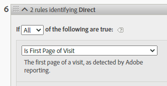
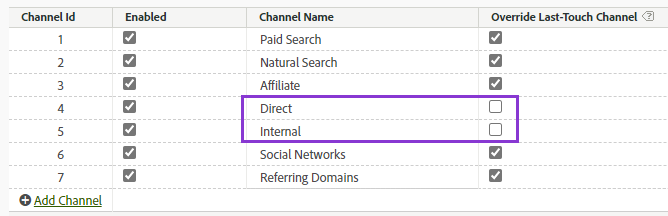
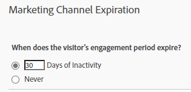

# Use Marketing channel dimensions in Adobe Experience Platform

If your organization uses the [Analytics Source Connector](https://experienceleague.adobe.com/docs/experience-platform/sources/connectors/adobe-applications/analytics.html) to bring report suite data into CJA, you can configure a connection in CJA to report on Marketing Channel dimensions.

## Prerequisites

* Report suite data must already be imported into Adobe Experience Platform using the [Analytics Source Connector](https://experienceleague.adobe.com/docs/experience-platform/sources/connectors/adobe-applications/analytics.html). Other sources of data are not supported, as Marketing channels rely on processing rules in an Analytics report suite.
* Marketing channel processing rules must already be set up. See [Processing rules for Marketing Channels](https://experienceleague.adobe.com/docs/analytics/components/marketing-channels/c-rules.html) in the traditional Analytics Components guide.

## Marketing Channel schema elements

Once you establish the Analytics Source Connector on a desired report suite, an XDM schema is created for you. This schema contains all Analytics dimensions and metrics as raw data. This raw data does not contain attribution or persistence. Instead, each event runs through marketing channel processing rules and records the first rule it matches. You specify attribution and persistence when creating a data view in CJA.

1. [Create a connection](/help/connections/create-connection.md) that includes a dataset based on the Analytics Source Connector.
2. [Create a data view](/help/data-views/create-dataview.md) that includes the following dimensions:
   * **`channel.typeAtSource`**: Equivalent to the [Marketing channel](https://experienceleague.adobe.com/docs/analytics/components/dimensions/marketing-channel.html) dimension.
   * **`channel._id`**: Equivalent to the [Marketing channel detail](https://experienceleague.adobe.com/docs/analytics/components/dimensions/marketing-detail.html)
3. Give each dimension the desired attribution model and persistence. If you want both first and last touch dimensions, drag each marketing channel dimension to the components area multiple times. Give each dimension the desired attribution model and persistence. Adobe also recommends giving each dimension a display name to make it easier for use in Workspace.
4. Create the data view.

Your marketing channel dimensions are now available for use in Analysis Workspace.

## Processing and architecture differences

>[!IMPORTANT]
>
>There are several fundamental data differences between report suite data and Platform data. Adobe highly recommends adjusting your report suite's marketing channel processing rules to help facilitate proper data collection in Platform.

>[!NOTE]
>
>To maximize effectiveness of Marketing Channels for Attribution IQ and Customer Journey Analytics, we have published some [revised best practices](https://experienceleague.adobe.com/docs/analytics/components/marketing-channels/mchannel-best-practices.html).

Marketing channel settings operate differently between Platform data and report suite data. Consider the following differences when setting up Marketing channels for CJA:

* **Is First Page of Visit**: This rule criteria is common on several default marketing channel definitions. Any processing rule that contains this criteria is ignored in Platform (other criteria in the same rule still apply). Sessions are determined at data query time instead of at the time of data collection, preventing Platform from using this specific rule criteria. Adobe recommends re-evaluating any marketing channel processing rules containing the 'Is First Page of Visit' criteria, opting for alternative approaches that achieve your goals.
   
   

* **Override Last-Touch Channel**: This setting in the Marketing Channel Manager normally prevents certain channels from getting last touch channel credit. Platform ignores this setting, allowing broad channels like 'Direct' or 'Internal' to attribute toward metrics in potentially undesired ways. Adobe recommends removing channels where you have 'Override Last-Touch Channel' unchecked.
  * You can delete the 'Direct' marketing channel in the Marketing Channel Manager, then rely on CJA's 'No value' dimension item for that channel. You can also rename this dimension item to 'Direct' or exclude the dimension item entirely when configuring a data view.
  * Alternatively, you can create a marketing channel classification, classifying each value to itself except for channels that you want to exclude in CJA. You can then use this classification dimension when creating a data view instead of `channel.typeAtSource`.

   

* **Marketing Channel Expiration**: This engagement period setting determines the period of inactivity before a visitor can obtain a new first touch channel in report suite data. Platform uses its own attribution settings, so this setting is ignored entirely in CJA.

   

## Comparing data between CJA and traditional Analytics

Because the architecture of Adobe Experience Platform is different than a traditional Analytics report suite, results are not guaranteed to match. However, you can use the following tips to make this comparison easier:

* Verify that the architectural differences listed above do not impact your comparison. This includes removing channels that do not override last touch channel, and removing rule criteria that are the first hit of a visit (session).
* Double check that your connection uses the same report suite as traditional Analytics. If your CJA connection contains multiple report suites with their own Marketing channel processing rules, there is not an easy way to compare it with traditional Analytics. You would want to create a separate connection for each report suite to compare data.
* Make sure that you compare the same date ranges, and that the time zone setting in your data view is the same as the report suite's time zone.
* Use a custom attribution model when viewing report suite data. For example, use the [Marketing channel](https://experienceleague.adobe.com/docs/analytics/components/dimensions/marketing-channel.html) dimension with metrics that use a non-default attribution model. Adobe advises against comparing the default dimensions [First touch channel](https://experienceleague.adobe.com/docs/analytics/components/dimensions/first-touch-channel.html) or [Last touch channel](https://experienceleague.adobe.com/docs/analytics/components/dimensions/last-touch-channel.html), because they rely on attribution collected in the report suite. CJA does not rely on a report suite's attribution data; instead, it is calculated when a CJA report is run.
* Some metrics do not have a reasonable comparison due to architectural differences between report suite data and Platform data. Examples include visits/sessions, visitors/people, and occurrences/events.
