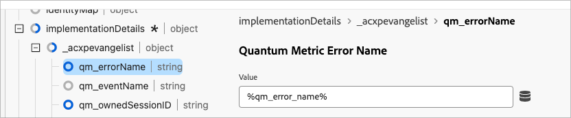

# Add Quantum Metric friction events to Customer Journey Analytics

Quantum Metric collects friction events such as page load slowness, page load errors, rage clicks, and more. These events can be passed into Customer Journey Analytics as complementary events in the user journey. With this combined data, you can better understand the impact of friction on downstream metrics.

## Prerequisites:

This use case has two requirements:

* You must be entitled to Quantum Metric's **Dev Ops** package.
* You must use tags in Adobe Experience Platform Data Collection.

## Step 1: Create a schema field to accommodate Quantum Metric friction events

This use case requires a dedicated schema field to send data to. You can create this field in any desired location in your schema and name it whatever you'd like. Example values are provided if your organization does not have a preference on name or location.

1. Log in to [experience.adobe.com](https://experience.adobe.com).
1. Navigate to **[!UICONTROL Data Collection]** > **[!UICONTROL Schemas]**.
1. Select the desired schema from the list.
1. Select the  icon next to the desired object. For example, next to `Implementation Details`.
1. In the right, enter the desired [!UICONTROL Name]. For example, `qmErrorName`.
1. Enter the desired [!UICONTROL Display name]. For example, `Quantum Metric error name`.
1. Select the [!UICONTROL Type] as **[!UICONTROL String]**.
1. Select **[!UICONTROL Save]**.

## Step 2: Capture friction events using the Quantum Metric tag extension

See [Quantum Metric extension](https://experienceleague.adobe.com/en/docs/experience-platform/destinations/catalog/analytics/quantum-metric) in the Adobe Experience Platform Destinations guide for instructions on how to set up your tags to include Quantum Metric data. Usage of this extension passes more rows into an existing dataset. 

Use tags in Adobe Experience Platform Data Collection to manually set the name of the friction event so that it can be included in the XDM object and analyzed. One way to do this is in the rule's custom code:

```js
_satellite.setVar('qm_error_name','error rage click');
return true;
```

Then, add the dynamically set data element to your XDM object:



## Step 3: Add one or more dimensions and metrics to the data view in Customer Journey Analytics

Edit your existing data view to add the session ID as an available dimension in Customer Journey Analytics.

1. Log in to [experience.adobe.com](https://experience.adobe.com).
1. Navigate to Customer Journey Analytics, and select **[!UICONTROL Data views]**, optionally from **[!UICONTROL Data management]**, in the top menu.
1. Select the desired existing data view.
1. Locate the Quantum Metric friction event field list on the left, and drag it to the metrics area in the center.
1. In the right pane, set the [Include/Exclude values](/help/data-views/component-settings/include-exclude-values.md) setting to the desired friction events that you want to track. You can add multiple friction events to the same metric to combine them. You can also drag another copy of the friction events field to the metrics area to track other friction events as a separate metric.
1. Once you have created all desired dimensions and metrics, Click **[!UICONTROL Save]**.
1. For a full list of error events, please refer to your Quantum Metric documentation. If you have additional questions, contact your Quantum Metric customer support representative or submit a request through the [Quantum Metric Customer Request Portal](https://community.quantummetric.com/s/public-support-page).

## Step 4: Use the dimension and metrics with the rest of your data in Analysis Workspace

With Quantum Metric friction event data collected alongside the rest of your visitor data, you can use them exactly as you would any other dimension or metric in Customer Journey Analytics.

1. Log in to [experience.adobe.com](https://experience.adobe.com).
1. Navigate to Customer Journey Analytics, and select **[!UICONTROL Workspace]** in the top menu.
1. Select an existing project, or create a project.
1. Create a [Freeform table](/help/analysis-workspace/visualizations/freeform-table/freeform-table.md).
1. Drag the desired dimensions and metrics to the Workspace canvas for analysis.

Possible analysis ideas include:

* Trend friction event data over time
* In a fallout or funnel visualization, add Customer Journey Analytics events as some steps and Quantum Metric friction events as others. This report allows you to see where visitors most commonly run into trouble.
* Create and apply a segment for visitors who experience friction events for deeper analysis
