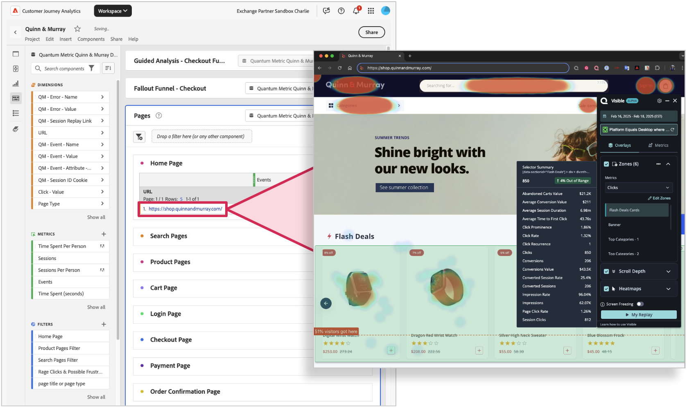

# Use Quantum Metric heatmaps with Customer Journey Analytics

Linking Quantum Metric heatmapping to CJA data lets you better understand page-level engagement and optimize pages based on consumer behavior. Workspace can be used to understand consumer user flows and see what paths consumers follow from one page to the next. Then, you can click hyperlinked Page URLs to visually heatmap how users engage with the content. By linking Quantum Metric Heatmapping to CJA, you can now associate page-level interactions with business outcomes, taking your analysis to the next level.

The table will return all the sessions in that segment, and you can click any one of them to explore further in QM.  Learn more about Quantum Metric session replay at https://www.quantummetric.com/platform/session-replay 

## Prerequisites

You must be entitled to Quantum Metric's **UX Ops** package in order to access Quantum Metric's heatmap capabilities.

## Step 1: Configure links in Analysis Workspace

1. Log in to [experience.adobe.com](https://experience.adobe.com).
1. Navigate to Customer Journey Analytics, and select **[!UICONTROL Workspace]** in the top menu.
1. Select an existing project, or create a project.
1. Create a [Freeform table](/help/analysis-workspace/visualizations/freeform-table/freeform-table.md).
1. Drag the page URL dimension to the Workspace canvas.
1. Right-click the dimension column header, then select **[!UICONTROL Create hyperlinks for all dimension items]**.
1. Select **[!UICONTROL Create a custom URL]**.
1. Paste the following URL structure:

    ```
    $value?qm-visible=true
    ```

1. Click **[!UICONTROL Create]**.
1. Test one of the links to see if it opens in the URL with the Quantum Metric extension visible. These links open in a new tab so your Workspace project remains open.



## Step 2: View heatmaps by clicking links within Customer Journey Analytics

Once you've found a page that you want to explore heatmapping, you can apply it to the desired panel. The table returns a URL that lets you explore heatmaps, scroll depth, and key zones for interaction using Quantum Metric. See [Quantum Metric heatmap product overview](https://www.quantummetric.com/platform/interaction-heatmaps) for more information. You can also contact your Quantum Metric customer support representative or submit a request through the [Quantum Metric Customer Request Portal](https://community.quantummetric.com/s/public-support-page).
